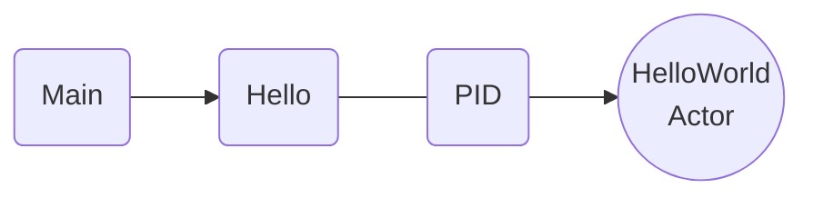

# Agent Guidelines for Diagrams

These notes capture how diagrams are typically authored in this repository.

- Use **Mermaid** for all diagrams.
- Choose `graph LR` for left-to-right flows or `graph TB` for top-to-bottom layouts.
- Represent actors as double‑circled nodes, e.g. `actor((Actor Name))`.
- Represent PIDs with simple nodes labeled `PID` and color them using `class pid light-blue`.
- Represent messages as nodes with the `message` class, e.g. `msg(Hello)\nclass msg message`.
- Apply color classes such as `green`, `blue`, `light-blue`, `yellow`, `red`, `gray`, or `comment` to convey meaning.
- Group related items with `subgraph` blocks and use `style` directives when boundaries need highlighting.
- Use `sequenceDiagram` for request–response or time-ordered interactions; use flowcharts (`graph`) for structural or topology diagrams (do NOT use `flowchart`)
- make sure to use valid syntax for styling elements in graph diagrams
- Use dashed lines or `linkStyle` to suppress unused arrows when needed.

These conventions are derived from existing documentation and should guide future diagram additions.

Here is a valid diagram with correct styling:

