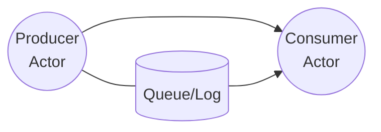

# Actors vs Queues and Logs

Actors excel at managing in-memory state and orchestrating concurrent work. Their mailboxes are ephemeral and rely on best-effort delivery. If a process crashes, in-flight messages may be lost. For workflows that demand durable delivery, ordering or exactly-once processing, a dedicated queue or log is the safer option.

The diagram below contrasts direct actor messaging with using a persistent queue or log.

## Real-time vs durable messaging

Actors pass messages directly in memory and can react in microseconds. This makes them ideal for real-time workloads such as multiplayer games or IoT device coordination where even small delays are unacceptable. Queues and logs persist to disk and replicate data, adding milliseconds of latency. They are "realtime-ish": great for reliability, but they cannot meet ultra low-latency requirements.

## When to choose actors

- Coordinating in-memory state and behaviour
- Performing lightweight or transient tasks
- Reacting to messages where occasional loss is acceptable

## When to choose a queue or log

- You need at-least-once or exactly-once guarantees
- Messages must survive process restarts or crashes
- Work needs to be distributed over time or across many consumers

Queues (e.g. RabbitMQ) and logs (e.g. Kafka) store messages durably and let consumers reprocess them if needed. Proto.Actor can integrate with these systems, but the queue or log remains the source of truth. Actors should focus on domain behaviour, while the messaging infrastructure provides reliability.

In short: not everything should be actor based. If your scenario requires strong delivery guarantees and can tolerate extra latency, persist the messages in a queue or log first and let actors pull work from there. Conversely, when ultra low latency is essential, keep the work in memory and lean on actors.

