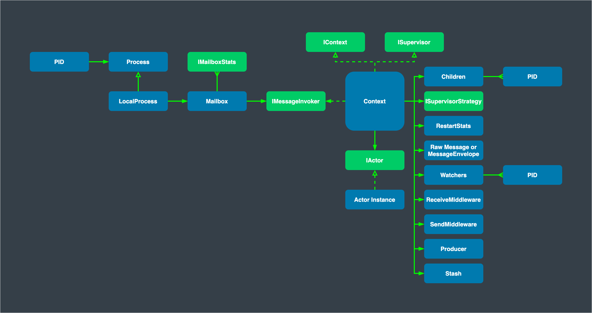

# Actors

An actor is a container for its [state](#state), [behavior](#behavior), [mailbox](#mailbox), [children](#children) and [supervisor strategy](#supervisor-strategy). All of this is encapsulated behind a process ID (`PID`).

## PID - Process ID

As detailed below, an actor object needs to be shielded from the outside in order to benefit from the actor model. Therefore, actors are represented externally using PIDs, which are objects that can be passed around freely and without restriction. This split into inner and outer objects enables transparency for all the desired operations: restarting an actor without needing to update references elsewhere, placing the actual actor object on remote hosts, and sending messages to actors in completely different applications. The most important aspect is that it is not possible to look inside an actor and access its state from the outside unless the actor unwisely publishes this information itself.

Read more: [PID](pid.md)

## State

Actor objects will typically contain some variables which reflect possible states the actor may be in. This can be an explicit state machine (e.g. using the FSM module), or it could be a counter, set of listeners, pending requests, etc. These data are what make an actor valuable, and they must be protected from corruption by other actors. The good news is that Proto.Actor actors conceptually each have their own light-weight thread, which is completely shielded from the rest of the system. This means that instead of having to synchronize access using locks you can just write your actor code without worrying about concurrency at all.

Behind the scenes Proto.Actor will run sets of actors on sets of real threads, where typically many actors share one thread, and subsequent invocations of one actor may end up being processed on different threads. Proto.Actor ensures that this implementation detail does not affect the single-threadedness of handling the actor's state.

Because the internal state is vital to an actor's operations, having inconsistent state is fatal. Thus, when the actor fails and is restarted by its supervisor, the state will be created from scratch, like upon first creating the actor. This is to enable the ability of self-healing of the system.

Optionally, an actor's state can be automatically recovered to the state before a restart by persisting received messages and replaying them after restart (see [Persistence](persistence.md)).

## Behavior

Every time a message is processed, it is matched against the current behavior of the actor. Behavior means a function which defines the actions to be taken in reaction to the message at that point in time, e.g. forward a request if the client is authorized, deny it otherwise. This behavior may change over time, e.g. because different clients obtain authorization over time, or because the actor may go into an “out-of-service” mode and later come back. These changes are achieved by either encoding them in state variables which are read from the behavior logic, or the function itself may be swapped out at runtime, see the become and unbecome operations. However, the initial behavior defined during construction of the actor object is special in the sense that a restart of the actor will reset its behavior to this initial one.

Read more: [Behavior](behaviors.md)

## Mailbox

An actor's purpose is the processing of messages, and these messages were sent to the actor from other actors (or from outside the actor system). The piece which connects sender and receiver is the actor's mailbox: each actor has exactly one mailbox to which all senders enqueue their messages. Enqueuing happens in the time-order of send operations, which means that messages sent from different actors may not have a defined order at runtime due to the apparent randomness of distributing actors across threads. Sending multiple messages to the same target from the same actor, on the other hand, will enqueue them in the same order.

There are different mailbox implementations to choose from, the default being a FIFO: the order of the messages processed by the actor matches the order in which they were enqueued. This is usually a good default, but applications may need to prioritize some messages over others. In this case, a priority mailbox will enqueue not always at the end but at a position as given by the message priority, which might even be at the front. While using such a queue, the order of messages processed will naturally be defined by the queue's algorithm and in general not be FIFO.

An important feature in which Proto.Actor differs from some other actor model implementations is that the current behavior must always handle the next dequeued message, there is no scanning the mailbox for the next matching one. Failure to handle a message will typically be treated as a failure, unless this behavior is overridden.

Read more: [Mailboxes](mailboxes.md)

## Children

Each actor is potentially a supervisor: if it creates children for delegating sub-tasks, it will automatically supervise them. The list of children is maintained within the actor's context and the actor has access to it. Modifications to the list are done by creating `Context.Spawn(...)` or stopping `child.Stop()` children and these actions are reflected immediately. The actual creation and termination actions happen behind the scenes in an asynchronous way, so they do not "block" their supervisor.

## Supervisor Strategy

The final piece of an actor is its strategy for handling faults of its children. Fault handling is then done transparently by Proto.Actor, applying one of the strategies described in Supervision and Monitoring for each incoming failure. As this strategy is fundamental to how an actor system is structured, it cannot be changed once an actor has been created.

Considering that there is only one such strategy for each actor, this means that if different strategies apply to the various children of an actor, the children should be grouped beneath intermediate supervisors with matching strategies, preferring once more the structuring of actor systems according to the splitting of tasks into sub-tasks.

Read more: [Supervision](supervision.md)

## When an Actor Terminates

Once an actor terminates, i.e. fails in a way which is not handled by a restart, stops itself or is stopped by its supervisor, it will free up its resources, draining all remaining messages from its mailbox into the system's “dead letter mailbox” which will forward them to the `EventStream` as `DeadLetters`. The mailbox is then replaced within the actor reference with a system mailbox, redirecting all new messages to the `EventStream` as `DeadLetters`. This is done on a best effort basis, though, do not rely on it in order to construct "guaranteed delivery".

Read more: [Eventstream](eventstream.md), [Deadletter](deadletter.md)

## Architectural Overview

Schematic view of the Proto.Actor internals:

