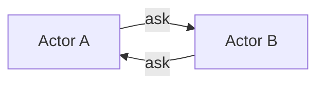

# Ask Pattern

The ask pattern provides request–response semantics between actors. An actor sends a message and waits for a reply, typically by using a future or awaiting a `Task`.

## Basic Flow


In Proto.Actor you can use `Context.Request` when the sender expects the recipient to know who sent the message. For an awaitable response, `Context.RequestAsync<T>` or `PID.RequestAsync<T>` returns a `Task<T>` that completes when the reply arrives.

```csharp
// ask a target actor for a reply
var response = await pid.RequestAsync<MyReply>(new MyRequest());
```

## When to Use
- Querying another actor for state or service results.
- Bridging between actor code and external await-based APIs.
- Providing back-pressure by limiting concurrent pending requests.

## Reentrancy and Ask
Waiting on `RequestAsync` inside an actor's receive method suspends message processing until the task completes. Combine the ask pattern with [Reentrancy](reenter.md) (`RequestReenter` or `ReenterAfter`) to keep the actor responsive. Without reentrancy, the actor cannot handle other messages and may cause a deadlock.

## Deadlock Example

If Actor A awaits a reply from Actor B while B simultaneously awaits a reply from A, neither actor can proceed. Reentrancy or redesigning the communication flow breaks the cycle.

See [Actor Communication](communication.md) for an overview of messaging APIs and [PID](pid.md) for additional request options.
