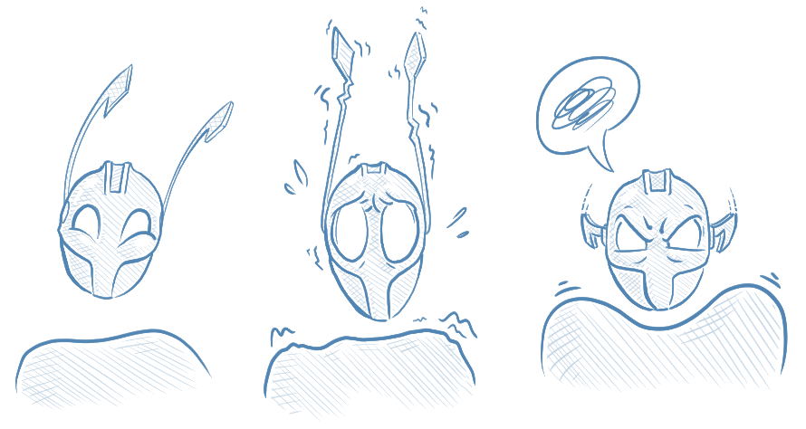

# Behaviors

Actors can change their behavior at any time. This is achieved through the Behavior class included with the core Proto.Actor library.



We're going to use the example of modelling a light bulb to demonstrate this:

```csharp
public class LightBulb : IActor
{
    private readonly Behavior _behavior;

    public LightBulb()
    {
        _behavior = new Behavior();
    }
}
```

This is done by means of delegating the default `ReceiveAsync` method to call the `ReceiveAsync` method on the `Behavior` class:

```csharp
public Task ReceiveAsync(IContext context)
{
    return _behavior.ReceiveAsync(context);
}
```

## Changing behaviors

There are three methods available for changing behaviors:

- `Become` simply sets the passed `Receive` method as the current behavior, replacing the default method.
- `BecomeStacked` pushes the passed `Receive` method onto the behavior stack, but preserves the previous behavior.
- `UnbecomeStacked` reverts to the previously used behavior.

### Become

When we initialize the LightBulb, we can set the initial state of the light to off:

```csharp
public class LightBulb : IActor
{
    private readonly Behavior _behavior;

    public LightBulb()
    {
        _behavior = new Behavior();
        _behavior.Become(Off)
    }
}
```

When in the Off state, if you touch the light bulb, it is cold. If you press the light switch, the light turns on:

```csharp
private Task Off(IContext context)
{
    switch (context.Message)
    {
        case PressSwitch _:
            context.Respond("Turning on");
            _behavior.Become(On);
            break;
        case Touch _:
            context.Respond("Cold");
            break;
    }

    return Task.CompletedTask;
}
```

If you touch the light when it is switched on, it is hot. If you press the light switch again, it turns off:

```csharp
private Task On(IContext context)
{
    switch (context.Message)
    {
        case PressSwitch _:
            context.Respond("Turning off");
            _behavior.Become(Off);
            break;
        case Touch _:
            context.Respond("Hot!");
            break;
    }

    return Task.CompletedTask;
}
```

### Global Message Handling

Sometimes you want certain messages to be treated the same way regardless of what your current behavior is. Consider what would happen were you to hit the light bulb with a hammer - it would smash, regardless of it being On or Off. This can be accomplished by handling these message types _before_ delegating to the Behavior class:

```csharp
public Task ReceiveAsync(IContext context)
{
    // any "global" message handling here
    switch (context.Message)
    {
        case HitWithHammer _:
            context.Respond("Smashed!");
            _behavior.Become(Smashed);
            return Task.CompletedTask;
    }
    // if not handled, use behavior specific
    return _behavior.ReceiveAsync(context);
}
```

In this example we return from the `HitWithHammer` case to prevent the message being handled by the specific state we are in. If you want to to handle it globally as well as delegate to the specific behavior just don't return.

We can also now handle the cases where somebody tries to turn on or touch the light bulb after it has been smashed, or replaces the bulb:

```csharp
private Task Smashed(IContext context)
{
    switch (context.Message)
    {
        case PressSwitch _:
            context.Respond(""); // nothing happens!
            break;
        case Touch _:
            context.Respond("Owwww!");
            break;
        case ReplaceBulb _:
        	_behavior.Become(Off);
        	break;
    }

    return Task.CompletedTask;
}
```

### BecomeStacked / UnbecomeStacked

This example shows how to use the `BecomeStacked` and `UnbecomeStacked` methods. When the actor calls `UnbecomeStacked` in `Receive2` it reverts back to `Receive`.

#### .NET


```csharp
public Task Receive(IContext context)
{
    _behavior.BecomeStacked(Receive2);
}

public Task Receive2(IContext context)
{
    _behavior.UnbecomeStacked(); // behavior will revert back to Receive
}
```


#### Go


```go
func (state *BecomeActor) Receive(context actor.Context) {
    context.BecomeStacked(state.Receive2)
}

func (state *BecomeActor) Receive2(context actor.Context) {
    context.UnbecomeStacked()
}
```


