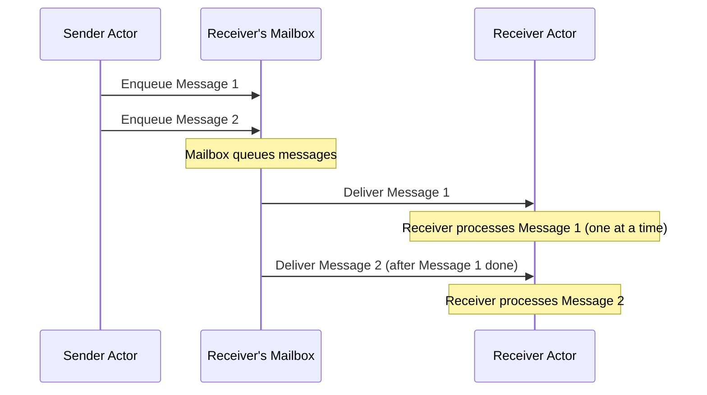

# Chapter 1: Introduction to the Actor Model and Proto.Actor

**Chapters:** [1](../chapter-1/) | [2](../chapter-2/) | [3](../chapter-3/) | [4](../chapter-4/) | [5](../chapter-5/)

The actor model is a conceptual model for designing concurrent, distributed systems. In the actor model, an actor is a lightweight entity that encapsulates state and behavior, and communicates exclusively by exchanging messages. Actors do not share memory; instead, they send messages to each other asynchronously. This eliminates the need for locks or manual thread management, since each actor processes one message at a time in a single-threaded manner. The actor model provides a high-level abstraction for concurrency, making it easier to build systems that are responsive, resilient, and elastic (as advocated by the Reactive Manifesto). Key benefits of using the actor model include:

- Simplified Concurrency: No explicit threads or locks — actors run independently and handle messages sequentially, avoiding race conditions by design.

- Isolation of State: Each actor’s state is encapsulated and not accessible directly by others, ensuring memory safety and easier reasoning about state changes.

- Location Transparency: Actors are identified by addresses. Sending a message to an actor uses its address (or `PID`) without needing to know the actor’s location (local or remote). This enables distribution and scaling across multiple machines seamlessly.

- Fault Tolerance via Supervision: Actors form hierarchies. An actor can create child actors and supervise them. If a child actor fails (e.g., throws an exception), the parent actor can handle the failure (restart the child, replace it, etc.), creating a self-healing system.

In the context of Proto.Actor, these principles are applied in a modern, cross-platform framework. Proto.Actor is an open-source actor framework available in multiple languages (including .NET/C# and Go) that implements both classic actors and “virtual actors” in clusters. It provides the building blocks to create actors, send messages, and scale out your system across cores and network nodes. Proto.Actor uses proven technologies under the hood (like gRPC for networking and Protocol Buffers for serialization) instead of reinventing them. Because it relies on standard tooling, Proto.Actor integrates well with other systems and languages. A Go actor can talk to a C# actor over the network without any custom glue code.

Proto.Actor also supports virtual actors in cluster scenarios; see [Virtual Actors](virtual-actors/) for more.

In summary, the actor model provides a robust mental model for concurrent systems, and Proto.Actor brings this model to practical use in C#, Go, and other languages. By using Proto.Actor, you gain:

- High-level concurrency primitives – focus on actors and messages rather than threads and locks.

- Scalability – design locally, then scale out to multiple processes or machines with Proto.Actor’s remote and cluster features without code changes.

- Polyglot and distributed capabilities – build parts of your system in different languages or deploy actors on different nodes; Proto.Actor’s networking ensures they work together as if they were in one process.

- Resilience – let actor supervision strategies handle errors and restarts, creating systems that can heal and adapt at runtime.

Below is a simple diagram illustrating how actors communicate and process messages sequentially using a mailbox:

This diagram shows that a sender actor can put multiple messages into the receiver’s mailbox quickly, but the receiver will dequeue and handle them one by one. This ensures thread-safe processing within the actor. In the next chapters, we will build on these concepts: first by exploring Proto.Actor’s core primitives for defining and using actors, then by leveraging remote communication, clustering (with virtual actors), and finally how to test actor systems using Proto.Actor’s toolkit. Each chapter includes examples in both C# and Go, plus diagrams to solidify the concepts.

**Chapters:** [1](../chapter-1/) | [2](../chapter-2/) | [3](../chapter-3/) | [4](../chapter-4/) | [5](../chapter-5/)

