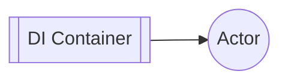

# Chapter 2: Dependency Injection

**Chapters:** [1](../chapter-1/) | [2](../chapter-2/) | [3](../chapter-3/) | [4](../chapter-4/) | [5](../chapter-5/)

[Back to Chapter 2](../)

Actors often need services such as logging or databases. Dependency Injection (DI) can create actors with those dependencies while keeping code testable.

## Using DI in C#

```csharp
using Microsoft.Extensions.DependencyInjection;
using Proto;

var services = new ServiceCollection();
services.AddSingleton<IMyService, MyService>();
var provider = services.BuildServiceProvider();

var system = new ActorSystem();
var props = Props.FromProducer(() => new MyActor(provider.GetRequiredService<IMyService>()));
var pid = system.Root.Spawn(props);
```

## Using DI in Go

```go
package main

import (
    "github.com/asynkron/protoactor-go/actor"
    "github.com/asynkron/protoactor-go/di"
)

type myService struct{}

type myActor struct{ svc *myService }

func (a *myActor) Receive(ctx actor.Context) {}

func main() {
    builder := di.New()
    builder.Register(func() *myService { return &myService{} })
    props := di.PropsFromFunc(builder, func(svc *myService) actor.Actor { return &myActor{svc: svc} })
    system := actor.NewActorSystem()
    pid := system.Root.Spawn(props)
    _ = pid
}
```

## DI Diagram


