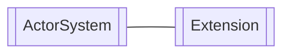

# Chapter 2: Extensions

**Chapters:** [1](../chapter-1/) | [2](../chapter-2/) | [3](../chapter-3/) | [4](../chapter-4/) | [5](../chapter-5/)

[Back to Chapter 2](../)

Extensions add optional capabilities to the `ActorSystem` without changing its core. Examples include metrics exporters, cluster providers, or dependency injection helpers.

## Creating an Extension

C# example registering a simple extension:

```csharp
using Proto;

public class MyExtensionId : ExtensionId<MyExtension>
{
    public override MyExtension CreateExtension(ActorSystem system) => new MyExtension();
}

public class MyExtension : IExtension { }

var system = new ActorSystem();
system.Extensions.Register(new MyExtensionId());
```

Go example:

```go
package main

import (
    "github.com/asynkron/protoactor-go/actor"
)

type myExtension struct{}

func (*myExtension) Started(*actor.ActorSystem) {}

func main() {
    system := actor.NewActorSystem()
    system.Extensions.Register(&myExtension{})
}
```

## Extension Diagram


