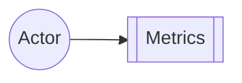

# Chapter 2: Metrics

**Chapters:** [1](../chapter-1/) | [2](../chapter-2/) | [3](../chapter-3/) | [4](../chapter-4/) | [5](../chapter-5/)

[Back to Chapter 2](../)

Proto.Actor can publish runtime metrics such as mailbox length, message throughput, or actor restarts. Metrics are exposed through extensions like Prometheus exporters.

## Enabling Metrics

C# example using the Prometheus extension:

```csharp
using Proto;
using Proto.Metrics;

var system = new ActorSystem();
// Enable default metrics and export them via Prometheus
Metrics.StartCollectors();
var pid = system.Root.Spawn(Props.FromProducer(() => new MyActor()));
```

In Go:

```go
package main

import (
    "github.com/asynkron/protoactor-go/actor"
    prom "github.com/asynkron/protoactor-go/metrics/prometheus"
)

func main() {
    system := actor.NewActorSystem()
    prom.StartCollectors(system) // start Prometheus collectors
    pid := system.Root.Spawn(actor.PropsFromProducer(func() actor.Actor { return &myActor{} }))
    _ = pid
}
```

## Metrics Diagram


