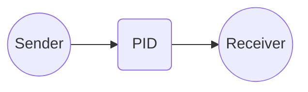

# Chapter 2: PIDs

**Chapters:** [1](../chapter-1/) | [2](../chapter-2/) | [3](../chapter-3/) | [4](../chapter-4/) | [5](../chapter-5/)

[Back to Chapter 2](../)

A `PID` (Process ID) is the address of an actor. It contains the actor's unique ID and the address of the node hosting it. All communication with an actor goes through its PID.

## Using PIDs

In C#, spawning an actor returns its PID:

```csharp
using Proto;

public class EchoActor : IActor
{
    public Task ReceiveAsync(IContext ctx)
    {
        // Respond with the same message
        if (ctx.Message is string text)
        {
            ctx.Respond($"Echo: {text}");
        }
        return Task.CompletedTask;
    }
}

var system = new ActorSystem();
var pid = system.Root.Spawn(Props.FromProducer(() => new EchoActor()));
system.Root.Request(pid, "hello", pid); // send a message using the PID
```

In Go, a PID is returned similarly:

```go
package main

import (
    "github.com/asynkron/protoactor-go/actor"
)

type echoActor struct{}

func (e *echoActor) Receive(ctx actor.Context) {
    switch msg := ctx.Message().(type) {
    case string:
        ctx.Respond("Echo: " + msg)
    }
}

func main() {
    system := actor.NewActorSystem()
    pid := system.Root.Spawn(actor.PropsFromProducer(func() actor.Actor { return &echoActor{} }))
    system.Root.Request(pid, "hello", pid)
}
```

## PID Diagram


