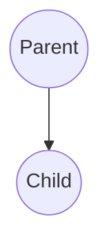

# Chapter 2: Spawning Actors

**Chapters:** [1](../chapter-1/) | [2](../chapter-2/) | [3](../chapter-3/) | [4](../chapter-4/) | [5](../chapter-5/)

[Back to Chapter 2](../)

Spawning creates new actors. Actors can spawn children or spawn named actors so others can find them.

## Spawning Children

```csharp
var childPid = ctx.Spawn(Props.FromProducer(() => new ChildActor()));
```

```go
childPid := ctx.Spawn(actor.PropsFromProducer(func() actor.Actor { return &childActor{} }))
```

## Named Actors

```csharp
var pid = system.Root.SpawnNamed(props, "worker1");
```

```go
pid := system.Root.SpawnNamed(props, "worker1")
```

## Spawning Diagram


