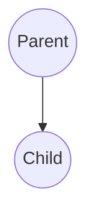

# Chapter 2: Supervision

**Chapters:** [1](../chapter-1/) | [2](../chapter-2/) | [3](../chapter-3/) | [4](../chapter-4/) | [5](../chapter-5/)

[Back to Chapter 2](../)

Supervision links parents and children into a hierarchy. If a child fails, the parent decides how to handle the failure: restart the child, stop it, or escalate the error.

## Basic Supervision

C# example showing a parent supervising a child:

```csharp
using Proto;
using System;

public class ChildActor : IActor
{
    public Task ReceiveAsync(IContext ctx)
    {
        if (ctx.Message is string msg && msg == "fail")
        {
            throw new Exception("boom");
        }
        return Task.CompletedTask;
    }
}

public class ParentActor : IActor
{
    public Task ReceiveAsync(IContext ctx)
    {
        switch (ctx.Message)
        {
            case Started:
                // spawn a child when parent starts
                ctx.Spawn(Props.FromProducer(() => new ChildActor()));
                break;
            case Terminated t:
                Console.WriteLine($"Child {t.Who} terminated");
                break;
        }
        return Task.CompletedTask;
    }
}
```

In Go:

```go
package main

import (
    "fmt"
    "github.com/asynkron/protoactor-go/actor"
)

type child struct{}

func (c *child) Receive(ctx actor.Context) {
    if msg, ok := ctx.Message().(string); ok && msg == "fail" {
        panic("boom")
    }
}

type parent struct{}

func (p *parent) Receive(ctx actor.Context) {
    switch msg := ctx.Message().(type) {
    case actor.Started:
        ctx.Spawn(actor.PropsFromProducer(func() actor.Actor { return &child{} }))
    case *actor.Terminated:
        fmt.Println("child terminated")
    }
}
```

## Supervision Diagram


