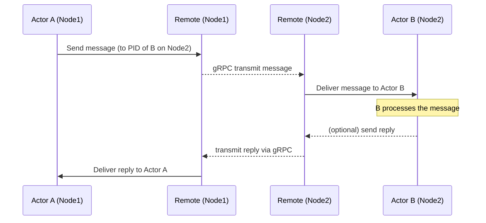

# Chapter 3: Remote Examples

**Chapters:** [1](../chapter-1/) | [2](../chapter-2/) | [3](../chapter-3/) | [4](../chapter-4/) | [5](../chapter-5/)

[Back to Chapter 3](../)

For a basic example, let’s illustrate a simple ping-pong between two processes using Proto.Remote. We’ll create a `PingActor` on one node that, when pinged, responds with a pong message. A client on another node will send the ping and await the response.

## Example: Remote Ping-Pong (C#)

### Server (Node 1) – Host a Ping actor:
```csharp
// On Node1 (Server)
using Proto;
using Proto.Remote;
using Proto.Remote.GrpcNet;

public class PingActor : IActor
{
    public Task ReceiveAsync(IContext context)
    {
        switch(context.Message)
        {
            case string text when text == "ping":
                context.Respond("pong");  // reply to sender
                break;
        }
        return Task.CompletedTask;
    }
}

var system = new ActorSystem();
// Configure remote on port 8000
var remoteConfig = GrpcNetRemoteConfig.BindTo("127.0.0.1", 8000)
    .WithProtoMessages(MyMessagesReflection.Descriptor)      // register Protobuf messages (if using custom types)
    .WithRemoteKind("pingKind", Props.FromProducer(() => new PingActor()));
system.WithRemote(remoteConfig);
await system.Remote().StartAsync();  // start the remote server

// Spawn the Ping actor with a known name, so it can be addressed remotely
var context = system.Root;
var pingProps = Props.FromProducer(() => new PingActor());
context.SpawnNamed(pingProps, "PingActor");  // name "PingActor"
Console.WriteLine("Ping actor started on Node1...");
Console.ReadLine();  // keep the server running
```

In the C# server code above, we started a Proto.Actor remote on TCP port 8000 and spawned a `PingActor` with the name `PingActor`. By doing so, that actor can be referenced remotely via the PID `PID("127.0.0.1:8000", "PingActor")`. The actor simply responds with `"pong"` whenever it receives the string `"ping"`. Note: We also registered a remote kind `"pingKind"` in `remoteConfig`, which would allow remote spawning of `PingActor` by kind if we wanted (though here we directly spawned it locally).

### Client (Node 2) – Call the remote Ping actor:
```csharp
// On Node2 (Client)
using Proto;
using Proto.Remote;
using Proto.Remote.GrpcNet;

var system = new ActorSystem();
var remoteConfig = GrpcNetRemoteConfig.BindTo("127.0.0.1", 0);  // 0 means choose a free port for this client
system.WithRemote(remoteConfig);
await system.Remote().StartAsync();  // start remote (client side)
Console.WriteLine("Remote client started.");

// Construct PID for remote actor
var pingActorPid = PID.FromAddress("127.0.0.1:8000", "PingActor");

// Send a ping and wait for response
var response = await system.Root.RequestAsync<string>(pingActorPid, "ping", TimeSpan.FromSeconds(5));
Console.WriteLine($"Got response: {response}");
```

In the client, we start a remote subsystem (with an ephemeral port). We then create a PID using the server’s address `"127.0.0.1:8000"` and the known name `"PingActor"`. Using `RequestAsync<T>` on the root, we send a `"ping"` message and await a string response. The `PingActor` on the server will receive the message and `Respond("pong")`, which Proto.Actor sends back over the network to the requesting context on the client. The client prints “Got response: pong”.

## Go Example: Remote Ping-Pong (Go code is conceptually similar – we would use `remote.Configure` and `remote.Start`):

### Server (Go):
```go
// Node1 (Server) in Go
package main

import (
    "fmt"
    "github.com/asynkron/protoactor-go/actor"
    remote "github.com/asynkron/protoactor-go/remote"
)

type pingActor struct{}

func (p *pingActor) Receive(ctx actor.Context) {
    if msg, ok := ctx.Message().(string); ok && msg == "ping" {
        ctx.Respond("pong")
    }
}

func main() {
    system := actor.NewActorSystem()
    // Configure remote on port 8090
    config := remote.Configure("127.0.0.1", 8090)
    // Create and start the remote server
    r := remote.NewRemote(system, config)
    r.Start()

    // Spawn the Ping actor with name
    props := actor.PropsFromProducer(func() actor.Actor { return &pingActor{} })
    system.Root.SpawnNamed(props, "PingActor")
    fmt.Println("Ping actor running at 127.0.0.1:8090 as 'PingActor'")
    select {} // block forever
}
```

### Client (Go):
```go
package main

import (
    "fmt"
    "time"
    "github.com/asynkron/protoactor-go/actor"
    remote "github.com/asynkron/protoactor-go/remote"
)

func main() {
    system := actor.NewActorSystem()
    config := remote.Configure("127.0.0.1", 0)  // 0 for any available port
    r := remote.NewRemote(system, config)
    r.Start()

    pid := actor.NewPID("127.0.0.1:8090", "PingActor")
    // Send ping and wait for reply using RequestFuture
    future := system.Root.RequestFuture(pid, "ping", 5*time.Second)
    result, err := future.Result()  // wait for response or timeout
    if err != nil {
        fmt.Println("Error: ", err)
        return
    }
    fmt.Printf("Got response: %v\n", result)  // expect "pong"
}
```

In the Go version, we similarly started a remote on the server (port 8090) and on the client (ephemeral). We used `actor.NewPID("127.0.0.1:8090", "PingActor")` to reference the remote actor by its address and name. Then we used `RequestFuture` to send a message and wait for a result. The server’s actor responds, and the client prints “Got response: pong”.

## How Remoting Works (Under the Hood)
Proto.Remote automatically handles serialization and networking. When you send a message to a PID with a non-empty address (e.g., `"127.0.0.1:8000"`), the message goes through a serialization pipeline: if it’s a Protobuf message or a built-in type, it gets serialized to binary. The Proto.Actor Remote then sends it via gRPC to the target address. On the remote side, the message is deserialized and dispatched to the local actor. All of this is transparent to the user – from our perspective, we just did `Send` or `RequestAsync` with a PID and a message. This is location transparency in action.

The only extra steps needed are the configuration (to set up networking and serialization) and ensuring both sides know the message types (hence sharing Protobuf schemas or assemblies). In a multi-language scenario (say, a Go client and a C# server), using Protobuf for messages is essential so that both have a common definition of the data structures. As long as the Protobuf contracts are the same, a Go actor can send a message to a C# actor and vice versa.

## Location Transparency and Remote Spawning
Location transparency means you could design your system without hard-coding where actors run. For instance, you might have an actor that does image processing – you can initially run it locally, but if load increases, you could run that actor on a separate machine and simply adjust addressing or use cluster. Proto.Remote even allows remote spawning: one node can ask another to spawn a new actor of a given kind. We touched on registering kinds earlier. For example, if Node2 wanted to spawn an actor on Node1, it could call something like `system.Root.SpawnNamedAsync("127.0.0.1:8000", "someName", "pingKind")` in C#. This would instruct Node1’s remote system to create a new actor using the Props we registered as `"pingKind"`. The returned PID would represent that new remote actor, and then we could send messages to it. Remote spawning is advanced usage that can be helpful, but often, if you’re building a dynamic system, you might use Proto.Cluster which automates a lot of that.

## Diagram: Remote Message Flow
The following sequence diagram illustrates the interaction between two actors on different nodes using Proto.Remote, including an optional reply:



In this diagram, Actor A sends a message to Actor B’s PID. The Proto.Remote system on Node1 packages the message and sends it over the network to Node2. Node2’s remote system delivers it to Actor B. If Actor B calls `Respond` (or otherwise sends a message back to the original sender), the process reverses, delivering the reply to Actor A. The developer did not have to explicitly manage sockets or endpoints beyond the initial configuration – Proto.Actor’s remoting took care of it.

With Proto.Remote, you can build distributed applications where each service or component runs in its own process but still interacts through actors. However, remoting requires that you manage the node membership (i.e., knowing addresses of nodes and starting them manually). For dynamic clusters with many nodes joining/leaving and virtual actor activation, Proto.Actor offers the Cluster abstraction, which we cover next.

**Chapters:** [1](../chapter-1/) | [2](../chapter-2/) | [3](../chapter-3/) | [4](../chapter-4/) | [5](../chapter-5/)

