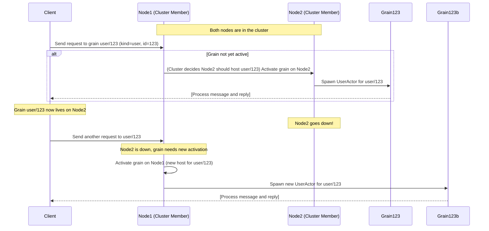

# Chapter 4: Building Distributed Solutions with Proto.Cluster (Virtual Actors)

**Chapters:** [1](chapter-1/) | [2](chapter-2/) | [3](chapter-3/) | [4](chapter-4/) | [5](chapter-5/)
While Proto.Remote allows point-to-point communication between known nodes, Proto.Cluster builds on top of it to provide a higher-level abstraction for distributed systems: clusters of virtual actors. In Proto.Cluster, actors can be addressed by a logical identity (like “user/123”) rather than a physical PID. The cluster takes care of finding or activating an actor with that identity on some node, and routing messages to it. This greatly simplifies building scalable systems, as you do not need to manually track where each actor lives or whether it’s running – the cluster does it for you. In this chapter, we’ll explain key concepts of Proto.Cluster (cluster identities, kinds, membership, etc.), how virtual actors (grains) work, and how to configure and use a Proto.Actor cluster in C# and Go.

## Why Use a Cluster?
Imagine you have a service that maintains user sessions or game characters. With just Proto.Remote, you could spawn these actors on some nodes and keep a directory of where each user’s actor is. But you’d have to design that directory, handle what happens if a node goes down (and the actors on it are lost), and route messages to the right node. Proto.Cluster automates these tasks. It provides:

- Dynamic membership: Nodes can join or leave the cluster, and the cluster will redistribute actors as needed.
- Virtual actors (grains): You don’t manually spawn these actors. Instead, when you send a message to an identity, the cluster ensures an actor exists (spawning it on-demand on some node if it’s the first message).
- Location transparency at scale: You address actors by (kind, identity) pair rather than by PID. The cluster’s identity lookup maps that to a real PID under the hood. If the actor moves or gets re-created, the mapping updates, but you keep using the same identity.
- Built-in naming and routing: The cluster prevents duplicate actors with the same identity from running concurrently (unless you configure it otherwise). It handles deciding which node should host a new activation (often via a hash or random distribution, or by delegation to a cluster provider).
- Fault tolerance: If a node crashes, the cluster can recreate the needed actors on other nodes once it detects the failure, so the system continues working (albeit those actors might start fresh unless you use persistence).

Proto.Actor’s clustering draws inspiration from the Orleans virtual actor model. In Orleans terms, a grain is an entity like an actor that is always addressed by its identity, not by where it is. Proto.Actor uses the term grain interchangeably with virtual actor. We’ll use “grain” when referring to the concept in cluster.

## Key Concepts in Proto.Cluster
- Cluster Identity: A combination of Kind and Identity. The Kind is a string that represents the type or role of the grain (e.g., "user", "order", "sensor"), and the Identity is a unique identifier for a specific grain of that kind (e.g., user ID, order ID, sensor ID). For example, user/123 has kind "user" and identity "123". Identities are unique per kind; two different kinds can have the same identity string without conflict.
- Cluster Kind: A registration of an actor (Props) to a kind name in the cluster configuration. You define what code should run for a given kind. For instance, you might register kind "user" with the Props for a UserActor (which might manage a user’s session or state). Both .NET and Go cluster APIs have a way to set this up (e.g., ClusterConfig.WithClusterKind("user", Props.FromProducer(() => new UserActor())) in C#).
- Cluster Provider: An implementation that keeps track of what nodes are in the cluster. Proto.Actor doesn’t hardcode the membership mechanism; instead, you plug in a provider (like a ConsulProvider, EtcdProvider, or a simple in-memory TestProvider for local dev). This provider is responsible for cluster node discovery and for designating one node as the cluster “leader” if needed for organizing (depending on the provider). For testing or single-machine demos, Proto.Actor provides a TestProvider (which essentially fakes cluster membership). In Kubernetes, there’s a provider that uses Kubernetes APIs, etc.
- Identity Lookup (Partition): This is the component that maps a given identity to a specific node. Proto.Actor’s default is a partitioning strategy: identities are hashed or otherwise distributed among the cluster members (often using a “partition actor” on each node). When you send a request to user/123, the cluster uses a hash of "user"+"123" to decide, say, that it should live on Node 2, and routes the request there. If the grain isn’t active yet, Node 2 will activate it on first message. Proto.Actor provides an implementation called PartitionIdentityLookup (and others) for this.
- Member: A node in the cluster. Each running ActorSystem with cluster enabled is a member (identified by an address and some metadata like host, port, etc.). Members can have statuses (joining, up, leaving, down). The cluster provider monitors these.

## Virtual Actor Lifecycle in Proto.Cluster
Let’s walk through the typical lifecycle of a grain (virtual actor) in Proto.Cluster, using a concrete example scenario:

Scenario: We have a cluster with nodes, and a grain kind "user". We want to send a message to ClusterIdentity("user", "123") (we’ll denote this as user/123).

Initially, user/123 does not exist on any node (no actor is running for it yet). But that’s okay – with virtual actors, you don’t explicitly spawn it. You just send a message (or make a request) to it. Here’s what happens on a high level:

- Message Send: The client or actor sends a message addressed to user/123. This goes into the cluster subsystem.
- Identity Lookup: The cluster determines which node should own user/123. Suppose it decides on Member2 (could be based on hashing, etc.).
- Activation: If Member2 doesn’t currently have an actor for user/123 running, the cluster on Member2 will spawn a new actor of kind "user" and give it the identity "123". This is done by using the Props associated with "user" kind. The new actor is started and a PID is assigned to it. The first message that triggered this will now be delivered to this actor.
- Caching PID: The cluster caches the mapping from user/123 -> PID (Member2’s address and the actor’s ID) so that subsequent messages to user/123 can be routed directly to that PID without re-spawning.
- Usage: Now the grain is active. Any node in the cluster that wants to send to user/123 will be forwarded to that PID on Member2. The client that sent a request might get a response if it was a ask-pattern request. From the client’s perspective, it just addressed user/123 and got a result, not caring which node handled it.
- If Member2 later goes down (crashes or leaves the cluster), what happens to user/123? The cluster notices Member2 is unreachable (via the provider). The cached PID for user/123 is invalidated. The next time someone sends a message to user/123, the cluster will perform an activation again – perhaps this time on a different node (say Member1). It does mean the actor’s state was lost when Member2 died (unless you use persistence – see a note on that later), but the system continues to function. This is why they’re called virtual actors – they can come and go, and the “virtual address” (the identity) stays constant.

To summarize differences from normal actors:

- Grains are referenced by identity, not direct PID. You use ClusterIdentity (kind + identity) to refer to them. The cluster will give you a PID under the hood, but you generally call cluster APIs to send/request.
- You don’t manually spawn grains (in most cases). You just send a message or call a grain method, and the system will spawn it if needed.
- Grains might be restarted on another node at any time (usually only after failures or if you deliberately stop them). This is transparent – you still use the same identity.
- Grains should handle state carefully. Since they can be reactivated, if you need state persistence beyond the life of a single activation, you might use Proto.Actor’s Persistence module to persist state (Module 9 of the bootcamp covers this).

Here’s a simplified sequence diagram of sending a message to a cluster grain for the first time and then after a node failure:



In this diagram, at first message, Node1 (perhaps a cluster leadership or routing function) chooses Node2 to host the grain and forwards the request. Node2 spawns Grain123 (UserActor). Later, Node2 fails. When the client sends again, the cluster now spawns Grain123b on Node1. The client is unaware of these changes; it just keeps targeting user/123. This demonstrates the self-healing, location-transparent nature of the cluster.

Proto.Cluster handles a lot behind the scenes: membership events, a partitioning actor that might live on each node to route grain messages, etc. But as a developer using it, you mostly interact with a friendly API. Let’s see how to set up a cluster and call a grain in code.

## Setting Up a Proto.Cluster (C#)
To start a cluster node in C#, you will configure the ActorSystem with cluster settings, similar to how we configured remoting:

Define your grain message contracts and (optionally) generate grain interfaces – often done via Proto.Cluster.CodeGen (which uses Protobuf IDL to generate strongly-typed interfaces for grains). For simplicity, we’ll assume a grain that just responds to a hello request.

Register cluster kinds: For each grain type, create a ClusterKind. For example:

```csharp
var helloKind = new ClusterKind("hello", Props.FromProducer(() => new HelloActor()));
```

The string "hello" is the kind name, and the Props defines how to create that actor.

Cluster configuration: Create a ClusterConfig. You must specify a cluster provider and an identity lookup. For demo purposes, Proto.Actor provides an in-memory provider (for tests or single-machine clusters) called TestProvider and a corresponding InMemAgent. We’ll use that to avoid external dependencies:

```csharp
var clusterProvider = new TestProvider(new TestProviderOptions(), new InMemAgent());
var identityLookup = new PartitionIdentityLookup();
var clusterConfig = ClusterConfig.Setup("MyCluster", clusterProvider, identityLookup, helloKind);
```

Here, "MyCluster" is an arbitrary cluster name (all nodes must use the same name). We included the helloKind so the cluster knows how to spawn those.

Add to ActorSystem and start:

```csharp
var system = new ActorSystem().WithRemote(GrpcNetRemoteConfig.BindToLocalhost())
                               .WithCluster(clusterConfig);
await system.Cluster().StartMemberAsync();
```

This builds the actor system with both remote and cluster capabilities. We bind to localhost with an automatically chosen port (or you can specify a port with BindTo). Then we call StartMemberAsync(), which joins the cluster (using the provider). If other nodes are running with the same provider, they will discover each other. In our case, if we run two nodes on the same machine with TestProvider, they’ll form a cluster of two members.

Once the cluster is running, we can obtain a reference to a grain and call methods (or send messages). If you used the code generation, you might have a HelloGrainClient that allows calling a typed method. Without codegen, you can use the cluster’s Request mechanism:

For instance, suppose HelloActor expects messages of type HelloRequest and responds with HelloResponse. You can send a request to the cluster like:

```csharp
var cluster = system.Cluster();
var result = await cluster.RequestAsync<HelloResponse>("hello", "user123", new HelloRequest { Name = "Proto" }, CancellationToken.None);
Console.WriteLine(result.Message);  // prints whatever HelloActor responded
```

Here, we invoked RequestAsync<T>(kind, identity, message, ...). Proto.Cluster will ensure that a grain of kind "hello" with identity "user123" is running somewhere and send the HelloRequest to it, then await the HelloResponse. This is a one-liner to interact with a virtual actor. Alternatively, with codegen, you might do:

```csharp
var helloGrain = cluster.GetHelloGrain("user123");
var reply = await helloGrain.SayHello(new HelloRequest { Name = "Proto" });
```

Which looks like a normal method call. Under the hood, it does the same thing – uses cluster identity to route to the grain.

## Go Setup: In Go, the cluster API is similar:
You configure with cluster.Configure(name, provider, lookup, remoteConfig). For example:

```go
provider := consul.New()  // using Consul provider, or use automanaged for local
lookup := disthash.New()  // partition lookup
remoteConfig := remote.Configure("127.0.0.1", 0)
config := cluster.Configure("MyCluster", provider, lookup, remoteConfig)
config = config.WithClusterKind("hello", actor.PropsFromProducer(func() actor.Actor {
    return &HelloActor{}
}))
clust := cluster.New(actorSystem, config)
clust.StartMember()
```

This joins the cluster using (for example) Consul for membership. In a local demo, you might use the clusterproviders/automanaged provider which doesn’t need external systems – it’s similar to the TestProvider.

To call a grain, if using codegen you’d have a generated client. Without it, you can manually request:

```go
pid := clust.Get("hello", "user123")  // gets a PID for the identity (might spawn if needed)
res, err := clust.Root().RequestFuture(pid, &HelloRequest{Name: "Proto"}, 5*time.Second).Result()
if err == nil {
    fmt.Println(res.(*HelloResponse).Message)
}
```

The cluster has convenience functions like cluster.Get to get a PID for an identity (though often you won’t need that directly if using typed API).

## Cluster Monitoring and Routing
When running a cluster, you often run multiple instances of your application (perhaps on different machines or containers). The cluster provider (like Consul, etcd, or Kubernetes API) helps them discover each other. Once discovered, Proto.Cluster ensures there is an activator on each node responsible for spawning grains when needed. There are also background gossip protocols to share information about what grains are active where, and ping each other for health. While you don’t need to interact with these directly, it’s useful to know that Proto.Cluster is doing a lot to maintain the illusion that any grain can be reached any time.

One point to note: grain eviction. By default, Proto.Actor does not garbage-collect grains automatically (other than on node shutdown). If a grain has not received messages for a while and you want to remove it from memory, you can use the ReceiveTimeout within the grain to self-stop on inactivity. You could also explicitly stop a grain by sending it a PoisonPill message or similar. But typically, grains are left in memory once activated until either the process stops or you program them to shut down on idle. This is a design decision to avoid the complexity of distributed garbage collection; it’s up to you to decide if an actor should die after being idle.

## Example: A Simple Clustered Hello (Go)
Let’s outline a minimal working cluster example in Go (since the .NET example was more configuration heavy, a Go example might be shorter here). We’ll use the AutoManaged provider, which allows a cluster on a single machine without external dependencies (useful for testing cluster logic locally). We’ll simulate two nodes in one process for brevity (though in practice they’d be separate processes).

```go
import (
    "fmt"
    "time"
    "github.com/asynkron/protoactor-go/actor"
    "github.com/asynkron/protoactor-go/cluster"
    "github.com/asynkron/protoactor-go/cluster/clusterproviders/automanaged"
    "github.com/asynkron/protoactor-go/cluster/identitylookup/disthash"
    "github.com/asynkron/protoactor-go/remote"
)

// Define a grain actor
type HelloActor struct{}

func (h *HelloActor) Receive(ctx actor.Context) {
    switch msg := ctx.Message().(type) {
    case *HelloRequest:
        reply := &HelloResponse{Message: "Hello, " + msg.Name + " from " + ctx.Self().Address}
        ctx.Respond(reply)
    }
}

func main() {
    system1 := actor.NewActorSystem()
    system2 := actor.NewActorSystem()

    // Configure cluster for both systems
    provider := automanaged.NewWithLease(func() string { return "127.0.0.1:0" }) // auto-managed membership
    lookup := disthash.New()
    remoteConfig := remote.Configure("127.0.0.1", 0) // auto assign port
    config := cluster.Configure("MyCluster", provider, lookup, remoteConfig).
        WithClusterKind("hello", actor.PropsFromProducer(func() actor.Actor { return &HelloActor{} }))

    cluster1 := cluster.New(system1, config)
    cluster2 := cluster.New(system2, config)
    // Start both cluster members
    cluster1.StartMember()
    cluster2.StartMember()

    // Give clusters a moment to discover each other
    time.Sleep(1 * time.Second)

    // Use cluster1 to request a greeting from cluster2's grain (maybe by hash it'll be on cluster2)
    res, err := cluster1.RequestFuture(cluster.NewClusterIdentity("hello", "user123"), &HelloRequest{Name: "Proto"}, 3*time.Second).Result()
    if err == nil {
        fmt.Println(res.(*HelloResponse).Message)
    }

    cluster1.Shutdown(true)
    cluster2.Shutdown(true)
}
```

This Go snippet creates two actor systems and clusters in one program (for demonstration). Both join the same cluster name "MyCluster". The AutoManaged provider with lease basically picks random free ports and shares the cluster topology among them automatically. After starting, we perform a cluster request to hello/user123. The cluster will route this to one of the nodes (likely cluster1 or cluster2, depending on hashing). The HelloActor replies with a message that includes ctx.Self().Address, so we can see which node responded. Running this should print a greeting that indicates which node (address) processed it. We then shut down both clusters.

In a real deployment, you would run separate processes (each running code similar to cluster1 initialization). They would find each other via the provider (Consul, etc.), and you would send requests from any node to any grain identity.

## When to use Proto.Cluster vs Proto.Remote
If you have a dynamic environment (microservices or need to scale out and in, with actors that can be anywhere), Proto.Cluster is very convenient and powerful. If your scenario is simpler (e.g., just two fixed processes that need to talk), Proto.Remote might suffice without the additional complexity of cluster membership. In fact, Proto.Cluster uses Proto.Remote under the hood for the actual messaging.

Proto.Cluster’s virtual actors simplify the developer’s mental model: you pretend every user or entity has a persistent actor. The system ensures that is “virtually” true, activating them on demand. This can greatly simplify certain classes of applications like games, IoT systems (sensors as actors), and stateful web services.

In the next (final) chapter, we will discuss how to test actor systems built with Proto.Actor. Testing concurrent and distributed code can be challenging, but Proto.Actor provides a TestKit and other tools to make writing tests for actors easier. We’ll look at examples of using Proto.TestKit for unit testing actor behavior.

**Chapters:** [1](chapter-1/) | [2](chapter-2/) | [3](chapter-3/) | [4](chapter-4/) | [5](chapter-5/)
