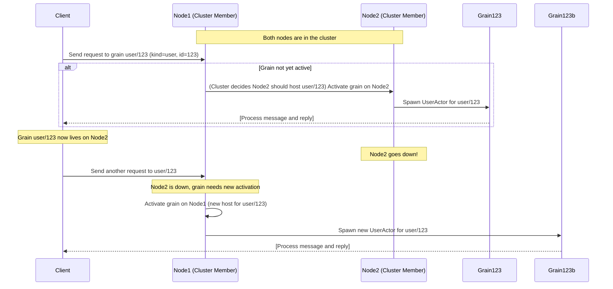

# Chapter 4: Building Distributed Solutions with Proto.Cluster (Virtual Actors)

**Chapters:** [1](../chapter-1/) | [2](../chapter-2/) | [3](../chapter-3/) | [4](../chapter-4/) | [5](../chapter-5/)

While Proto.Remote allows point-to-point communication between known nodes, Proto.Cluster builds on top of it to provide a higher-level abstraction for distributed systems: clusters of virtual actors. In Proto.Cluster, actors can be addressed by a logical identity (like “user/123”) rather than a physical PID. The cluster takes care of finding or activating an actor with that identity on some node, and routing messages to it. This greatly simplifies building scalable systems, as you do not need to manually track where each actor lives or whether it’s running – the cluster does it for you. In this chapter, we’ll explain key concepts of Proto.Cluster (cluster identities, kinds, membership, etc.), how virtual actors (grains) work, and how to configure and use a Proto.Actor cluster in C# and Go.

For a motivation overview, see [Why Use a Cluster?](why-cluster/).

Proto.Actor’s clustering draws inspiration from the Orleans virtual actor model. In Orleans terms, a grain is an entity like an actor that is always addressed by its identity, not by where it is. Proto.Actor uses the term grain interchangeably with virtual actor. We’ll use “grain” when referring to the concept in cluster.

## Key Concepts in Proto.Cluster
- Cluster Identity: A combination of Kind and Identity. The Kind is a string that represents the type or role of the grain (e.g., "user", "order", "sensor"), and the Identity is a unique identifier for a specific grain of that kind (e.g., user ID, order ID, sensor ID). For example, user/123 has kind "user" and identity "123". Identities are unique per kind; two different kinds can have the same identity string without conflict.
- Cluster Kind: A registration of an actor (Props) to a kind name in the cluster configuration. You define what code should run for a given kind. For instance, you might register kind "user" with the Props for a UserActor (which might manage a user’s session or state). Both .NET and Go cluster APIs have a way to set this up (e.g., `ClusterConfig.WithClusterKind("user", Props.FromProducer(() => new UserActor()))` in C#).
- Cluster Provider: An implementation that keeps track of what nodes are in the cluster. Proto.Actor doesn’t hardcode the membership mechanism; instead, you plug in a provider (like a ConsulProvider, EtcdProvider, or a simple in-memory TestProvider for local dev). This provider is responsible for cluster node discovery and for designating one node as the cluster “leader” if needed for organizing (depending on the provider). For testing or single-machine demos, Proto.Actor provides a TestProvider (which essentially fakes cluster membership). In Kubernetes, there’s a provider that uses Kubernetes APIs, etc.
- Identity Lookup (Partition): This is the component that maps a given identity to a specific node. Proto.Actor’s default is a partitioning strategy: identities are hashed or otherwise distributed among the cluster members (often using a “partition actor” on each node). When you send a request to user/123, the cluster uses a hash of "user"+"123" to decide, say, that it should live on Node 2, and routes the request there. If the grain isn’t active yet, Node 2 will activate it on first message. Proto.Actor provides an implementation called PartitionIdentityLookup (and others) for this.
- Member: A node in the cluster. Each running ActorSystem with cluster enabled is a member (identified by an address and some metadata like host, port, etc.). Members can have statuses (joining, up, leaving, down). The cluster provider monitors these.

## Virtual Actor Lifecycle in Proto.Cluster
Let’s walk through the typical lifecycle of a grain (virtual actor) in Proto.Cluster, using a concrete example scenario:

Scenario: We have a cluster with nodes, and a grain kind "user". We want to send a message to `ClusterIdentity("user", "123")` (we’ll denote this as user/123).

Initially, user/123 does not exist on any node (no actor is running for it yet). But that’s okay – with virtual actors, you don’t explicitly spawn it. You just send a message (or make a request) to it. Here’s what happens on a high level:

- Message Send: The client or actor sends a message addressed to user/123. This goes into the cluster subsystem.
- Identity Lookup: The cluster determines which node should own user/123. Suppose it decides on Member2 (could be based on hashing, etc.).
- Activation: If Member2 doesn’t currently have an actor for user/123 running, the cluster on Member2 will spawn a new actor of kind "user" and give it the identity "123". This is done by using the Props associated with "user" kind. The new actor is started and a PID is assigned to it. The first message that triggered this will now be delivered to this actor.
- Caching PID: The cluster caches the mapping from user/123 -> PID (Member2’s address and the actor’s ID) so that subsequent messages to user/123 can be routed directly to that PID without re-spawning.
- Usage: Now the grain is active. Any node in the cluster that wants to send to user/123 will be forwarded to that PID on Member2. The client that sent a request might get a response if it was an ask-pattern request. From the client’s perspective, it just addressed user/123 and got a result, not caring which node handled it.
- If Member2 later goes down (crashes or leaves the cluster), what happens to user/123? The cluster notices Member2 is unreachable (via the provider). The cached PID for user/123 is invalidated. The next time someone sends a message to user/123, the cluster will perform an activation again – perhaps this time on a different node (say Member1). It does mean the actor’s state was lost when Member2 died (unless you use persistence – see a note on that later), but the system continues to function. This is why they’re called virtual actors – they can come and go, and the “virtual address” (the identity) stays constant.

To summarize differences from normal actors:

- Grains are referenced by identity, not direct PID. You use `ClusterIdentity` (kind + identity) to refer to them. The cluster will give you a PID under the hood, but you generally call cluster APIs to send/request.
- You don’t manually spawn grains (in most cases). You just send a message or call a grain method, and the system will spawn it if needed.
- Grains might be restarted on another node at any time (usually only after failures or if you deliberately stop them). This is transparent – you still use the same identity.
- Grains should handle state carefully. Since they can be reactivated, if you need state persistence beyond the life of a single activation, you might use Proto.Actor’s Persistence module to persist state (Module 9 of the bootcamp covers this).

Here’s a simplified sequence diagram of sending a message to a cluster grain for the first time and then after a node failure:



In this diagram, at first message, Node1 (perhaps a cluster leadership or routing function) chooses Node2 to host the grain and forwards the request. Node2 spawns Grain123 (UserActor). Later, Node2 fails. When the client sends again, the cluster now spawns Grain123b on Node1. The client is unaware of these changes; it just keeps targeting user/123. This demonstrates the self-healing, location-transparent nature of the cluster.

Proto.Cluster handles a lot behind the scenes: membership events, a partitioning actor that might live on each node to route grain messages, etc. But as a developer using it, you mostly interact with a friendly API. Let’s see how to set up a cluster and call a grain in code.

## Setting Up a Proto.Cluster (C#)
To start a cluster node in C#, you will configure the ActorSystem with cluster settings, similar to how we configured remoting:

Define your grain message contracts and (optionally) generate grain interfaces – often done via Proto.Cluster.CodeGen (which uses Protobuf IDL to generate strongly-typed interfaces for grains). For simplicity, we’ll assume a grain that just responds to a hello request.

Register cluster kinds: For each grain type, create a `ClusterKind`. For example:

```
// Example code would go here
```

**Chapters:** [1](../chapter-1/) | [2](../chapter-2/) | [3](../chapter-3/) | [4](../chapter-4/) | [5](../chapter-5/)

