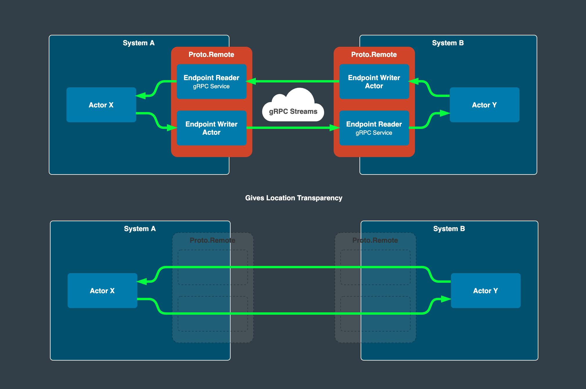
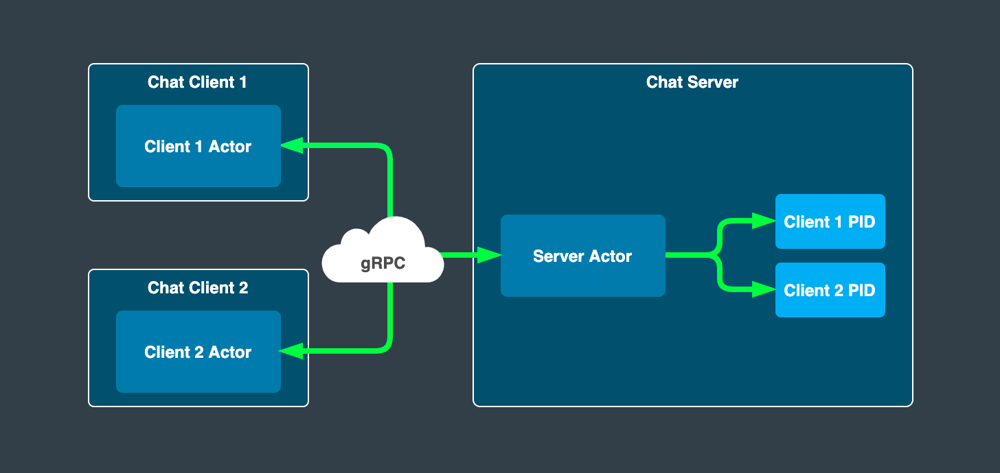

# Chat Example Using Proto.Remote

In this example, we are going to go beyond `Proto.Actor` and leverage `Proto.Remote` package in order to enable bidirectional communication between different actors in a client to server fashion.

These actors might be living inside of separate actor systems partitioned by a network (potentially located on different machines) and as a result of this, we are actually going to demonstrate how easy it is to create a basic but functional distributed system of actors by using just a couple of Proto features.

## Proto.Remote

Communication between actors living in the same actor system is a pretty straightforward and reliable task for `Proto.Actor` alone to accomplish but bringing the network into play is a whole different ball game.\
As soon as we connect two machines together via the network we delve into the world of distributed systems that are prone to all kinds of issues that simply don't exist when we are operating in the comfort of a single monolithic application.

To learn more about this, you can read about the fallacies of distributed computing [here](https://en.wikipedia.org/wiki/Fallacies_of_distributed_computing).

What `Proto.Remote` does for us is that it abstracts many of these issues away from us (such as serialization and communication over the network) and lets us concentrate on the important thing, which is our application and our problem domain. It offers what is called `location transparency` that enables us to treat communication between actors on different machines the same as communication between actors in the local system by using nothing more than simple process `PIDs`.

If your mind is a bit twisted by now, check out the sketch below:



As stated by the founder of Proto.Actor Roger Johansson:

> `Proto.Remote` manages all the complexity of connections and message serialization, making it so that client actor and server actor believe they are talking directly to each other.

### gRPC

The way `Proto.Remote` accomplishes this is by using `gRPC` as an underlying transport that like we already mentioned deals with the messy networking details of service to service communication. Without going further into details it suffices to say that it leverages HTTP2 protocol streaming capability that in turn enables bidirectional streaming between clients and servers.

Another very powerful aspect of `gRPC` is that it enables us to combine clients and servers (different actor systems) written using different programming languages. So for example you might have one actor system written in `Go` and another using `C#` and they would seamlessly communicate with each other.

You can read more about `gRPC` [here](https://grpc.io/).

### Protocol Buffers

The main ingredient of gRPC are [Protocol Buffers](https://developers.google.com/protocol-buffers) aka `Protobuf`.
Protobuf is an interface definition language that enables us to define contracts between services (messages and endpoints) in a language natural fashion.\
We can then take these contracts and use gRPC in order to generate clients and servers in different languages and take care of all of the underlying transport mechanism and serialization/deserialization of those messages.

## High-Level Overview of Our Chat Example

You can find the example on github [here](https://github.com/aneshas/protoactor-dotnet/tree/chat-example-refactor/examples/Chat).

As shown in the picture, our chat example will consist of client and server actors distributed over the network communicating via `Proto.Remote` library.

Since client and server parts of our example are in a client/server relationship (duh), each client actor will initiate a connection request towards the server by using its `PID` and in fact use the server as a kind of service.

The server in turn will keep track of all client PIDs and use them in order to be able to broadcast incoming messages in a fan-out fashion to all known clients (including the sender).

## Protobuf Chat Messages

So, now that we know how `gRPC` and `Protobuf` enable us to communicate between different actor systems, the first thing we need to do is to define our contracts (actor messages) using protobuf IDL.

```protobuf
syntax = "proto3";
package messages;
option csharp_namespace = "chat.messages";

import "Proto.Actor/Protos.proto";

message Connect
{
	actor.PID Sender = 1;
}

message Connected {
    string Message = 1;
}

message SayRequest {
    string UserName = 1;
    string Message = 2;
}

message SayResponse {
    string UserName = 1;
    string Message = 2;
}

message NickRequest {
    string OldUserName = 1;
    string NewUserName = 2;
}

message NickResponse {
    string OldUserName = 1;
    string NewUserName = 2;
}
```

As you see, the language itself is pretty straight forward but in order to fully understand it, you can read more about it [here](https://developers.google.com/protocol-buffers/docs/overview).

For now, it is enough to say that based on these protobuf definitions, libraries containing message classes will be autogenerated in our respective languages (in this case C#) which we can then use reference from our client and server implementations.

## Server

You can find the complete server example [here](https://github.com/aneshas/protoactor-dotnet/tree/chat-example-refactor/examples/Chat/Server).

In the next couple of sections, we are going to dissect it piece by piece.

### Creating an Actor System

First we need to initialize and start our actor system and remote which is accomplished by following lines of code located in `InitializeActorSystem` method in the server assembly.



```csharp
var config =
    BindToLocalhost(8000)
        .WithProtoMessages(ChatReflection.Descriptor);

var system
    = new ActorSystem()
        .WithRemote(config);

system
    .Remote()
    .StartAsync();

context = system.Root;
```



The magic happens on the first lines where we use `BindToLocalhost` method from `Proto.Remote.GrpcCore.GrpcCoreRemoteConfig` static class which creates `Proto.Remote` configuration that binds to `localhost` address on port 8000 and chaining `WithProtoMessages` we tell the config factory where to find the fore mentioned auto-generated messages from our protobuf definition which are in this case located in `chat.messages` namespace.

Next, we simply start the system and make a note of the root context for later usage.

After this, the server will be ready to accept connections on `localhost:8000` and enable us to receive messages from remote actor systems.

Easy as that.

### Overview of Server Actor




```csharp
var clients = new HashSet<PID>();

context.SpawnNamed(
    Props.FromFunc(
        ctx => {
            switch (ctx.Message)
            {
                case Connect connect:
                    Console.WriteLine($"Client {connect.Sender} connected");

                    clients.Add(connect.Sender);

                    ctx.Send(
                        connect.Sender,
                        new Connected
                        {
                            Message = "Welcome!"
                        }
                    );
                    break;
                case SayRequest sayRequest:
                    foreach (var client in clients)
                    {
                        ctx.Send(
                            client,
                            new SayResponse
                            {
                                UserName = sayRequest.UserName,
                                Message = sayRequest.Message
                            }
                        );
                    }

                    break;
                case NickRequest nickRequest:
                    foreach (var client in clients)
                    {
                        ctx.Send(
                            client,
                            new NickResponse
                            {
                                OldUserName = nickRequest.OldUserName,
                                NewUserName = nickRequest.NewUserName
                            }
                        );
                    }

                    break;
            }

            return Task.CompletedTask;
        }
    ),
    "chatserver"
);
```



For this example, we are going to use a quick and convenient way of creating an actor from a function which is provided by `Props.FromFunc` method. We are going to spawn the actor in the root context (the top-level actor system).

The actor func takes closure over the `clients` hash set which is used to keep track of all connected clients.\
Each time a connection request is received via `Connected` message, the incoming client `PID` is added to the set and a response message is sent back to the sender.

When a `SayRequest` message is received, the response is broadcasted back to all clients via `SayResponse` message. A similar thing happens with `NickRequest` message which is used to change the nick of the user and is then also sent back to all clients in the same fan-out fashion.

## Client


As shown in the picture, the task of the client application is to read command messages from the command line, parse and transform them into chat command messages which are then serialized and sent over the network by `Proto.Remote` and its underlying `gRPC` implementation.

You can find the complete client example [here](https://github.com/aneshas/protoactor-dotnet/tree/chat-example-refactor/examples/Chat/Client)
where you can see that the client side is a tad bit more involved, but nothing too fancy. Let's go over the important parts piece by piece.

### Creating an Actor System

Same as before, we will initialize and start our actor system and remote.



```csharp
var config =
    BindToLocalhost()
        .WithProtoMessages(ChatReflection.Descriptor);

var system =
    new ActorSystem()
        .WithRemote(config);

system
    .Remote()
    .StartAsync();

context = system.Root;
```



The way we do this is pretty much the same as with our server example except we are not providing port number for our client remote configuration. The port will come into play later when we resolve the server `PID`. (see below)

### Overview of Client Actor




```csharp
client = context.Spawn(
    Props.FromFunc(
        ctx => {
            switch (ctx.Message)
            {
                case Connected connected:
                    Console.WriteLine(connected.Message);
                    break;
                case SayResponse sayResponse:
                    Console.WriteLine($"{sayResponse.UserName} {sayResponse.Message}");
                    break;
                case NickResponse nickResponse:
                    Console.WriteLine($"{nickResponse.OldUserName} is now {nickResponse.NewUserName}");
                    break;
            }

            return Task.CompletedTask;
        }
    )
);
```



You can notice that the client actor is pretty straightforward in that it only listens to messages sent by the server and writes them out to console.\

Now let's take a look at how we can resolve the server `PID` and establish a connection to it.

### Resolving Server PID

Resolving server `PID` is as easy as calling `FromAddress` factory method on `PID` class supplying it with the combination of `host:port` and the `name/id` of the server actor we spawned earlier.



```csharp
server = PID.FromAddress("127.0.0.1:8000", "chatserver");
```



Now that we have resolved and obtained the server `PID`, we are able to transparently send messages back and forth via our local actor system.

### Connecting to Server

As per our previously established protobuf contract, we initiate a connection to the server by sending the initial `Connect` message which contains the `PID` of our client actor, which will subsequently be used by the server actor to respond to us thus establishing a two-way connection.



```csharp
context.Send(
    server,
    new Connect
    {
        Sender = client
    }
);
```




### Parsing and Sending Command Messages




```csharp
var nick = "Alex";

while (true)
{
    var text = Console.ReadLine();

    if (string.IsNullOrWhiteSpace(text))
        continue;

    if (text.Equals("/exit"))
        return;

    if (text.StartsWith("/nick "))
    {
        var t = text.Split(' ')[1];

        context.Send(
            server,
            new NickRequest
            {
                OldUserName = nick,
                NewUserName = t
            }
        );

        nick = t;

        continue;
    }

    context.Send(
        server,
        new SayRequest
        {
            UserName = nick,
            Message = text
        }
    );
}
```




This is the main loop of the client program in which we listen for user input from the command line and try to make sense of it (parse it).

We basically have only a few cases here:

First, we simply ignore hitting the return key by doing nothing.

Next, we check if the user has entered an exit command. If that's the case, we return from our main loop which in turn ends our program and shuts down the actor system.

If the user tries to change the default nick by using /nick command, we parse the new nick, pack it inside of `NickRequest` message and send it over to the server via our root context. Notice how we transparently send the message here by only providing the server `PID` and the message it self is then automatically routed to the correct actor by Proto.Remote.

At last, if the user types in some unstructured text we it is a chat message pass it along as such to the server via SayRequest message. Remember that we wired up our client actor to receive messages from the server and print them out to the console.

## Go Example

As stated before, client and server might as well be built using different languages and interact with each other just as well. In fact, there is the same chat example written in `Go` hosted here.

This brings us to the end of the tour of our chat example. Hope you enjoyed it.

## Useful Links

- [Proto.Remote](/docs/remote/)
- [gRPC](https://grpc.io/)
- [Protocol Buffers](https://developers.google.com/protocol-buffers)
- [Actor Context](/docs/context/)
