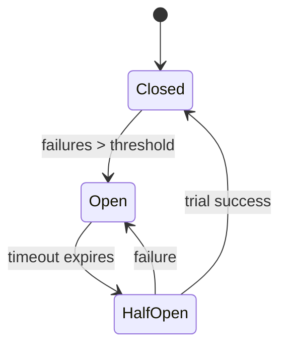
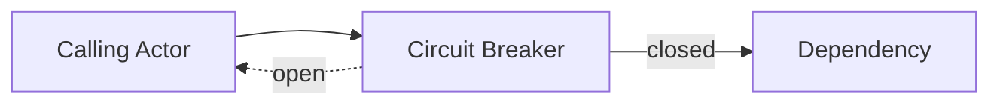

# Circuit Breaker Pattern

A circuit breaker prevents a failing dependency from overwhelming the system. When error rates exceed a threshold the breaker "opens" and short‑circuits requests until the dependency recovers.

## State Transitions


## Why Use It?
Remote calls may hang or fail rapidly. Without protection, actors waiting on those calls can pile up and consume resources.

## Implementing in Proto.Actor
Wrap outbound requests in a circuit breaker component. On failure, record the error and temporarily reject new requests. After a cool‑down period allow a limited number of trial requests; if they succeed the breaker closes.

## Interaction


## Example
The snippet below shows a minimal circuit breaker actor. It tracks consecutive failures
and transitions between **Closed**, **Open**, and **HalfOpen**. This example can be
adapted or extended for production use.

```csharp
using System;
using System.Threading;
using System.Threading.Tasks;
using Proto;

public sealed class ServiceUnavailable
{
    public string Reason { get; }
    public ServiceUnavailable(string reason = "Circuit open or call failed") => Reason = reason;
}

public enum CircuitState { Closed, Open, HalfOpen }

public sealed class HalfOpenTrigger { } // internal signal

public sealed class CircuitBreakerActor : IActor
{
    private readonly PID _target;
    private readonly int _failureThreshold;
    private readonly TimeSpan _openDuration;       // how long to stay Open
    private readonly TimeSpan _perCallTimeout;     // timeout for each request
    private readonly Func<object, bool>? _isFailureReply;

    private CircuitState _state = CircuitState.Closed;
    private int _consecutiveFailures = 0;
    private bool _trialInFlight = false;

    public CircuitBreakerActor(
        PID target,
        int failureThreshold,
        TimeSpan openDuration,
        TimeSpan perCallTimeout,
        Func<object, bool>? isFailureReply = null)
    {
        _target = target;
        _failureThreshold = Math.Max(1, failureThreshold);
        _openDuration = openDuration <= TimeSpan.Zero ? TimeSpan.FromSeconds(30) : openDuration;
        _perCallTimeout = perCallTimeout <= TimeSpan.Zero ? TimeSpan.FromSeconds(5) : perCallTimeout;
        _isFailureReply = isFailureReply;
    }

    public Task ReceiveAsync(IContext context) => context.Message switch
    {
        HalfOpenTrigger => OnHalfOpenTrigger(context),
        _                 => OnUserMessage(context, context.Message!)
    };

    private Task OnHalfOpenTrigger(IContext context)
    {
        if (_state == CircuitState.Open)
        {
            _state = CircuitState.HalfOpen;
            _trialInFlight = false;
        }
        return Task.CompletedTask;
    }

    private async Task OnUserMessage(IContext context, object msg)
    {
        if (_state == CircuitState.Open)
        {
            context.Respond(new ServiceUnavailable("Circuit is open"));
            return;
        }

        if (_state == CircuitState.HalfOpen && _trialInFlight)
        {
            context.Respond(new ServiceUnavailable("Half-open: trial already in flight"));
            return;
        }

        var replyTo = context.Sender;
        var isTrial = _state == CircuitState.HalfOpen;
        if (isTrial) _trialInFlight = true;

        object? reply = null;
        bool success = false;

        try
        {
            using var cts = new CancellationTokenSource(_perCallTimeout);
            reply = await context.RequestAsync<object>(_target, msg, cts.Token).ConfigureAwait(false);
            success = _isFailureReply?.Invoke(reply) != true;
        }
        catch (OperationCanceledException)
        {
            success = false;
        }
        catch
        {
            success = false;
        }

        if (success)
        {
            _consecutiveFailures = 0;
            if (_state == CircuitState.HalfOpen)
            {
                _state = CircuitState.Closed;
                _trialInFlight = false;
            }
            context.Respond(reply!);
            return;
        }

        _consecutiveFailures++;

        if (_state == CircuitState.HalfOpen)
        {
            Open(context);
            _trialInFlight = false;
        }
        else if (_state == CircuitState.Closed && _consecutiveFailures >= _failureThreshold)
        {
            Open(context);
        }

        context.Respond(new ServiceUnavailable(
            _state == CircuitState.Open ? "Circuit opened" : "Call failed"));
    }

    private void Open(IContext context)
    {
        _state = CircuitState.Open;
        _trialInFlight = false;
        var delay = Task.Delay(_openDuration);
        context.ReenterAfter(delay, _ =>
        {
            if (_state == CircuitState.Open)
                context.Self.Tell(new HalfOpenTrigger());
            return Task.CompletedTask;
        });
    }
}

// Usage
var system = new ActorSystem();

var targetPid  = system.Root.Spawn(Props.FromProducer(() => new TargetActor()));
var breakerPid = system.Root.Spawn(Props.FromProducer(() =>
    new CircuitBreakerActor(
        target: targetPid,
        failureThreshold: 5,
        openDuration: TimeSpan.FromSeconds(30),
        perCallTimeout: TimeSpan.FromSeconds(3),
        isFailureReply: reply => reply is ErrorResponse // treat domain error as failure
    )));

var reply = await system.Root.RequestAsync<MyReply>(breakerPid, new MyRequest(), TimeSpan.FromSeconds(5));
```

This sample returns `ServiceUnavailable` when the circuit is open or a call fails. For
production scenarios consider adding metrics, logging, or retry policies to improve resilience.

## Middleware Example
Sometimes the circuit breaker logic can live in middleware instead of a dedicated actor. The middleware below tracks consecutive failures and temporarily rejects messages while the circuit is open.

```csharp
using System;
using System.Threading;
using System.Threading.Tasks;
using Proto;

public sealed class ServiceUnavailable
{
    public string Reason { get; }
    public ServiceUnavailable(string reason = "Circuit open") => Reason = reason;
}

public enum CircuitState { Closed, Open, HalfOpen }

public static class CircuitBreakerMiddleware
{
    /// <summary>
    /// Create a receive-middleware circuit breaker.
    /// Counts handler exceptions as failures and optionally classifies requests as failures.
    /// </summary>
    public static ReceiveMiddleware Create(
        int failureThreshold = 5,
        TimeSpan? openDuration = null,
        Func<object, bool>? isFailureRequest = null)
    {
        var _failureThreshold = Math.Max(1, failureThreshold);
        var _openDuration = openDuration is { } od && od > TimeSpan.Zero ? od : TimeSpan.FromSeconds(30);

        var _state = CircuitState.Closed;
        var _consecutiveFail = 0;
        var _trialAllowed = true;
        CancellationTokenSource? _cooldownCts = null;

        void Open()
        {
            _state = CircuitState.Open;
            _trialAllowed = false;

            _cooldownCts?.Cancel();
            _cooldownCts = new CancellationTokenSource();
            var token = _cooldownCts.Token;

            _ = Task.Run(async () =>
            {
                try
                {
                    await Task.Delay(_openDuration, token).ConfigureAwait(false);
                    if (!token.IsCancellationRequested)
                    {
                        _state = CircuitState.HalfOpen;
                        _trialAllowed = true; // first request gets through
                    }
                }
                catch (OperationCanceledException) { }
            }, token);
        }

        void OnSuccess()
        {
            _consecutiveFail = 0;
            if (_state == CircuitState.HalfOpen)
            {
                _state = CircuitState.Closed;
                _trialAllowed = true;
            }
        }

        void OnFailure()
        {
            _consecutiveFail++;
            if (_state == CircuitState.HalfOpen)
            {
                Open();
                return;
            }

            if (_state == CircuitState.Closed && _consecutiveFail >= _failureThreshold)
            {
                Open();
            }
        }

        return next => async (context, message) =>
        {
            if (message is ISystemMessage || message is LifecycleEvent)
            {
                await next(context, message).ConfigureAwait(false);
                return;
            }

            if (_state == CircuitState.Open)
            {
                context.Respond(new ServiceUnavailable("Circuit is open"));
                return;
            }

            if (_state == CircuitState.HalfOpen && !_trialAllowed)
            {
                context.Respond(new ServiceUnavailable("Half-open: trial already in flight"));
                return;
            }

            var upfrontFail = isFailureRequest?.Invoke(message) == true;
            if (upfrontFail)
            {
                OnFailure();
                context.Respond(new ServiceUnavailable("Rejected by circuit rule"));
                return;
            }

            var isTrial = _state == CircuitState.HalfOpen && _trialAllowed;
            if (isTrial) _trialAllowed = false;

            try
            {
                await next(context, message).ConfigureAwait(false);
                OnSuccess();
            }
            catch
            {
                OnFailure();
                context.Respond(new ServiceUnavailable("Handler failed"));
            }
        };
    }
}
```

Usage mirrors normal props creation; the sender remains unaware of the circuit breaker:

```csharp
var targetProps = Props
    .FromProducer(() => new TargetActor())
    .WithReceiverMiddleware(
        CircuitBreakerMiddleware.Create(
            failureThreshold: 5,
            openDuration: TimeSpan.FromSeconds(30),
            isFailureRequest: null // or msg => msg is Ping { ShouldFail = true }
        ));

var targetPid = system.Root.Spawn(targetProps);

var reply = await system.Root.RequestAsync<MyReply>(targetPid, new MyRequest(), TimeSpan.FromSeconds(5));
```

## Tips
- Combine with retries and timeouts.
- Expose breaker state via metrics for observability.
- Use different breakers per dependency to avoid cascading failures.
