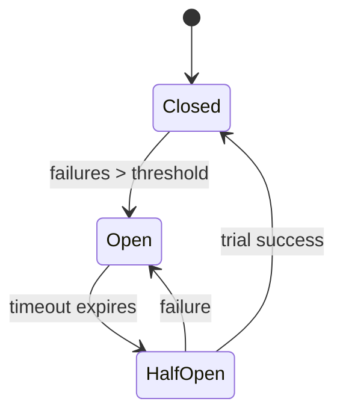
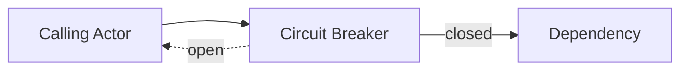

# Circuit Breaker Pattern

A circuit breaker prevents a failing dependency from overwhelming the system. When error rates exceed a threshold the breaker "opens" and short‑circuits requests until the dependency recovers.

## State Transitions


## Why Use It?
Remote calls may hang or fail rapidly. Without protection, actors waiting on those calls can pile up and consume resources.

## Implementing in Proto.Actor
Wrap outbound requests in a circuit breaker component. On failure, record the error and temporarily reject new requests. After a cool‑down period allow a limited number of trial requests; if they succeed the breaker closes.

## Interaction


## Example
```cs
var breaker = new CircuitBreaker(5, TimeSpan.FromSeconds(30));
if(!breaker.TryExecute(() => context.RequestAsync(target, msg)))
{
    context.Respond(new ServiceUnavailable());
}
```
The code above rejects requests when more than five consecutive failures occur.

## Tips
- Combine with retries and timeouts.
- Expose breaker state via metrics for observability.
- Use different breakers per dependency to avoid cascading failures.
