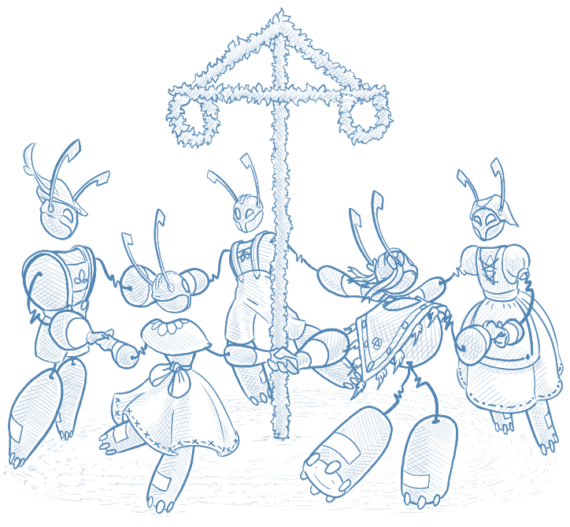
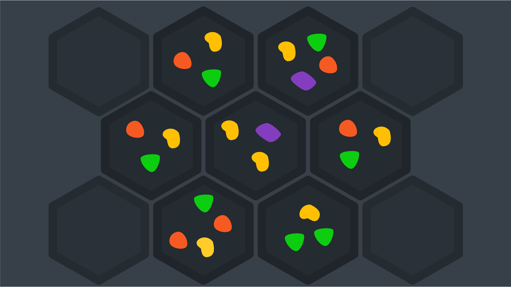
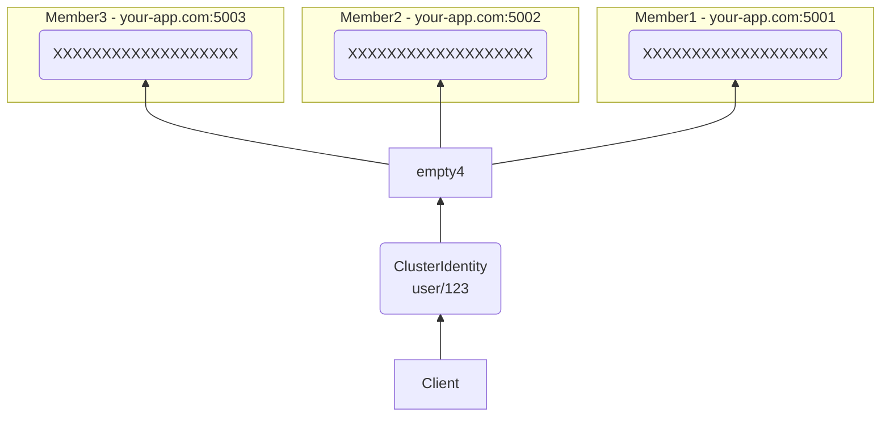
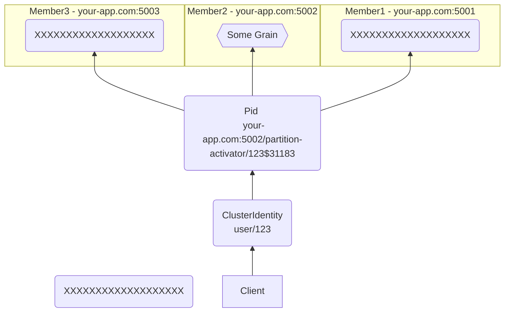
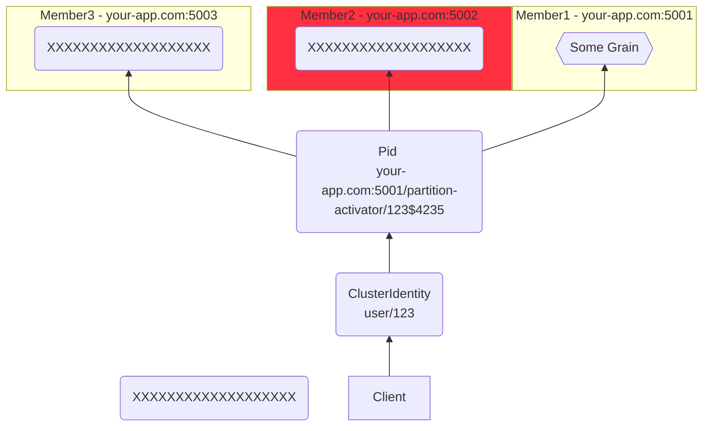
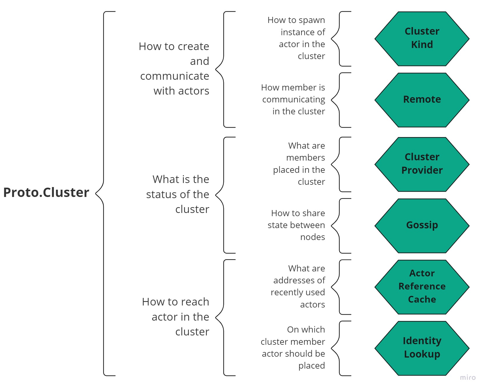

# Proto.Cluster

<small>[Homage to Proto.Actors Swedish roots, Swedish midsummer ring dance - Connected Cluster Actors]</small>

## Example Source Code

Working cluster examples are available on GitHub:

- [.NET cluster example](https://github.com/asynkron/protoactor-dotnet/tree/dev/examples/ClusterGrainHelloWorld)
- [Go cluster example](https://github.com/asynkron/protoactor-go/tree/dev/examples/cluster-basic)

## Virtual Actors, aka. Grains

Proto.Cluster leverages the _"Virtual Actor Model"_, pioneered by Microsoft Orleans.
Unlike the traditional Actor Model used in Erlang or Akka, where developers must manage actor lifecycles, placement, and failures, the virtual actor model focuses on ease of use and high availability, abstracting most complexity away from the developer.

> The Microsoft Orleans website describes this as _A straightforward approach to building distributed, high-scale applications in .NET_.

**Proto.Actor** combines this way of clustering, with the traditional actor model to combine the best of both worlds.
This allows us to create huge clusters of stateful services where the virtual actors acts as entry points which in turn can contain entire graphs of local actors.

This offers us a unique way to optimize for data locality, while still offering ease of use at scale.

Just like everything else in Proto.Actor where we have reused proven technologies such as Protobuf and gRPC, we do the same for clustering, we do not reinvent the wheel and create our own cluster mechanics.
Instead, we leverage proven technologies such as Consul, ETCD or Kubernetes to power our Cluster member management.

The short version of what virtual actors are, is that they are abstractions on top of plain actors.
They are spawned _somewhere_ in your cluster, and their lifecycle is managed by the cluster instead of you.

This means that you as a developer, don't have to care or know if the actor already exists or where it exists.
You address it using its kind and identity and the cluster does the rest for you.

## Grains vs actors

Let's break down how grains differ from actors:

- **They are referenced by cluster identities, not PIDs**. A cluster identity uniquely identifies a grain. It consists of a _kind_ and an _identity_. Some examples: `vehicle/JB007`, `vehicle/ECTO1`, `user/1`, `user/2`. Think of it as a _proxy_ to a grain.

- **They don't need to be manually spawned.** As a client, you never explicitly spawn grains - you kind of assume they're already there. Send a request to a cluster identity and it'll find its way to a grain. If a grain doesn't exist yet, it'll be spawned on the go. During the lifetime of your application, a single grain can be started and stopped multiple times. Most of the time, you don't need to care about that - you just use a cluster identity and everything else is taken care of by the cluster.

- **Their location is transparent**. As a client, you never explicitly declare on which cluster member a grain should be spawned. Also, at different points in time, the same grain might be hosted on different cluster members. Again - you just use a cluster identity and a request finds its way to a grain.

- **Communication with grains should always be request/response**. For grains to work properly, they must almost always respond to the messages they receive.

## Grain lifecycle

Let's consider the following example:

1. We're developing an application that allows us to send messages to users.
1. User is represented by grains.
1. We want to send a message to a grain with cluster identity `user/123`.

When a cluster starts, the grain `user/123` is not spawned anywhere. Nothing is stopping us from sending requests to it, though:

Since we've just sent the first request to it, the cluster spawns a grain on one of the cluster members, in this case, `Member 2`, which is hosted on `your-app.com:5002`.

The grain is spawned as an actor, which like all actors, has a PID, receives a `Started` message, etc.

Also, a request we've sent is delivered to the newly created grain.

From now on, when you send a request to this grain, its cluster identity (`user/123`) will be translated into a PID pointing to that specific host and actor (e.g. `your-app.com:5002/partition-activator/123$31183`). This is all transparent from the client's perspective.

The topology of the cluster may change over time. Let's say `Member 2` goes down. In this case, sooner or later (depending on the cluster's configuration) that grain will be respawned on a different node as a different actor (with a new PID, e.g. `your-app.com:5001/partition-activator/123$4235`). Again, this is transparent to the client.

To recap:

- At first, the grain wasn't spawned anywhere.
- Then it was spawned as an actor on Member 2.
- When Member 2 went down, it was spawned on Member 1 as a different actor.

In none of the above situations did we have to care about its state, location, or even existence. Under the hood, Proto.Cluster took care of those details. This is the reason why grains are sometimes called _virtual_ actors.

### Shutting down a grain

Grains are created automatically; however, there is no mechanism out of the box in Proto.Actor that would garbage collect them. To stop a grain you can:
* stop it in reaction to an event that should terminate its lifetime (e.g., a user disconnects from a game and no longer needs to be tracked)
* set `ReceiveTimeout` on the grain to detect inactivity, then react to the timeout message by poisoning the grain

### Activation statistics

Proto.Cluster records basic activation metrics for each grain. Recent updates also track how many times a grain has started, enabling operators to spot repeated restarts or thrashing.

## Cluster Identity

Actors are referenced by PIDs. Grains, however, should almost always be referenced by a **cluster identity**.

Cluster identity consists of:

1. **Kind** - a string describing the type of a grain in your system, e.g. `user` or `vehicle`.

1. **Identity** - a string that uniquely identifies a grain of a given kind. Usually, it corresponds to how a given concept is uniquely identified in your domain, e.g. license plate number for a vehicle, ISBN for a book, or IATA code for an airport. Sometimes it will just correspond to how an entity is identified in your system, e.g. an integer or a GUID.

Here are some examples of cluster identities:

1. `vehicle/JB007`, `vehicle/ECTO1`
1. `airport/ATL`, `airport/AMS`
1. `user/1`, `user/2`
1. `temperatureSensor/ff7e1600-ecdd-4150-80d3-17dd1074bcc0`

## Getting started

If you're new to the concept of virtual actors / grains, it's highly recommended that you take a look at a tutorial:

- [Getting Started With Grains / Virtual Actors (.NET)](cluster/getting-started-net.md)
- [Getting Started With Grains / Virtual Actors (Go)](cluster/getting-started-go.md)

## Proto.Cluster components

Proto.Cluster consists of a few main components that come together and provide virtual actor cluster functionality.

- Cluster Kind - wrapper over [Props](props.md) that instructs the cluster how to create actors

- Remote Configuration - describes how to reach member in the cluster network and how to serialize messages, more details might be found [here](remote.md)

- Cluster provider - abstraction that provides with information about available members in the cluster, more details might be found [here](cluster/cluster-providers-net.md)

- Gossip - the way how members shares information about each member's state, more details might be found [here](cluster/gossip.md)

- Actor Cache - set of recently used actor references cached in member's memory to speed up access to it

- Identity Lookup - component that is responsible for placing actor on specified member, more details might be found [here](cluster/identity-lookup-net.md)

Components join together to provide more advanced functionalities that are essential for the cluster to work correctly.

