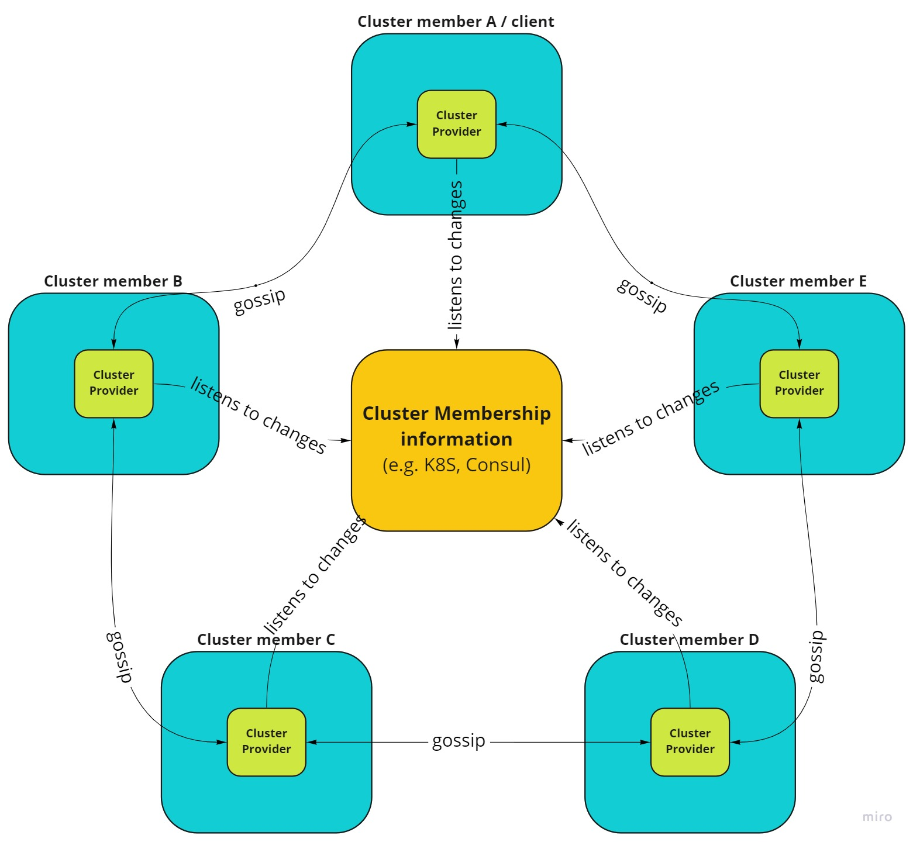

# Cluster Providers (.NET)

Cluster provider is an abstraction that provides an information about currently available members (nodes) in a cluster. Together with [gossip protocol strategy](gossip.md), it allows to resign from any leader-follower concepts in the clustering code.

Main responsibilities of cluster provider is to add new member into a cluster, monitor and notify about any member changes. These functionalities are provided in a different way depending which cluster provider is selected.

Proto.Actor continues philosophy of not reinventing the wheel again, so it is possible to choose between one of already battle tested components that provide these functionalities.

Available providers:

- [Kubernetes Provider](kubernetes-provider-net.md)
- [Consul Provider](consul-net.md)
- [Amazon ECS Provider](aws-provider-net.md)
- [Test Provider](test-provider-net.md)
- ETCD Provider
- Zookeeper Provider
- Self Managed Provider - your own implementation of [`IClusterProvider`](https://github.com/asynkron/protoactor-dotnet/blob/dev/src/Proto.Cluster/IClusterProvider.cs) interface

## Cluster Client

Cluster client is an abstraction that gives possibility to send messages to actors in a cluster. In most cases, cluster member is also a cluster client, but in some scenarios these components are split. In these cases, cluster provider has possibility to start only the cluster client.
