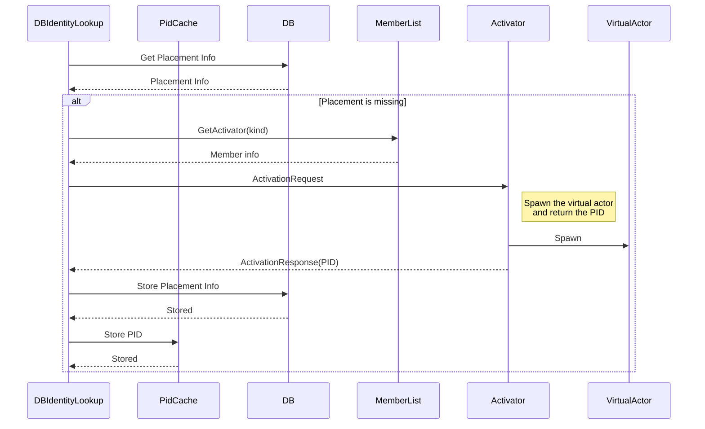

# DB Identity Lookup

This strategy uses an external database to keep information about spawned actors in the cluster. Actor's placement is first checked in the PID cache. If it is not present there then, is retrieved from the database. If actor information is not found there, then based on the [member strategy](member-strategies.md) new actor is spawned. After successful placement, information about it is saved to the database.

## Characteristics

* It limits the number of actors that need to move to a new node on topology change. Only actors hosted on the leaving member need to move.
* Activation of an actor might take 2 database calls and 1 in-cluster network hop, which increases latency.
* Adds an external dependency to the cluster.
* The database needs to be scaled separately from the cluster.
* Consistency guarantees of the database can be leveraged for ensuring that every cluster member has the same view of actor activations.

## Implementations

### Redis

```csharp
static IIdentityLookup GetRedisIdentityLookup()
{
    var multiplexer = ConnectionMultiplexer.Connect("redis_connection_string");

    return new IdentityStorageLookup(
        new RedisIdentityStorage("mycluster", multiplexer, maxConcurrency: 50)
    );
}
```

### Mongo

```csharp
static IIdentityLookup GetMongoIdentityLookup()
{
    var client = new MongoClient("mongo_connection_string");
    var db = client.GetDatabase("ClusterIdentities");
    var pidsCollection = db.GetCollection<PidLookupEntity>("pids");

    return new IdentityStorageLookup(
        new MongoIdentityStorage("mycluster", pidsCollection, maxConcurrency: 50)
    );
}
```

### Custom implementation

It is possible to add support for other databases by implementing the `IIdentityStorage` interface.

## Limiting concurrency

Too many parallels calls to the database may overload it. Load spikes are expected when cluster topology changes or rolling upgrade of the application runs. This is why the identity storage lookups allow you to specify concurrency limits. Note: these limits are scoped to a single node, so the actual global limit  is `node limit * number of nodes`.

Internally, [AsyncSemaphore](https://github.com/asynkron/protoactor-dotnet/blob/dev/src/Proto.Actor/Utils/AsyncSemaphore.cs#L12) is used to enforce the limits. It can be reused by your own implementations as well.

## Under the hood

From a consumer perspective, the IdentityLookup is called if the actor system currently has no knowledge of the location of a virtual actor. The following diagram shows how this is done in DB Identity Lookup:




