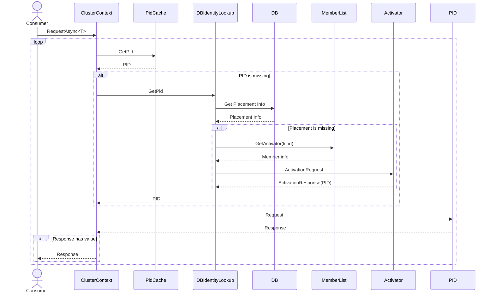

# DB Identity Lookup

This strategy uses external database to keep information about spawned actors in the cluster. Actor's placement is first checked in the cluster cache. If it is not present there then is tried to be grabbed from the database. If actor spawn information is not found there then based on actor placement strategy, new actor spawn is done. After successful placement, information about it is saved in the databse.




## Async Semaphore

To avoid too many parallel calls to the database, that might potentially kill it or cause client timeouts, it can be needed to introduce a mechanism that limits concurrency. Proto.Actor has own implementation of [AsyncSemaphore](https://github.com/asynkron/protoactor-dotnet/blob/dev/src/Proto.Actor/Utils/AsyncSemaphore.cs#L12) that protects against that. DB storage implementations have a parameter that controls concurrency level.

## Redis implementaion

```csharp

static IIdentityLookup GetRedisIdentityLookup()
{
    var multiplexer = ConnectionMultiplexer.Connect(config["RedisAddress"]);
    var redisIdentityStorage = new RedisIdentityStorage("mycluster", multiplexer, maxConcurrency: 50);

    return new IdentityStorageLookup(redisIdentityStorage);
}

```

## Mongo implementation

```csharp

static IIdentityLookup GetMongoIdentityLookup()
{
    var db = GetMongo();
    var pidsCollection = db.GetCollection<PidLookupEntity>("pids");

    var identity = new IdentityStorageLookup(
        new MongoIdentityStorage("mycluster", pidsCollection, maxConcurrency: 200)
    );
    return identity;
}

```
