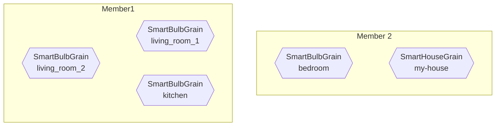

# Getting Started With Grains / Virtual Actors (.NET)

In this tutorial we will:

1. Model smart bulbs and a smart house using virtual actors/grains.
1. Run these grains in a cluster of members (nodes).
1. Send messages to and between these grains.
1. Host everything in a simple ASP.NET Core app.

The code from this tutorial is available [on GitHub](https://github.com/asynkron/protoactor-grains-tutorial).

## Setting up the project

First things first, let's get the project setup and basic configuration out of the way, so we can later focus on grains and clustering.

### Required packages

Create an ASP.NET Core Web Application named `ProtoClusterTutorial`. For simplicity, this tutorial will use a Minimal API.

We'll need the following NuGet packages:

- `Proto.Actor`
- `Proto.Remote`
- `Proto.Cluster`
- `Proto.Cluster.CodeGen`
- `Proto.Cluster.TestProvider`
- `Grpc.Tools` - for compiling Protobuf messages

This tutorial was prepared using:

- .NET 6
- Proto.Actor 1.0.0-rc1 (all `Proto.*` packages share the same version number)
- `Grpc.Tools` 2.46.1

### Base web app

Let's establish what our base web app code should look like:

`Program.cs`:

```csharp
var builder = WebApplication.CreateBuilder(args);

var app = builder.Build();

app.MapGet("/", () => Task.FromResult("Hello, Proto.Cluster!"));

app.Run();
```

Try running your app to see if everything works so far.

### Basic Proto.Cluster infrastructure and configuration

First, we'll get the basic infrastructure of the cluster going.

We need to create, configure and register an `ActorSystem` instance. To keep it clean, we will create an `IServiceCollection` extension in another file to do that:

`ActorSystemConfiguration.cs`:

```csharp
using Proto;
using Proto.Cluster;
using Proto.Cluster.Partition;
using Proto.Cluster.Testing;
using Proto.DependencyInjection;
using Proto.Remote;
using Proto.Remote.GrpcNet;

namespace ProtoClusterTutorial;

public static class ActorSystemConfiguration
{
    public static void AddActorSystem(this IServiceCollection serviceCollection)
    {
        serviceCollection.AddSingleton(provider =>
        {
            // actor system configuration

            var actorSystemConfig = ActorSystemConfig
                .Setup();

            // remote configuration

            var remoteConfig = GrpcNetRemoteConfig
                .BindToLocalhost();

            // cluster configuration

            var clusterConfig = ClusterConfig
                .Setup(
                    clusterName: "ProtoClusterTutorial",
                    clusterProvider: new TestProvider(new TestProviderOptions(), new InMemAgent()),
                    identityLookup: new PartitionIdentityLookup()
                );

            // create the actor system

            return new ActorSystem(actorSystemConfig)
                .WithServiceProvider(provider)
                .WithRemote(remoteConfig)
                .WithCluster(clusterConfig);
        });
    }
}
```

Now we can register it in our web app:

`Program.cs`:

```csharp
builder.Services.AddActorSystem();
```

It is also suggested to turn on Proto.Actor logging. It will help with resolving any issue we encounter. To do that, resolve `ILoggerFactory` dependency in `Program.cs` and use it for Proto.Actor logging config.

```csharp
...

var app = builder.Build();

var loggerFactory = app.Services.GetRequiredService<ILoggerFactory>();
Proto.Log.SetLoggerFactory(loggerFactory);

...

```

Let's go through each configuration section one by one:

#### Actor System configuration

This is a standard Proto.Actor configuration. It's out of the scope for this tutorial; if you want to learn more, you should check out the [Actors](../actors.md) section of Proto.Actor's documentation.

#### Remote configuration

Proto.Cluster uses Proto.Remote for transport. Again, its configuration is out of scope for this tutorial; if you want to learn more, you should check out the [Remote](../remote.md) section of Proto.Actor's documentation.

#### Cluster configuration

This is where we configure Proto.Cluster. Let's explain its parameters:

1. `clusterName` - any name will do.
1. `clusterProvider` - a Cluster Provider is an abstraction that provides information about currently available members (nodes) in a cluster. Since right now our cluster only has one member, it's ok to use a [Test Provider](test-provider-net.md).
   Later we will switch to other implementations, like [Consul Provider](consul-net.md) or [Kubernetes Provider](kubernetes-provider-net.md). You can read more about Cluster Providers [here](cluster-providers-net.md).
1. `identityLookup` - an Identity Lookup is an abstraction that allows a cluster to locate grains. `PartitionIdentityLookup` is generally a good choice for most cases. You can read more about Identity Lookup [here](identity-lookup-net.md).

### Cluster object

Most of the time we'll want to interact with the cluster, we will use a `Cluster` object. You can get it from an `ActorSystem` instance:

```csharp
using Proto;
using Proto.Cluster;

// ...

Cluster cluster = actorSystem.Cluster();
```

<!-- todo: link Cluster object documentation when available -->

### Starting a cluster member

Cluster members need to be explicitly started and shut down. You can do it in the following way:

```csharp
await _actorSystem
    .Cluster()
    .StartMemberAsync();

await _actorSystem
    .Cluster()
    .ShutdownAsync();
```

Since we're creating a web app, it's best if we start our cluster using a [hosted service](https://docs.microsoft.com/en-us/aspnet/core/fundamentals/host/hosted-services?view=aspnetcore-6.0&tabs=visual-studio):

`ActorSystemClusterHostedService.cs`:

```csharp
using Proto;
using Proto.Cluster;

namespace ProtoClusterTutorial;

public class ActorSystemClusterHostedService : IHostedService
{
    private readonly ActorSystem _actorSystem;

    public ActorSystemClusterHostedService(ActorSystem actorSystem)
    {
        _actorSystem = actorSystem;
    }

    public async Task StartAsync(CancellationToken cancellationToken)
    {
        Console.WriteLine("Starting a cluster member");

        await _actorSystem
            .Cluster()
            .StartMemberAsync();
    }

    public async Task StopAsync(CancellationToken cancellationToken)
    {
        Console.WriteLine("Shutting down a cluster member");

        await _actorSystem
            .Cluster()
            .ShutdownAsync();
    }
}
```

Register the hosted service in our web app:

`Program.cs`:

```csharp
builder.Services.AddHostedService<ActorSystemClusterHostedService>();
```

At this point, our cluster is not doing much, but it won't hurt to run it and check if nothing breaks. You should see a `Starting a cluster member` line in your app's console.

## Creating a smart bulb grain

Now that we're done with the basic configuration, it's time to implement some features.

In this tutorial, we'll use grains to model smart bulbs. Their functionality will be as follows:

1. A smart bulb has a state, which is either: "unknown", "on" or "off".
1. Initially, smart bulb's state is "unknown".
1. We can turn a smart bulb on or off, which will write a message to a console.
1. Turning a smart bulb on when it's already on or turning it off when it's already off will not do anything.

### Virtual Actors / Grains

To avoid confusion, in this tutorial we'll refer to virtual actors as grains.

To recap:

1. Grains are essentially actors, meaning they will process messages one at a time.
1. Grains are not explicitly crated (activated). Instead, they are created when they receive the first message.
1. Each grain lives in _one_ of the cluster members.
1. Grain's location is transparent, meaning we don't need to know in which cluster member grain lives to call it.
1. Communication with grains should almost always be a request/response.
1. Grains are identified by a _kind_ and _identity_, e.g. `airport`/`AMS` or `user`/`53`. It's important to distinguish kind/identity pair with an actor's ID, which in the case of grains might change between activations.

*Note: The request / response pattern is required for grain communication, because internally Proto.Actor relies on the responses to determine if the PID (actor id) it has for the grain is still valid. If it's not, the request will be retried after refreshing the PID.*

### Generating a grain

<!-- todo: link grains documentation page when it's created -->

The recommended way of creating a grain is by using a `Proto.Cluster.CodeGen` package, which generates most of the grain's boilerplate code from a `.proto` file.

You can create it manually without that package, but it's easy to make a mistake, e.g. respond to a message with a wrong type of message or not respond at all.

Read more about generating grains [here](codegen-net.md) and more about protobuf syntax [here](https://developers.google.com/protocol-buffers/docs/proto3).

Add following file to the project:

`Grains.proto`:

```protobuf
syntax = "proto3";

option csharp_namespace = "ProtoClusterTutorial";

import "google/protobuf/empty.proto";

service SmartBulbGrain {
  rpc TurnOn (google.protobuf.Empty) returns (google.protobuf.Empty);
  rpc TurnOff (google.protobuf.Empty) returns (google.protobuf.Empty);
}
```

In order for code generation to work (for both grains and messages), we need to handle them properly in the project file:

`ProtoClusterTutorial.csproj`

```xml
<ItemGroup>
    <ProtoGrain Include="Grains.proto" />
</ItemGroup>
```

`ProtoGrain` is an MSBuild task provided by `Proto.Cluster.CodeGen`.

This is a good moment to build a project and see if code generation completes successfully.

### Implementing a grain

If everything works correctly, we should implement our grain. `Proto.Cluster.Codegen` only created an abstract base class for our grain, so we need to implement it:

`SmartBulbGrain.cs`:

```csharp
using Proto;
using Proto.Cluster;

namespace ProtoClusterTutorial;

public class SmartBulbGrain : SmartBulbGrainBase
{
    private readonly ClusterIdentity _clusterIdentity;

    private enum SmartBulbState { Unknown, On, Off }
    private SmartBulbState _state = SmartBulbState.Unknown;

    public SmartBulbGrain(IContext context, ClusterIdentity clusterIdentity) : base(context)
    {
        _clusterIdentity = clusterIdentity;

        Console.WriteLine($"{_clusterIdentity.Identity}: created");
    }

    public override async Task TurnOn()
    {
        if (_state != SmartBulbState.On)
        {
            Console.WriteLine($"{_clusterIdentity.Identity}: turning smart bulb on");

            _state = SmartBulbState.On;
        }
    }

    public override async Task TurnOff()
    {
        if (_state != SmartBulbState.Off)
        {
            Console.WriteLine($"{_clusterIdentity.Identity}: turning smart bulb off");

            _state = SmartBulbState.Off;
        }
    }
}
```

<!-- todo: explain context and cluster identity -->

### Registering a grain

Remember, that grains are not activated explicitly, but rather when they receive the first message. In other words, Proto.Cluster needs to know how to create new instances of your grains. More specifically, they need be registered when configuring Cluster with a `WithClusterKind` method.

`ActorSystemConfiguration.cs`:

```csharp
var clusterConfig = ClusterConfig
    .Setup(
        clusterName: "ProtoClusterTutorial",
        clusterProvider: new TestProvider(new TestProviderOptions(), new InMemAgent()),
        identityLookup: new PartitionIdentityLookup()
    )
    .WithClusterKind(
        kind: SmartBulbGrainActor.Kind,
        prop: Props.FromProducer(() =>
            new SmartBulbGrainActor(
                (context, clusterIdentity) => new SmartBulbGrain(context, clusterIdentity)
            )
        )
    );
```

As with actors, we need to provide a `Props` describing how our grain is created.

`SmartBulbGrainActor` is another class generated by `Proto.Cluster.Codegen`, which is a wrapper for our grain code.

#### Side note: dependency injection

Suppose our grain depends on some services registered in the ASP.NET dependency injection container. At the same time the `IContext` parameter needs to be passed to grain's constructor. You could inject the services and additionally pass `context` with following code:

```csharp
// "provider" is the IServiceProvider from the serviceCollection.AddSingleton scope
Props.FromProducer(() => 
    new SmartBulbGrainActor(
        (context, clusterIdentity) => 
            ActivatorUtilities.CreateInstance<SmartBulbGrainActor>(provider, context)));

```

## Communicating with grains

### Grain client

We can communicate with grains using the `Cluster` object:

```csharp
private readonly ActorSystem _actorSystem;

public async Task TurnTheLightOnInTheKitchen(CancellationToken ct)
{
    SmartBulbGrainClient smartBulbGrainClient = _actorSystem
        .Cluster()
        .GetSmartBulbGrain(identity: "kitchen");

    await smartBulbGrainClient.TurnOn(ct);
}
```

Both `GetSmartBulbGrain` extension method and `SmartBulbGrainClient` class were generated by `Proto.Cluster.Codegen`.

Mind that `smartBulbGrainClient` is a client for a _specific_ grain, in this case, a smart bulb that's located in the kitchen.

### Smart bulb simulator

To see how grains behave in our system, we'll create a simulator that will send random messages to random smart bulbs.

We'll do that by creating another hosted service:

```csharp
using Proto;
using Proto.Cluster;

namespace ProtoClusterTutorial;

public class SmartBulbSimulator : BackgroundService
{
    private readonly ActorSystem _actorSystem;

    public SmartBulbSimulator(ActorSystem actorSystem)
    {
        _actorSystem = actorSystem;
    }

    protected override async Task ExecuteAsync(CancellationToken stoppingToken)
    {
        var random = new Random();

        var lightBulbs = new[] { "living_room_1", "living_room_2", "bedroom", "kitchen" };

        while (!stoppingToken.IsCancellationRequested)
        {
            var randomIdentity = lightBulbs[random.Next(lightBulbs.Length)];

            var smartBulbGrainClient = _actorSystem
                .Cluster()
                .GetSmartBulbGrain(randomIdentity);

            if (random.Next(2) > 0)
            {
                await smartBulbGrainClient.TurnOn(stoppingToken);
            }
            else
            {
                await smartBulbGrainClient.TurnOff(stoppingToken);
            }

            await Task.Delay(TimeSpan.FromMilliseconds(500), stoppingToken);
        }
    }
}
```

Register the simulator in `Program.cs`:

```csharp
builder.Services.AddHostedService<SmartBulbSimulator>();
```

When you ran the app, you should see console output similar to:

```log
Starting a cluster member
smart bulb simulator: turning on smart bulb 'living_room_1'
living_room_1: created
living_room_1: turning smart bulb on
smart bulb simulator: turning on smart bulb 'bedroom'
bedroom: created
bedroom: turning smart bulb on
smart bulb simulator: turning on smart bulb 'living_room_2'
living_room_2: created
living_room_2: turning smart bulb on
smart bulb simulator: turning off smart bulb 'bedroom'
bedroom: turning smart bulb off
smart bulb simulator: turning on smart bulb 'living_room_2'
```

As you can see in the first few lines, a `living_room_1` grain is created only after a first message is sent to it.

## Using custom messages

Right now communication with our grain is quite simple: both `TurnOn` and `TurnOff` methods accept and return a predefined `google.protobuf.Empty` message. In this section, we will try to receive a custom message from a grain.

### Creating a custom message

Let's say we want to get a smart bulb's state. For simplicity, let's create a `GetSmartBulbStateResponse` that only contains a smart bulb's state:

`Messages.proto`:

```protobuf
syntax = "proto3";

option csharp_namespace = "ProtoClusterTutorial";

message GetSmartBulbStateResponse {
  string state = 1;
}
```

In a project file:

`ProtoClusterTutorial.csproj`

```xml
<ItemGroup>
    <Protobuf Include="Messages.proto" />
</ItemGroup>
```

### Importing a custom message

<!-- todo: either use "grain definition file" earlier of think of sth else -->

To use this message in a grain, we need to do three things:

1. Let `Proto.Cluster.CodeGen` know where to look for messages.
1. Import these messages in a `Grains.proto` file.
1. Register that message in `Proto.Remote`.

ad 1) We need to configure the `ProtoGrain` MSBuild task by adding `AdditionalImportDirs` attribute:

`ProtoClusterTutorial.csproj`

```xml
<ItemGroup>
    <ProtoGrain Include="Grains.proto" AdditionalImportDirs="." />
</ItemGroup>
```

ad 2) We need to add the following line to the beginning `Grains.proto`:

```protobuf
import "Messages.proto";
```

ad 3) We need to use `WithProtoMessages` on `Proto.Remote` configuration:

`ActorSystemConfiguration.cs`:

```csharp
using Proto.Remote;

// ...

// remote configuration

var remoteConfig = GrpcNetRemoteConfig
    .BindToLocalhost()
    .WithProtoMessages(MessagesReflection.Descriptor);
```

### Extending a grain

Let's add a new method to our grain. It should look like this:

`Grains.proto`:

```protobuf
syntax = "proto3";

option csharp_namespace = "ProtoClusterTutorial";

import "Messages.proto";
import "google/protobuf/empty.proto";

service SmartBulbGrain {
  rpc TurnOn (google.protobuf.Empty) returns (google.protobuf.Empty);
  rpc TurnOff (google.protobuf.Empty) returns (google.protobuf.Empty);
  rpc GetState (google.protobuf.Empty) returns (GetSmartBulbStateResponse);
}
```

Implement this method:

`SmartBulbGrain.cs`

```csharp
public override Task<GetSmartBulbStateResponse> GetState()
{
    return Task.FromResult(new GetSmartBulbStateResponse
    {
        State = _state.ToString()
    });
}
```

Let's create an API method to call it:

`Program.cs`

```csharp
app.MapGet("/smart-bulbs/{identity}", async (ActorSystem actorSystem, string identity) =>
{
    return await actorSystem
        .Cluster()
        .GetSmartBulbGrain(identity)
        .GetState(CancellationToken.None);
});
```

Run the app and try navigating to `/smart-bulbs/bedroom` in your browser. You should get results similar to the following:

```json
{ "state": "On" }
```

### Side note: grain activation

Let's use this moment to emphasize how grains work. Try navigating to: `/smart-bulbs/made-up-identity` or `/smart-bulbs/xyz123`. In both cases you should get:

```json
{ "state": "Unknown" }
```

Proto.Custer will activate any grain you send a message to, even the ones you haven't anticipated. Sometimes this might require some additional handling, e.g. checking if a given identity is valid, is present in some sort of a database, etc. Proto.Actor has a built in mechanism for handling this scenario, see [ClusterKind.WithSpawnPredicate](https://github.com/asynkron/protoactor-dotnet/blob/dev/src/Proto.Cluster/ClusterKind.cs).

It's important to have this in the back of your head when designing a system using grains.

## Communicating between grains

To show how grains can communicate with each other, we'll create a new grain that will represent a smart house. It will be responsible for counting how many smart bulbs are on.
For simplicity, we'll assume there's only one smart house with identity `my-house`. Each bulb will report its status to this smart house when it changes.

### Creating a new grain

Create a definition for a new grain:

`Grains.proto`:

```protobuf
service SmartHouseGrain {
  rpc SmartBulbStateChanged (SmartBulbStateChangedRequest) returns (google.protobuf.Empty);
}
```

Define the `SmartBulbStateChangedRequest` message:

`Messages.proto`:

```protobuf
message SmartBulbStateChangedRequest {
  string smart_bulb_identity = 1;
  bool is_on = 2;
}
```

Implement the grain:

`SmartHouseGrain.cs`:

```csharp
using Proto;
using Proto.Cluster;

namespace ProtoClusterTutorial;

public class SmartHouseGrain : SmartHouseGrainBase
{
    private readonly ClusterIdentity _clusterIdentity;

    private readonly SortedSet<string> _turnedOnSmartBulbs = new();

    public SmartHouseGrain(IContext context, ClusterIdentity clusterIdentity) : base(context)
    {
        _clusterIdentity = clusterIdentity;

        Console.WriteLine($"{_clusterIdentity.Identity}: created");
    }

    public override Task SmartBulbStateChanged(SmartBulbStateChangedRequest request)
    {
        if (request.IsOn)
        {
            _turnedOnSmartBulbs.Add(request.SmartBulbIdentity);
        }
        else
        {
            _turnedOnSmartBulbs.Remove(request.SmartBulbIdentity);
        }

        Console.WriteLine($"{_clusterIdentity.Identity}: {_turnedOnSmartBulbs.Count} smart bulbs are on");

        return Task.CompletedTask;
    }
}
```

Register this grain in the cluster by calling another `WithClusterKind` on `ClusterConfig`:

`ActorSystemConfiguration.cs`:

```csharp
...
.WithClusterKind(
    kind: SmartHouseGrainActor.Kind,
    prop: Props.FromProducer(() =>
        new SmartHouseGrainActor(
            (context, clusterIdentity) => new SmartHouseGrain(context, clusterIdentity)
        )
    )
);
```

### Sending messages between grains

Again, to call a grain, we need to use a `Cluster` object. In a grain, we can get it from an `IContext` instance. In the grains generated with `Proto.Cluster.CodeGen`, it's available as a `Context` property.

Modify the smart bulb grain accordingly:

`SmartBulbGrain.cs`:

```csharp
public override async Task TurnOn()
{
    if (_state != SmartBulbState.On)
    {
        Console.WriteLine($"{_clusterIdentity.Identity}: turning smart bulb on");

        _state = SmartBulbState.On;

        await NotifyHouse();
    }
}

public override async Task TurnOff()
{
    if (_state != SmartBulbState.Off)
    {
        Console.WriteLine($"{_clusterIdentity.Identity}: turning smart bulb off");

        _state = SmartBulbState.Off;

        await NotifyHouse();
    }
}

public override Task<GetSmartBulbStateResponse> GetState()
{
    return Task.FromResult(new GetSmartBulbStateResponse
    {
        State = _state.ToString()
    });
}

private async Task NotifyHouse()
{
    await Context
        .GetSmartHouseGrain("my-house")
        .SmartBulbStateChanged(
            new SmartBulbStateChangedRequest
            {
                SmartBulbIdentity = _clusterIdentity.Identity,
                IsOn = _state == SmartBulbState.On
            },
            CancellationToken.None
        );
}
```

Try running the app. You should see console output similar to:

```log
smart bulb simulator: turning off smart bulb 'living_room_2'
living_room_2: created
living_room_2: turning smart bulb off
my-house: created
my-house: 0 smart bulbs are on
smart bulb simulator: turning on smart bulb 'bedroom'
bedroom: created
bedroom: turning smart bulb on
my-house: 1 smart bulbs are on
smart bulb simulator: turning on smart bulb 'living_room_2'
living_room_2: turning smart bulb on
my-house: 2 smart bulbs are on
```

## Running a cluster with multiple members (nodes)

To showcase how grains work in a distributed system, we're going to run two members of our example app. Additionally, `SmartBulbSimulator` will be running as a separate application.

To do that, we'll need a proper Cluster Provider. To recap, a Cluster Provider is an abstraction that provides information about currently available members in a cluster.
In other words, it tells a cluster member what are the other members, thus allowing them to communicate with one another. You can read more about Cluster Providers [here](cluster-providers-net.md).

Until now, we've been using a [Test Provider](test-provider-net.md), which is only suited for running a single-member cluster.
To run a cluster with multiple members, we'll use a [Consul Provider](consul-net.md), which, like the name suggests, utilizes [HashiCorp Consul](https://www.consul.io/).

Let's also recap, how grains work. Each grain (i.e smart bulbs and a smart house) will live in one of the cluster members:




### Consul provider

Now we can replace `TestProvider` with Consul provider.

First, we'll need to run Consul:

1. [Download Consul binaries here](https://www.consul.io/downloads).
1. Open a terminal and run the downloaded Consul binary in the development mode: `./consul agent -dev`

Let's now configure the [Consul Provider](consul-net.md) in our example.

Add `Proto.Cluster.Consul` NuGet package to the `ProtoClusterTutorial` project.

Change cluster member provider:

`ActorSystemConfiguration.cs`

```cs
var clusterConfig = ClusterConfig
    .Setup(
        clusterName: "ProtoClusterTutorial",
        clusterProvider: new ConsulProvider(new ConsulProviderConfig()),
        identityLookup: new PartitionIdentityLookup()
    )
    // ...
```

This will connect to Consul using the default port.

For more information on how to configure Consul Provider, read [the Consul provider documentation page](consul-net.md).

Run the `ProtoClusterTutorial` app to check if everything works so far. The app should not process any data since simulator is turned off.

### Running multiple members

Now we're ready to run multiple members. Start a terminal and navigate to the `ProtoClusterTutoral` project directory.

First, make sure your app is up to date:

```sh
dotnet build
```

Then we do the same for `SmartBulbSimulatorApp` project in the new terminal window:

```sh
dotnet build
```

Start the first member (in the first terminal):

```sh
dotnet run --no-build --urls "http://localhost:5161" 
```

At this point, the app shouldn't do much now, as the simulator is turned off.

Open a third terminal with `ProtoClusterTutoral` project directory, start the second member.


```bash
dotnet run --no-build --urls "http://localhost:5162"
dotnet run --no-build --urls "http://localhost:5161" ProtoRemotePort=5000 RunSimulation=false
```

After this we could observe in logs that cluster topology has changed but still the application is not doing much since simulator is off.

Back to the second terminal and run `SmartBulbSimulatorApp` app.

```bash
dotnet run --no-build --urls "http://localhost:5162" ProtoRemotePort=5001 RunSimulation=true
```

When you look at the console output, grains should be distributed between two members.

Sample output from the first member terminal:

```log
living_room_2: created
living_room_2: turning smart bulb off
bedroom: created
bedroom: turning smart bulb off
living_room_2: turning smart bulb on
living_room_2: turning smart bulb off
bedroom: turning smart bulb on
bedroom: turning smart bulb off
living_room_2: turning smart bulb on
bedroom: turning smart bulb on
...
```

Sample output from the second member terminal:

```log
living_room_1: created
living_room_1: turning smart bulb off
my-house: created
my-house: 0 smart bulbs are on
smart bulb simulator: turning off smart bulb 'living_room_1'
smart bulb simulator: turning off smart bulb 'living_room_2'
my-house: 0 smart bulbs are on
smart bulb simulator: turning off smart bulb 'kitchen'
kitchen: created
kitchen: turning smart bulb off
my-house: 0 smart bulbs are on
smart bulb simulator: turning off smart bulb 'living_room_1'
smart bulb simulator: turning on smart bulb 'kitchen'
kitchen: turning smart bulb on
my-house: 1 smart bulbs are on
smart bulb simulator: turning off smart bulb 'bedroom'
my-house: 1 smart bulbs are on
smart bulb simulator: turning on smart bulb 'living_room_2'
my-house: 2 smart bulbs are on
smart bulb simulator: turning on smart bulb 'living_room_1'
living_room_1: turning smart bulb on
my-house: 3 smart bulbs are on
...
```

This is a good opportunity to perform an experiment: turn off the first member. You should see, that all the grains from the first member should be recreated on the second member.

## Kubernetes

To see how to run the application we've been building in Kubernetes, see the [continuation of the tutorial](getting-started-kubernetes.md).

## Conclusion

Hopefully, at this point, you know how to build a cluster of grains using Proto.Actor. If you want to learn more, it's highly recommended, that you take a look at [the documentation](../_index.md), especially [the Cluster section](../cluster.md).

Thanks for your interest and good luck!
