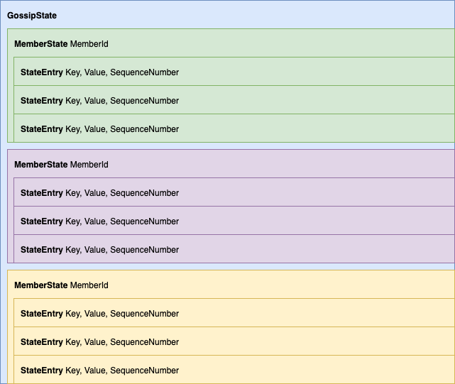
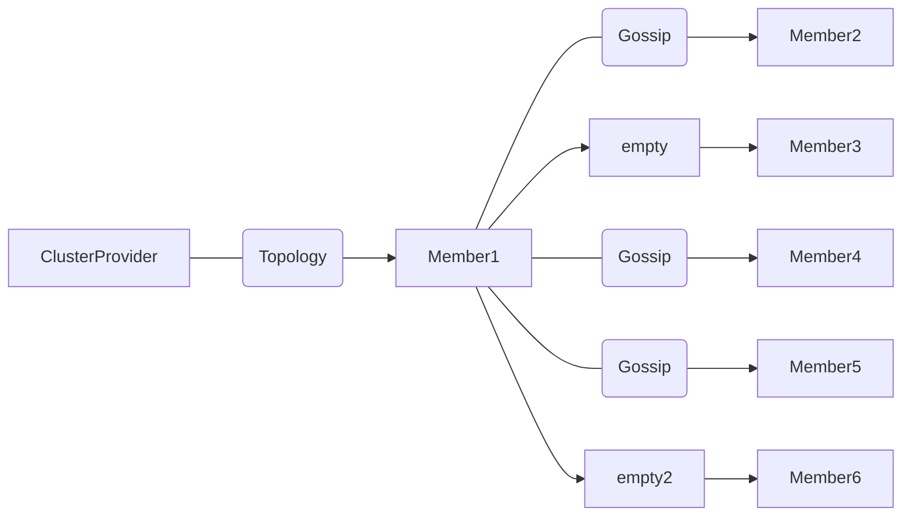

# Cluster Gossip

A **gossip protocol** is a procedure or process of computer peer-to-peer communication that is based on the way epidemics spread.Some distributed systems use peer-to-peer gossip to ensure that data is disseminated to all members of a group. Some ad-hoc networks have no central registry and the only way to spread common data is to rely on each member to pass it along to their neighbours. The term **epidemic protocol** is sometimes used as a synonym for a **gossip protocol**, as gossip spreads information in a manner similar to the spread of a virus in a biological community.


## Gossip in Proto.Actor

### GossipState

Each member has a `GossipState`, this state is made up of a dictionary of `MemberId` to `GossipMemberState` objects
`GossipMemberState` objects are in turn dictionaries of keys, system and user defined, mapping to a `Protobuf.Any` state.

This means we can have a `GossipMemberState` object for "member123".
Inside this member state object, we can have entries for known payloads.
e.g. "topology", "heartbeat", "banned-members" etc.

This state is replicated from the owner member to other members of the cluster via gossip.
State is always defined per member, allowing us to know what other members see and know.

To get a complete view of say banned-members, we could take the banned-member entry from each member, and merge those results. giving us an eventual consistent set of banned members.



### Committed Offsets

Each member has a dictionary of _committed offsets_ for itself, and all other known members.
These offsets represent the highest `SequenceNumber` this node has seen for a given key.

Keys are made up of `MemberId` and `StateEntryKey`

e.g.

- **"Member1234.topology" : 123**
- **"Member1234.heartbeat" : 567**

During the gossip transmission, the sender member will transfer a delta of all state changes from what the sender knows that the target knows, upto what the sender believes the target doesn't know.

The sender member can _know_ that some state has been transmitted to the target, we know this via the `CommittedOffsets`, the sender does not however know if any of the state after this point, has already been transmitted by any other node, unless they have gossipped this to the sender that is.


### Gossip fan-out

Gossip between member nodes occur at intervals and target members are picked at random with a selection of `ClusterConfig.GossipFanout` number of members.



### Sending user state

To set cluster state, there is a `Cluster.Gossip.SetKey(key, value)` method.
This method takes a key for the state you wish to set, e.g. "MyState" and a value, in the form of a `Protobuf.Any` message.
Once set, the cluster will start to sync this information over to other cluster members.


### Reading gossip state

```csharp
//get the heartbeat entry in the gossip state
var memberHeartbeats = await System.Cluster().Gossip.GetState<MemberHeartbeat>(GossipKeys.Heartbeat);

//create a list with tuple (MemberId, Kind, Count)
var stats = (from x in memberHeartbeats
    let memberId = x.Key
    from y in x.Value.ActorStatistics.ActorCount
    select (MemberId: memberId, Kind: y.Key, Count: y.Value))
    .ToList();
```    
