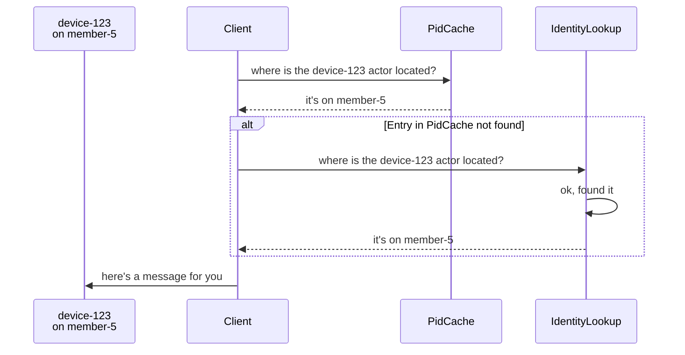
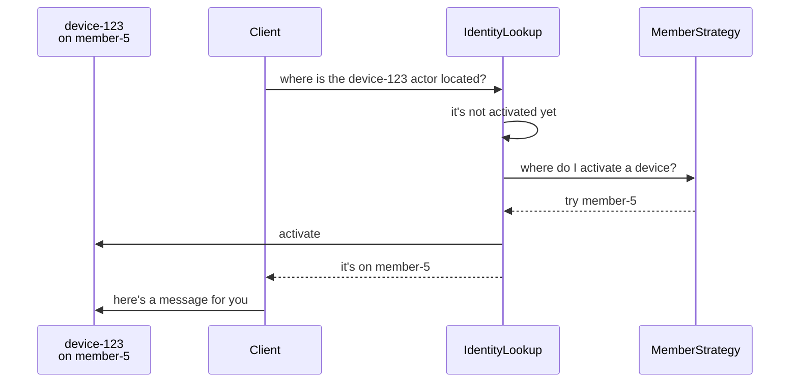

# Identity Lookup (.NET)

Identity lookup allows the Proto.Cluster to use different strategies to locate virtual actors. 

If the actor is not activated yet, it will be activated according to the [member strategy](member-strategies.md).

 Depending on the use case, different strategy will be suitable.

* [Partition Identity Lookup](partition-idenity-lookup.md) - the actor locations are partitioned and stored in memory. Each cluster member is responsible for a single partition. Use this implementation if you are unsure what fits your use case.

* [DB Identity Lookup](db-identity-lookup.md) - implementation based on an external database that stores all the actor locations.

* [Partition Activator Lookup (Experimental)](partition-activator-lookup.md) - implementation based on consistent hashing. Location is assigned by the hash function, member strategy is ignored.