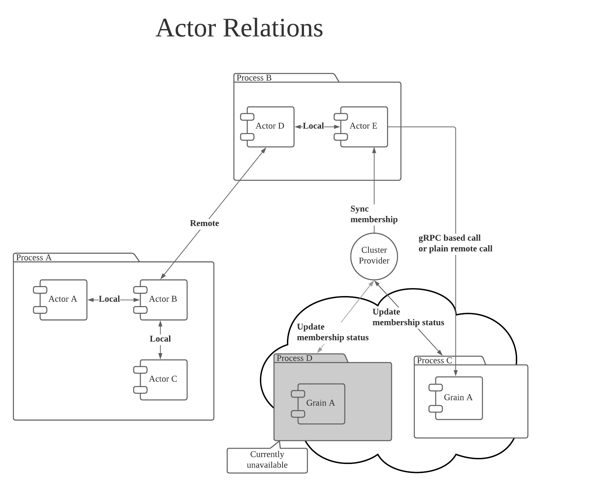
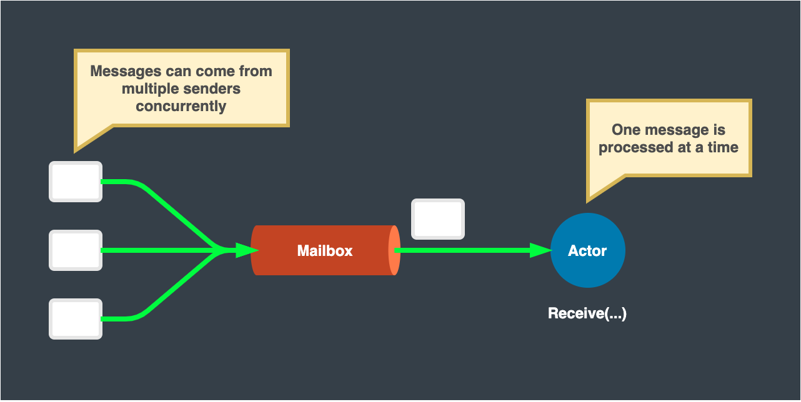
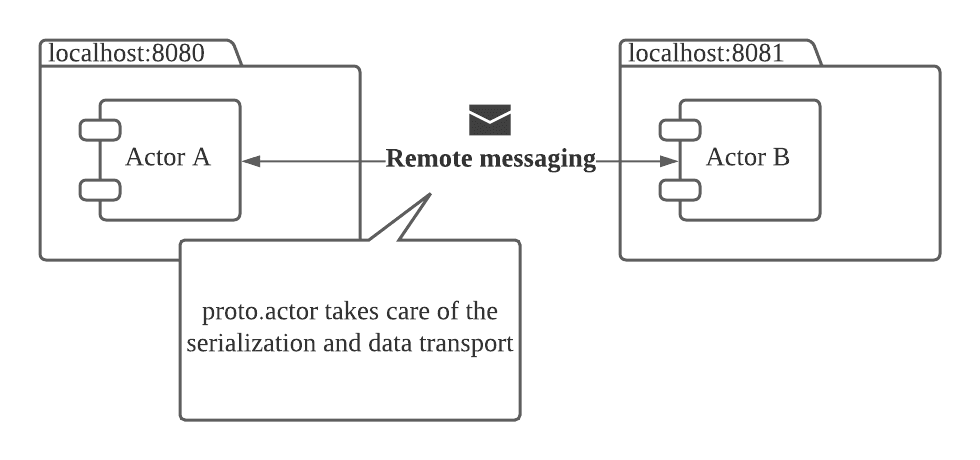
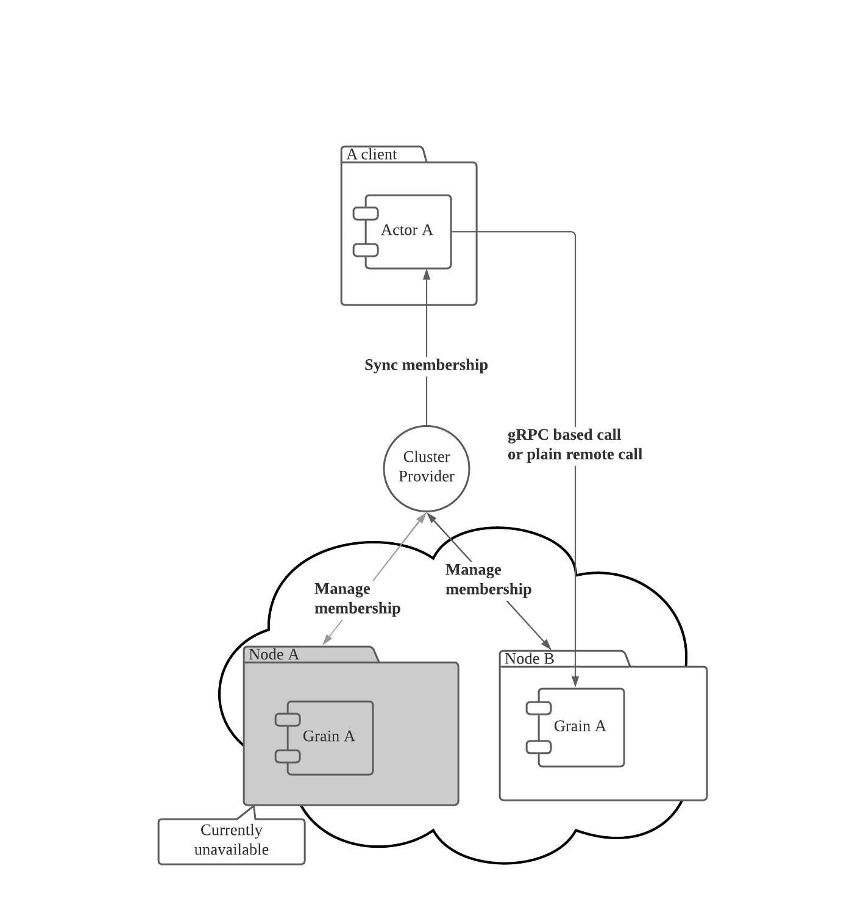
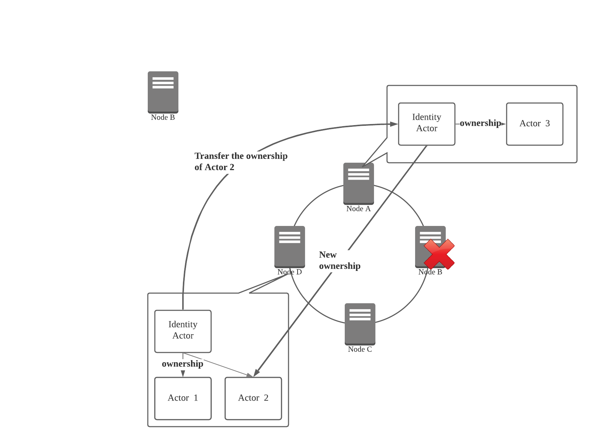
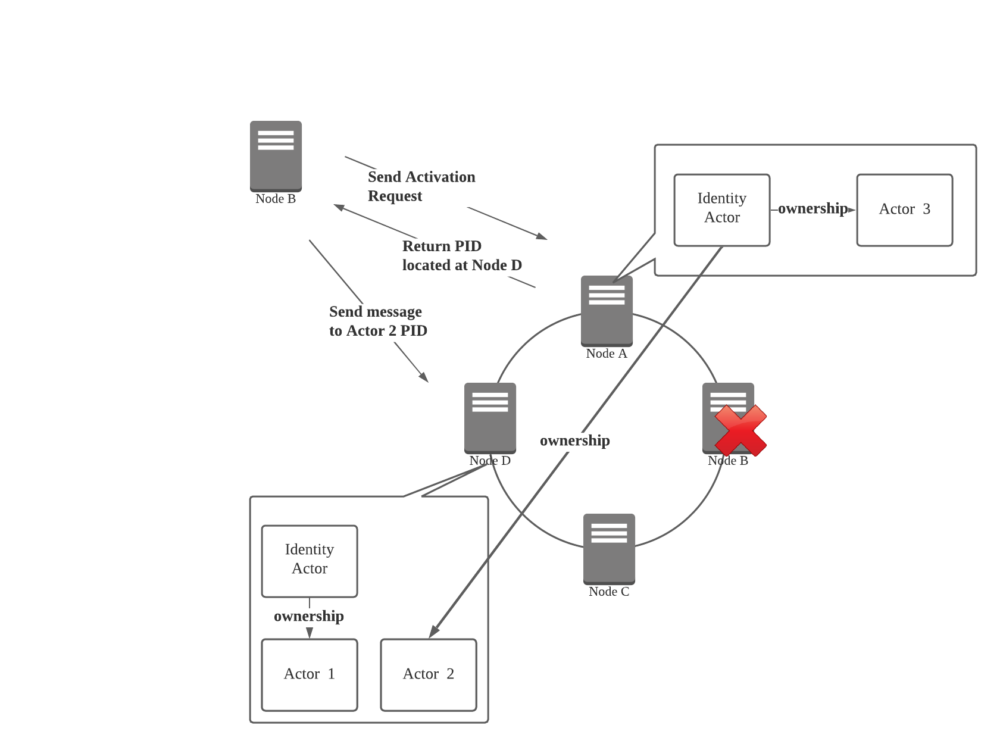
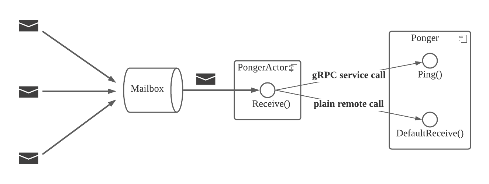

#  High Availability using Proto.Actor Clustering

# The Basic Ideas
To better understand why and when clustering architecture should be adopted, the below subsections show the benefits of actor model in general, its remoting architecture, and its clustering architecture.


## Actor Model in General
With the power of actor model, a developer has easier access to concurrent programming. The actor can keep mutable state, and its messaging queue – a mailbox – guarantees messages are passed to the actor one at a time. The actor processes a corresponding task against the receiving message, updates its mutable state, and then receives the next message. Therefore only one job is run by an actor at any moment. This solves the difficulty of concurrency and mutable states, and lets developers concentrate on business logic.



## Remoting
While actor model eases the concurrent programming with mutatable states, the system is hard to scale as long as the actor system is hosted by a single machine. Remoting is a good solution to scale out the actor system among multiple machines.

When one sends a message to a specific actor, the sender is not directly referring to the receiving actor itself. Instead, a reference to the actor is exposed to developers for messaging. This reference is called `PID`, which is short for “process id.” In Proto.Actor, the concept of “process” or “process id” is quite similar to that of Erlang. 
For those who are familiar with Akka’s actor model, `PID` can be equivalent to `ActorRef`.

This `PID` knows where the actual actor instance is located and how to communicate with it. 
The location may be within the same host machine; Maybe not. The important thing is that a sender does not have to pay extra attention to the data serialization/deserialization and data transport. 
In short, one can communicate with an actor hosted by another machine just like the way communicating with a locally hosted actor.

With such location transparency, multiple machines can collaborate with each other and work as a single actor system. This is remoting – a key to scaling out the actor system.



## Clustering
While remoting is an important feature to build a scalable actor system, there still is room to improve the actor system’s availability as a whole. 
A sender enqueues a message to the remotely hosted actor’s mailbox, but the destination host’s availability is not always guaranteed. 
A hardware outage or power outage on a specific host may occur at any moment. As a matter of fact, even a daily operation such as application deployment may lower the service availability instantaneously. 
In such a case, messaging a remotely hosted actor results in a dead letter. 
To work as a distributed actor system, all machines must always be available and ready to interact with each other, or otherwise a messaging fails. Keeping a hundred percent availability for all time is not realistic or pragmatic.

Clustering is built with a service discovery mechanism on top of the remoting feature to give extra robustness to work with the aforementioned availability issue. 
Multiple server instances work as a single cluster to provide specific types of actors. 
When one or more server instances go down, such an event is detected by the service discovery mechanism, and messages are always routed to active actors on active instances.



The following sections introduce some concepts and terms, how a specific actor is located at a specific server instance before and after a topology change, and some executable code to work with clustering.

## Concepts and Terms

### Member
When an application process joins cluster membership, the application process is explicitly called a “member” This may be effectively equal to a server instance especially when one server instance hosts one application process. However, multiple application processes can technically run on a single server instance at the same time, so there still is a difference.

### Cluster Provider
The core of clustering is cluster provider; this provides a consistent view of active nodes. Once the application process starts, the node constantly interacts with the cluster provider to update its own availability and gets other nodes’ membership status. 
With the up-to-date topology view, Proto.Actor automatically distributes actors across cluster nodes based on partitioning by consistent hash.

Proto.Actor supports several cluster provider implementations:

* **Consul - Go, .NET** … This implementation uses HashiCorp’s Consul for service discovery. This was the first implementation of cluster provider.
* **Kubernetes - .NET** … This implementation uses the Kubernetes API to watch Pod changes, and registers the cluster metadata using Pod labels.
* **etcd - Go** … This is an etcd version of cluster provider implementation. If one has experience with Kubernetes, this implementation may be easier to start with.
* **Automanaged - Go** … This does not use any centralized service discovery system, but instead each member ping each other to manage membership.
* **Zookeeper - Go** … This implementation uses Apache Zookeeper for service discovery.

### Virtual Actor
Proto.Actor’s clustering mechanism borrows the idea of “virtual actor” from Microsoft Orleans, where developers are not obligated to handle an actor’s lifecycle. If the destination actor is not yet spawned when the first message is sent, proto.actor spawns one and lets this newborn actor handle the message; if the actor is already present, the existing actor simply receives the incoming message. From message sender’s point of view, the destination actor is always guaranteed to “exist” This is highly practical and works well with the clustering mechanism. An actor’s hosting node may crash at any moment, and the messages to that actor may be redirected to a new hosting node. If a developer must be aware of the actor’s lifecycle, a developer is obligated to be aware of such topology change to re-spawn the failing actor. The concept of virtual actor hides such complexity and eases the interaction.

### Grain
With virtual actor model, an actor is sometimes called a “Grain” However, the implementation of the grain is quite the same as any other actor. A notable difference is that proto.actor automatically spawns the grain on the initial message reception.


"There are only two hard things in Computer Science: cache invalidation and naming things." -- Phil Karlton
<br/>
<br/>
Proto.Actor **generally** use the name **"Virtual Actor"** for Cluster managed actors. and **generally** use the word **"Grain"** for the code generated typed virtual actors.

This is far from perfect, but allows us to make some distinction between the different types.
<br/>
<br/>
**Sergey Bykov**, creator of Microsoft Orleans, wrote this about naming and actors:
https://dev.to/temporalio/the-curse-of-the-a-word-1o7i


### Activation
As described in the above “virtual actor” section, an actor always exists. Instead of explicitly spawning a new actor, one may “activate” the destination actor by getting the PID of the destination actor. Proto.actor internally checks the existence of the destination actor and spawns one if one is not present.

An actor may disappear when a hosting node crashes, or an actor may stop itself when an idle interval with no message reception exceeds a certain period of time. Activation works well to re-spawn such actors with no extra care.

### Passivation
Once the virtual actor is initialized by an activation, it seems to always exist, because of the nature of the virtual actor. This, however, it is not always ideal in terms of limited server resources to keep a virtual actor around forever in memory.
Proto.Actor lets a developer specify a timeout interval, where the virtual actor terminates itself when this interval passes after the last message reception time.

### Kind
To explicitly state which node is capable of providing what types of virtual actors, a developer needs to register the “kind” on cluster membership initiation. By registering the mapping of a kind and a corresponding virtual actor `Props`, the cluster provider knows the node is capable of hosting those specific kinds of actors, and the client can compute to which node it must send an activation request.

### Identity Lookup
Identity lookup (`IdentityLookup` interface), currently only exist for the .NET version of Proto.Actor.
This allows the Proto.Cluster to use different strategies to locate virtual actors.
The default, built in mechanism, is the `PartitionIdentityLookup`, which uses a distributed hashtable to locate the "Identity Owners", this is the same strategy that is used in Go, however not yet pluggable in that case.

In addition, there are also database backed IdentityLookup implementations, specifically MongoDB and Redis.
In these cases, instead of first locating the "Identity Owner" in order to locate a virtual actor in the cluster.
The system queries the database to collect this information. the data is stored in a key value fashion. where the key is the `ClusterIdentity`, meaning the Identity and the Kind of the virtual actor, together with metadata and the actual `PID` of the current activation.

This might sound as if it would introduce a lot of overhead to any interaction, however all of this information is cached and kept around until the cluster detects that it has to invalidate an entry in the cache.
This cache is called a `PidCache` and lives inside the `Cluster` instance.


The reason to make identity lookup pluggable, is that the user can then decide on what guarantees and additional tools they can leverage.
e.g. the PartitionIdentityLookup, is fast and easy to set up, but might in rare cases result in multiple activations of an actor. specifically during topology changes, and/or networking split brain scenarios.
Different databases come with different consistency guarantees and the user is then free to chose whatever tool fit their usecase.
Another additional benefit of the database backed IdentityLookups is that you can view the content in your standard development tools. e.g. view what actors exist, query, extract statistics etc from the identity lookup data in the database.


### Identity Ownership 

This section only applies to the default, partition based identity lookup;

Other than the virtual actor itself, an “identity ownership” is an important concept to understand how virtual actors are located in one specific node. The cluster’s topology view changes when a node goes down or a new node is added to the cluster membership. One may assume that virtual actor must be relocated to another node because virtual actors are distributed by using consistent hashing. That, however, is a relatively complicated task. A virtual actor may have its own state and behavior, so serializing them and transferring that information to another node is difficult.

Instead of transferring a virtual actor itself, proto.actor only transfers the “identity ownership” of the virtual actor. An owner knows where the actor is currently located. When sending a message to a specific actor, Proto.Actor calculates the location of the “identity owner” instead of the actor with consistent hashing, and then gets the actor’s address from the “identity owner”, Therefore, an owner and its subordinating actors do not necessarily exist on the same node. The later section covers how the ownership is transferred.


### Communication Protocol
Because the topology view may change at any moment and the identity ownership can be transferred at any moment as well, the fire-and-forget model of messaging may fail from time to time. For example, one may send a message to a specific grain at the same time as the topology change. The ownership could be transferred when the message is received by the previous owner node. To make sure a message is delivered to the target virtual actor, a gRPC-based communication is available.

Once an IDL file for gRPC is given, a messaging method with a retrial logic is generated by Proto.Actor. This method computes the location of the ownership and sends an activation request again when the initial messaging fails due to the aforementioned ownership transfer. This gRPC-based communication gives more robustness, but the nature of the request/response communication model may affect performance. In such a case, a developer may simply send a message with the pre-defined messaging methods such as `Context.Send()`, `Context.Request()` and `Context.RequestFuture()`-Go / `Context.RequestAsync`-.NET.

## Locating a Virtual Actor
If a developer has experience working on storage sharding, one might be familiar with the idea of consistent hashing. This is a powerful mechanism to decide in a reproducible manner which node on a virtual ring topology has the ownership of a given “key” and also requires a fewer re-location on topology change. Proto.Actor employs this algorithm to decide where the actor – more precisely the identity owner – must be located.

### Initial State
The below image describes how a grain is located. With the latest membership shared by cluster provider, a message sender computes the hash value of the destination grain and elicits where the recipient grain’s owner exists based on the partitioning by consistent hash. Once the owner’s location is known, a sender sends an activation request to the owner. The owner receives the message and sees if the grain instance already exists. If exist, then return the PID of the grain; if not, then spawn one and returns its PID. This is the simplest form of identity lookup.


### Topology Update
When the cluster membership is updated and the topology changes due to the Node B’s outage, all cluster members acquire such an event from the cluster provider. Each server instance then re-computes the hash value of its owning grains and checks if it still owns them. If a grain needs to be owned by another server instance, the ownership is transferred to the new owner. This guarantees that owners are always placed on each ideal node that is determined by consistent hashing while grain instances stay where they are currently located.



### Grain Re-activation
After the topology refresh, a sender re-computes where the owner of Actor 2 exists. This sends an activation request to the new owner – node A –, and node A returns the PID of actor 2 on node D. The sender now can send a message to actor 2 on node D. In this way, the existing grain and its internal state is not re-located on topology change; only the ownership does.




For better performance, proto.actor internally caches the location of known grains and refresh this when topology view changes.

### Messaging with a Grain
With the basics introduced in the previous sections, this section works on a project where a pinger actor sends a “ping” message and a ponger grain sends back a “pong” message. In addition to simply sending an empty signal, a ping message contains a cumulative count of the ping messages being sent; pong message contains the count a ping message contained.

Below is the detailed spec.

* Use automanaged cluster provider to minimize the implementation
* One application process hosts a pinger actor and sends a ping message every second
* Another application process hosts a ponger grain
  * This grain is capable of handling gRPC-based Ping() request and a plain message
  * This grain is initialized with a passivation interval setting of ten seconds

The complete code is located at github.com/oklahomer/protoactor-go-sender-example.

## Message Definition
Because messages are sent from one node to another over wire, they must be serializable. Proto.actor employs pre-existing, well-known Protocol Buffers for data serialization instead of inventing a new serialization protocol. Before getting started, be sure to install protoc and gogoprotobuf’s protoc-gen-gogoslick to generate Golang code. In addition to those tools, one proto.actor-specific tool is required. Run the below command to install the binary. A developer needs to specify dev branch by adding @dev at the end since this is not yet merged to master branch as of 2021-05-03.

```bash
$ go get github.com/AsynkronIT/protoactor-go/protobuf/protoc-gen-gograinv2@dev
```

Below is an example of two messages: `PingMessage` and `PongMessage`. These two message definitions are sufficient to send ping and pong messages to each other. However, a service definition is required to utilize the gRPC-based messaging. That is Ponger. Ponger lets the caller send a `Ping` message with `SendPing()` method and the receiver sends back `Pong` message.

```protobuf
syntax = "proto3";
package messages;

message PingMessage {
    uint64 cnt = 1;
}

message PongMessage {
    uint64 cnt = 1;
}

service Ponger {
    rpc Ping(PingMessage) returns (PongMessage) {}
}
```

Name this file `protos.proto` and locate under cluster/messages. When the IDL file is ready, run the below command to generate required Go code. Two files other than the IDL – `protos.pb.go` and `protos_protoactor.go` – are generated.

```bash
$ protoc --gogoslick_out=. ./cluster/messages/protos.proto
$ protoc --gograinv2_out=. ./cluster/messages/protos.proto 
$ tree ./cluster 
cluster
└── messages
    ├── protos.pb.go
    ├── protos.proto
    └── protos_protoactor.go

1 directory, 3 files
```

`protos_protoactor.go` defines Proto.actor-specific interface, struct, and function. They are covered in the below sections:

### Grain Implementation

#### PongerActor
`protos_protoactor.go` contains a Ponger.Actor struct in it, which receives the incoming message and makes a method call to the corresponding interface method from the IDL definition, or simply proxies the message to a defaut message receive method. A developer only has to provide such methods by providing Ponger implementation.



### Ponger Interface
`Ponger` interface is defined in `protos_protoactor.go`, of which a developer must provide an implementation to set up a ponger grain.



```go
// Ponger interfaces the services available to the Ponger
type Ponger interface {
	Init(id string)
	Terminate()
	ReceiveDefault(ctx actor.Context)
	Ping(*PingMessage, cluster.GrainContext) (*PongMessage, error)
	
}
```



A common method for initialization – `Init()` – is already implemented by `cluster.Grain` so a `Ponger` implementation can re-use this by embedding cluster.Grain as below:



```go
type ponger struct {
	cluster.Grain
}
```



However, `Terminate()`, `ReceiveDefault()` and `Ping()` still need to be implemented by a developer. `Terminate()` is called on passivation right before PongerActor stops and hence the subordinating ponger instance also must stop. `ReceiveDefault()` is a method to receive any message that are not expected to be handled in gRPC-like manner; `Ping()` is a method to recieve `PingMessage` and return `PongMessage` in gRPC-like manner.



```go
type ponger struct {
	cluster.Grain
}

var _ messages.Ponger = (*ponger)(nil) // This guarantees ponger implements messages.Ponger.

func (*ponger) Terminate() { 
	// A virtual actor always exists, so this usually does not terminate once the actor is initialized.
	// However, a timeout can be set so a virtual actor terminates itself when no message comes for a certain period of time.
	// Do the finalization if required.
}

func (*ponger) ReceiveDefault(ctx actor.Context) {
	// Do something with a received message. Not necessarily in request-response manner.
}

func (*ponger) Ping(ping *messages.PingMessage, ctx cluster.GrainContext) (*messages.PongMessage, error) {
	// Receive ping and return pong in gRPC-based protocol
	return nil, nil
}
```



Method implementations could be somewhat like below. Because the actor struct is already generated and exported to protos_protoactor.go by protoc-ge-gograinv2, the implementations are pretty simple.



```go
// Terminate takes care of the finalization.
func (p *ponger) Terminate() {
	// Do finalization if required. e.g. Store the current state to storage and switch its behavior to reject further messages.
	// This method is called when a pre-configured idle interval passes from the last message reception.
	// The actor will be re-initialized when a message comes for the next time.
	// Terminating the idle actor is effective to free unused server resource.
	//
	// A poison pill message is enqueued right after this method execution and the actor eventually stops.
	log.Printf("Terminating ponger: %s", p.ID())
}

// ReceiveDefault is a default method to receive and handle incoming messages.
func (*ponger) ReceiveDefault(ctx actor.Context) {
	switch msg := ctx.Message().(type) {
	case *messages.PingMessage:
		pong := &messages.PongMessage{Cnt: msg.Cnt}
		log.Print("Received ping message")
		ctx.Respond(pong)

	default:
		// Do nothing

	}
}

// Ping is a method to support gRPC Ponger service.
func (*ponger) Ping(ping *messages.PingMessage, ctx cluster.GrainContext) (*messages.PongMessage, error) {
	// The sender process is not a sending actor, but a future process
	log.Printf("Sender: %+v", ctx.Sender())

	pong := &messages.PongMessage{
		Cnt: ping.Cnt,
	}
	return pong, nil
}
```



### Overall ponger process
To activate the ponger grain, a process must be defined as below code. Comments are added to each steps.



```go
package main

import (
	"github.com/AsynkronIT/protoactor-go/actor"
	"github.com/AsynkronIT/protoactor-go/cluster"
	"github.com/AsynkronIT/protoactor-go/cluster/automanaged"
	"github.com/AsynkronIT/protoactor-go/remote"
	"log"
	"os"
	"os/signal"
	"protoactor-go-sender-example/cluster/messages"
	"time"
)

// ponger handles the incoming messages.
// This supports gRPC Ponger service and plain message handling.
type ponger struct {
	cluster.Grain
}

var _ messages.Ponger = (*ponger)(nil)

// Terminate takes care of the finalization.
func (p *ponger) Terminate() {
	// Do finalization if required. e.g. Store the current state to storage and switch its behavior to reject further messages.
	// This method is called when a pre-configured idle interval passes from the last message reception.
	// The actor will be re-initialized when a message comes for the next time.
	// Terminating the idle actor is effective to free unused server resource.
	//
	// A poison pill message is enqueued right after this method execution and the actor eventually stops.
	log.Printf("Terminating ponger: %s", p.ID())
}

// ReceiveDefault is a default method to receive and handle incoming messages.
func (p *ponger) ReceiveDefault(ctx actor.Context) {
	log.Printf("A plain message is sent from sender: %+v", ctx.Sender())

	switch msg := ctx.Message().(type) {
	case *messages.PingMessage:
		log.Print("Received ping message")
		pong := &messages.PongMessage{Cnt: msg.Cnt}
		ctx.Respond(pong)

	default:

	}
}

// Ping is called when gRPC-based request is sent against Ponger service.
func (p *ponger) Ping(ping *messages.PingMessage, ctx cluster.GrainContext) (*messages.PongMessage, error) {
	// The sender process is not a sending actor, but a future process
	log.Printf("Received Ping call from sender: %+v", ctx.Sender())

	pong := &messages.PongMessage{
		Cnt: ping.Cnt,
	}
	return pong, nil
}

func main() {
	// Setup actor system
	system := actor.NewActorSystem()

	// Register ponger constructor.
	// This is called when the wrapping PongerActor is initialized.
	// PongerActor proxies messages to ponger's corresponding methods.
	messages.PongerFactory(func() messages.Ponger {
		return &ponger{}
	})

	// Prepare remote env that listens to 8080
	// Messages are sent to this port.
	remoteConfig := remote.Configure("127.0.0.1", 8080)

	// Configure cluster provider to work as a cluster member.
	// This node uses port 6331 for cluster provider, and register itself -- localhost:6331" -- as cluster member.
	cp := automanaged.NewWithConfig(1*time.Second, 6331, "localhost:6331")

	// Register an actor constructor for the Ponger kind.
	// With this registration, the message sender and other cluster nodes know this node is capable of providing Ponger.
	// PongerActor will implicitly be initialized when the first message comes.
	clusterKind := cluster.NewKind(
		"Ponger",
		actor.PropsFromProducer(func() actor.Actor {
			return &messages.PongerActor{
				// The actor stops when 10 seconds passed since the last message reception.
				// When the next
				Timeout: 10 * time.Second,
			}
		}))
	clusterConfig := cluster.Configure("cluster-example", cp, remoteConfig, clusterKind)
	c := cluster.New(system, clusterConfig)

	// Start as a cluster member.
	// Use StartClient() when this process is not a member of cluster nodes but required to send messages to cluster grains.
	c.Start()

	// Run till signal comes
	finish := make(chan os.Signal, 1)
	signal.Notify(finish, os.Interrupt, os.Kill)
	<-finish
}
```



### Sender Implementation

#### messages.GetPongerGrainClient()

For a message sender, protos_protoactor.go provides GetPongerGrainClient() function. By calling this function, one can acquire PongerGrainClient instance to initiate gRPC request with PongerGrainClient.Ping(). Making a request in gRPC manner is preferable while the fire-and-forget messaging method such as Context.Send() also works to send message to the destination grain. The gRPC request method calls Cluster.Call to get a hold of ponger grain’s PID, where it retries up to pre-defined threshold count to get the destination PID. As introduced in “Communication Protocol” section, the ownership of the grain may transfer at the same time as one sends a message to it. Retrial logic is vital to make sure the message is actually received by the destination grain. One can pass the retry setting
The implementation can be somewhat like below:



```go
// Setup cluster
c := cluster.Configure(...)
// Get PID of ponger grain
grain := messages.GetPongerGrainClient(clustr, "ponger-1")

// Build a PingMessage payload and make a gRPC request.
ping := &messages.PingMessage{
	Cnt: 1,
}

// Explicitly define the retrial count
option := cluster.NewGrainCallOptions(c).WithRetry(3)

// Make a request and receive a response
pong, err := grain.Ping(ping, option)
```



### Overall pinger process

Below is the example code to run pinger actor.



```go
package main

import (
	"github.com/AsynkronIT/protoactor-go/actor"
	"github.com/AsynkronIT/protoactor-go/cluster"
	"github.com/AsynkronIT/protoactor-go/cluster/automanaged"
	"github.com/AsynkronIT/protoactor-go/remote"
	"log"
	"os"
	"os/signal"
	"protoactor-go-sender-example/cluster/messages"
	"time"
)

var cnt uint64 = 0

type pingActor struct {
	cluster *cluster.Cluster
	cnt     uint
}

func (p *pingActor) Receive(ctx actor.Context) {
	switch ctx.Message().(type) {
	case struct{}:
		cnt += 1
		ping := &messages.PingMessage{
			Cnt: cnt,
		}

		client := messages.GetPongerGrainClient(p.cluster, "ponger-1")
		option := cluster.NewGrainCallOptions(p.cluster).WithRetry(3)
		pong, err := client.Ping(ping, option)
		if err != nil {
			log.Print(err.Error())
			return
		}
		log.Printf("Received %v", pong)

	case *messages.PongMessage:
		// Never comes here.
		// When the pong grain responds to the sender's gRPC call,
		// the sender is not a ping actor but a future process.
		log.Print("Received pong message")

	}
}

func main() {
	// Setup actor system
	system := actor.NewActorSystem()

	// Prepare remote env that listens to 8081
	remoteConfig := remote.Configure("127.0.0.1", 8081)

	// Configure cluster on top of the above remote env
	// This node uses port 6330 for cluster provider, and add ponger node -- localhost:6331 -- as member.
	// With automanaged implementation, one must list up all known nodes at first place to ping each other.
	// Note that this node itself is not registered as a member node because this only works as a client.
	cp := automanaged.NewWithConfig(1*time.Second, 6330, "localhost:6331")
	clusterConfig := cluster.Configure("cluster-example", cp, remoteConfig)
	c := cluster.New(system, clusterConfig)
	// Start as a client, not as a cluster member.
	c.StartClient()

	// Start ping actor that periodically send "ping" payload to "Ponger" cluster grain
	pingProps := actor.PropsFromProducer(func() actor.Actor {
		return &pingActor{
			cluster: c,
		}
	})
	pingPid := system.Root.Spawn(pingProps)

	// Subscribe to signal to finish interaction
	finish := make(chan os.Signal, 1)
	signal.Notify(finish, os.Interrupt, os.Kill)

	// Periodically send ping payload till signal comes
	ticker := time.NewTicker(1 * time.Second)
	defer ticker.Stop()
	for {
		select {
		case <-ticker.C:
			system.Root.Send(pingPid, struct{}{})

		case <-finish:
			log.Print("Finish")
			return

		}
	}
}
```



## Conclusion
As illustrated in this article, clustering is a good way to scale the actor system and have higher availability. A developer can interact with actors in the same way as interacting with a local one because proto.actor takes care of locating the destination grain, grain activation, and data transport. Thanks to such architecture, a developer may concentrate on the business logic instead of designing an architecture from scratch.

