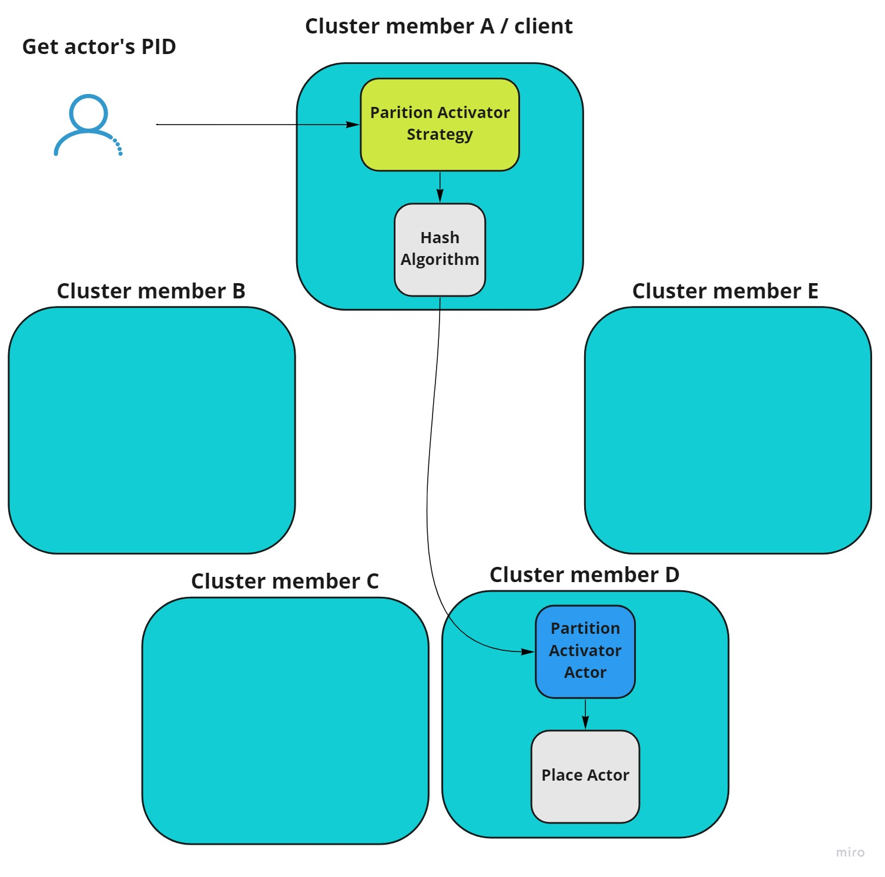

# Partition Activator Lookup (Experimental)

This strategy is a simplification of PartitionIdentityLookup strategy. The same member is responsible for owning identity and spawning an actor. When cluster topology changes, the actors need to be moved according to new assignments from the consistent hashing algorithm.

In this strategy it is not possible to use [member strategies](member-strategies.md). Actor is placed always in the member that is selected by hash algorithm.



## Usage

```csharp
actorSystem.WithCluster(
    ClusterConfig
        .Setup(clusterName, clusterProvider, new PartitionActivatorLookup())
);
```

## Characteristics

* After topology change, all the actors that changed the member assignment need to be instantly moved. This may cause a slowdown in the application.
* The placement strategy is very simple and requires at most one network hop. This reduces latency for activations.
* It scales with the cluster size.
* No dependency on external components.
