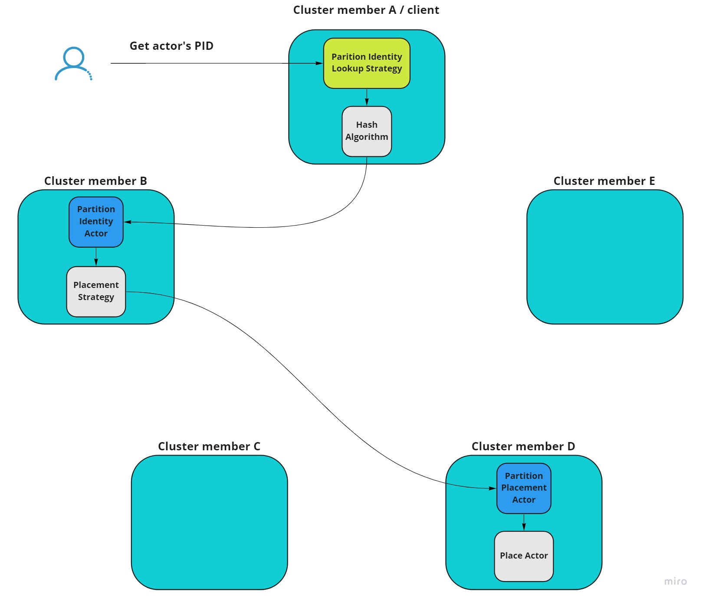
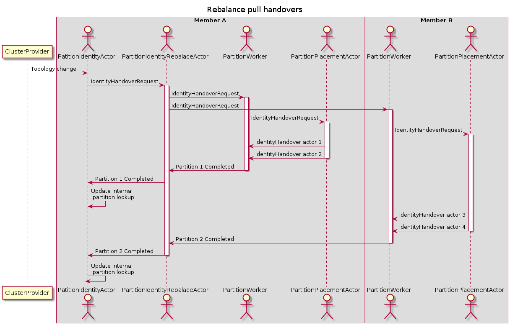

# Partition Identity Lookup

The main feature of this strategy is to split responsibility of owning actor's identity from responsibility of placing it in some member. So in general, one cluster member is responsible to keep actor's identity and another to spawn in the cluster.

The identity owner member is assigned with a consistent hashing algorithm, while placement is determined with a [member strategy](member-strategies.md).



When cluster topology changes (members are leaving or joining the cluster), the partitioned identities need to be rebalanced, because identity ownership changes (according to the consistent).

## Usage

```csharp
actorSystem.WithCluster(
    ClusterConfig
        .Setup(clusterName, clusterProvider, new PartitionIdentityLookup())
);
```

## Characteristics

* It limits the number of actors that need to move to a new node on topology change. Only actors hosted on the leaving member need to move.
* It scales with the cluster size.
* If the actor location is not cached in the PID cache, it may take 2 network hops to locate the actor. Also activating an actor may take 2 network hops.
* No dependency on external components.
* In rare cases it might result in multiple activations of an actor. Specifically during topology changes, and/or networking split brain scenarios.

## Rebalancing

 Rebalance is triggered by cluster topology change and it starts after all members in the cluster reach topology consensus.

The rebalancing can be executed in 4 modes:

* Pull, Send: Full - the identity owner pulls the full information from the placement actor
* Pull, Send: Delta (Experimental) - the identity owner pulls only information about actors that were affected by topology change
* Push, Send: Full (Experimental) - placement actor pushes full topology structure to identity owners
* Push, Send: Delta (Experimental) - placement actor pushes only information about actors that were affected by topology change

```csharp
actorSystem.WithCluster(
    ClusterConfig
        .Setup(clusterName, clusterProvider,
            new PartitionIdentityLookup(new PartitionConfig
                {
                    Mode = PartitionIdentityLookup.Mode.Pull, 
                    Send = PartitionIdentityLookup.Send.Delta,
                    HandoverChunkSize = 1000
                }))
);
```

### Mode Pull, Send Full rebalance

