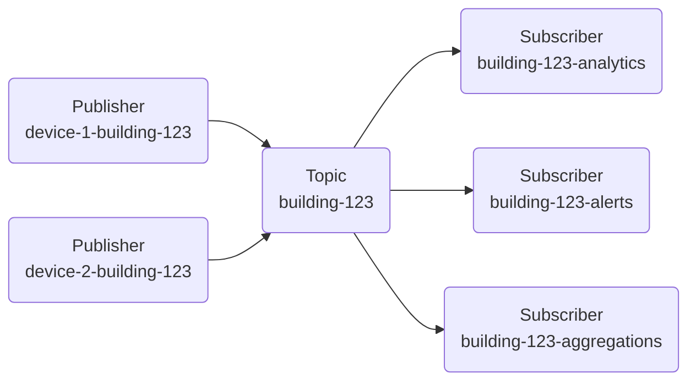
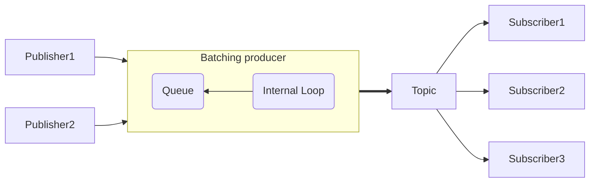
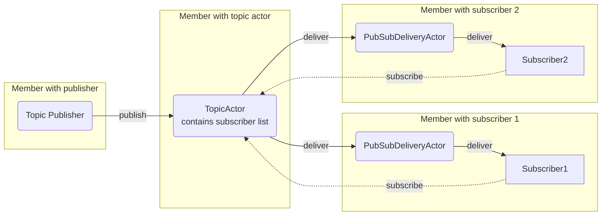

# Cluster Pub-Sub (Experimental)

Proto.Actor has a feature that enables you to broadcast messages from a publisher to a number of subscribers. On the publisher side, the message is published to a "topic", which is identified by its unique name. On the subscriber side, you subscribe to a topic by its name. Proto.Actor routes the published message to all topic subscribers, sending a copy of the message to each one.



Both the publishers and the subscribers can be distributed across the cluster. This way it is possible to leverage the full power of virtual actors while while ensuring the communication is loosely coupled.

## Publishing a message

The `IPublisher` interface can be used to publish a single message or a batch of messages.

```csharp
var publisher = context.Cluster().Publisher();

// publish single message
await publisher.Publish("my-topic", new ChatMessage { Message = "hello" });

// publish a batch in one go
await publisher.PublishBatch("my-topic", ChatTopic, new ChatMessage[]
    {
        new() {Message = "hello"},
        new() {Message = "world"}
    });
```

The task returned by `Publish` will complete when the message is delivered to the topic and topic was able to send the message to subscribers. The delivery to the subscriber is not guaranteed. The order of the messages is preserved.

## Subscribing to a topic

There are different options on how to subscribe to a topic, depending on whether you are doing this from an actor or from outside code. The simplest subscription could look like this:

```csharp
var pid = await cluster.Subscribe("my-topic", context => {
        if (context.Message is ChatMessage)
        {
            // process
        }

        return Task.CompletedTask;
    }
);

```

This code will spawn a new actor that subscribes to specified topic. Alternatively, you can subscribe an existing actor, that will get the published messages in its `Receive` handler:

```csharp
await cluster.Subscribe("my-topic", actorPID);
```

To subscribe from a code generated grain, you can use the variant of `Subscribe` that accepts cluster identity.

```csharp
public class User : UserActorBase
{
    private const string ChatTopic = "chat";
    
    public User(IContext context) : base(context) { }

    public override Task OnStarted()
        => Context.Cluster().Subscribe("my-topic", Context.ClusterIdentity()!);

    public override Task OnStopping()
        => Context.Cluster().Unsubscribe("my-topic", Context.ClusterIdentity()!);

    // there is no code generated method to receive the published messages, 
    // so we have to use the generic `Receive` handler
    public override Task OnReceive()
    {
        if (Context.Message is ChatMessage msg)
            Console.WriteLine($"Received '{msg.Message}'");

        return Task.CompletedTask;
    }
}
```

## Unsubscribing from a topic

Use a proper `Unsubscribe` overload to cancel topic subscription.

```csharp
// with regular actor
cluster.Unsubscribe("my-topic", actorPID);

// with virtual ator
cluster.Unsubscribe("my-topic", ClusterIdentity.Create("my-id", "my-kind"));

```

### What if I forget to unsubscribe?

If you stop the subscriber without first unsubscribing from the topic, two different situations may occur depending on whether virtual or regular actors are used:
* When using virtual actors, they are assumed to always exist. If there is no activation available currently, the framework will spawn one when a message arrives to this actor. So a message published to the topic will activate the virtual actor again.
* Regular actors have an explicit lifecycle. If you stop such actor, all messages directed to it will end up in the deadletter process. When this situation is detected, the subscriber will get automatically unsubscribed. It is still recommended to unsubscribe explicitly.

## Persistent subscriptions

Subscriptions are collected in the `TopicActor`. By default they are not persisted. If this actor needs to restart, the subscriptions are lost.

You can provide an implementation of `IKeyValueStore<Subscribers>` to persist the subscriptions externally, e.g. in Redis.

```csharp
var clusterConfig = ClusterConfig
    .Setup("MyCluster", 
        new TestProvider(
            new TestProviderOptions(), 
            new InMemAgent()), 
            new PartitionIdentityLookup())
    .WithClusterKind(
        TopicActor.Kind, 
        Props.FromProducer(() => new TopicActor(new MyRedisKVStore())));
```

This topic kind registration overrides the default one in the cluster.

## BatchingProducer

Message delivery can be optimized by sending messages in batches. `BatchingProducer` helps create batches when multiple publishers target a single topic. The batching producer collects messages from different sources, groups them, and then sends each batch to subscribers.



*Note: There is no delay waiting for the producer queue to reach certain threshold. All messages are published as soon as possible, with each iteration of the loop taking min `1`, max `MaxBatchSize` messages from the queue.*

```csharp
await using var producer = cluster.BatchingProducer("my-topic");
var t1 = producer.ProduceAsync(new ChatMessage { Message = "Hello" });
var t2 = producer.ProduceAsync(new ChatMessage { Message = "Hi" });

await Task.WhenAll(t1, t2);
```

Notice how the produce tasks are awaited together instead of sequentially. This pattern ensures that work is parallelized and each task completes only after the message is delivered to the topic, not merely queued internally.

*Note: you can also decide to not await the task if you are interested in the "fire and forget" scenario.*

Disposing the producer stops the internal loop gracefully. Recent updates avoid channel closed exceptions when the producer shuts down.

### Cancel a message

You can pass a cancellation token to the `ProduceAsync` method. It gives you the possibility to cancel the message. Cancellation can only happen as long as the message is in the internal queue of the producer. When actual publishing starts, the cancellation token is ignored.

```csharp
var cts = new CancellationTokenSource();
var t1 = producer.ProduceAsync(new ChatMessage { Message = "Hello" }, cts.Token);
cts.Cancel();

// awaiting t1 will throw OperationCancelledException if the message was not yet published
```

### Retry policy

By default, the `BatchingProducer` will fail and stop on publishing error. You can override this behavior by providing implementation of the `PublishingErrorHandler` in the producer config.

```csharp
public delegate Task<PublishingErrorDecision> PublishingErrorHandler(
    int retries, 
    Exception e, 
    PubSubBatch batch
);
```

You can return following decisions from the handler:

* FailBatchAndStop - the default policy, marks all pending tasks as failed and stops the producer
* FailBatchAndContinue - fails current batch, and continues with the next one
* RetryBatchAfter(TimeSpan delay) - retry publishing the batch after a delay
* RetryBatchImmediately - immediately retries publishing

If the decision is to retry, the message batch will be sent to all the subscribers again, event if previously it was processed correctly by some of them.

## Under the hood

The pub sub functionality is implemented using two actors: the TopicActor and the PubSubMemberDeliveryActor. The TopicActor knows about all the subscribers. It is a virtual actor, so there is no need to explicitly instantiate it. The delivery of messages is optimized by TopicActor, which sends only single over-the-network message to each of the members, that contain subscribers. Then PubSubMemberDeliveryActor (running on each member) distributes the messages locally within the member, to each of the subscribers.

