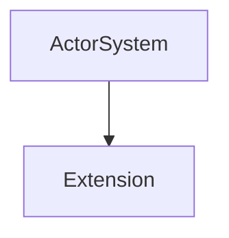
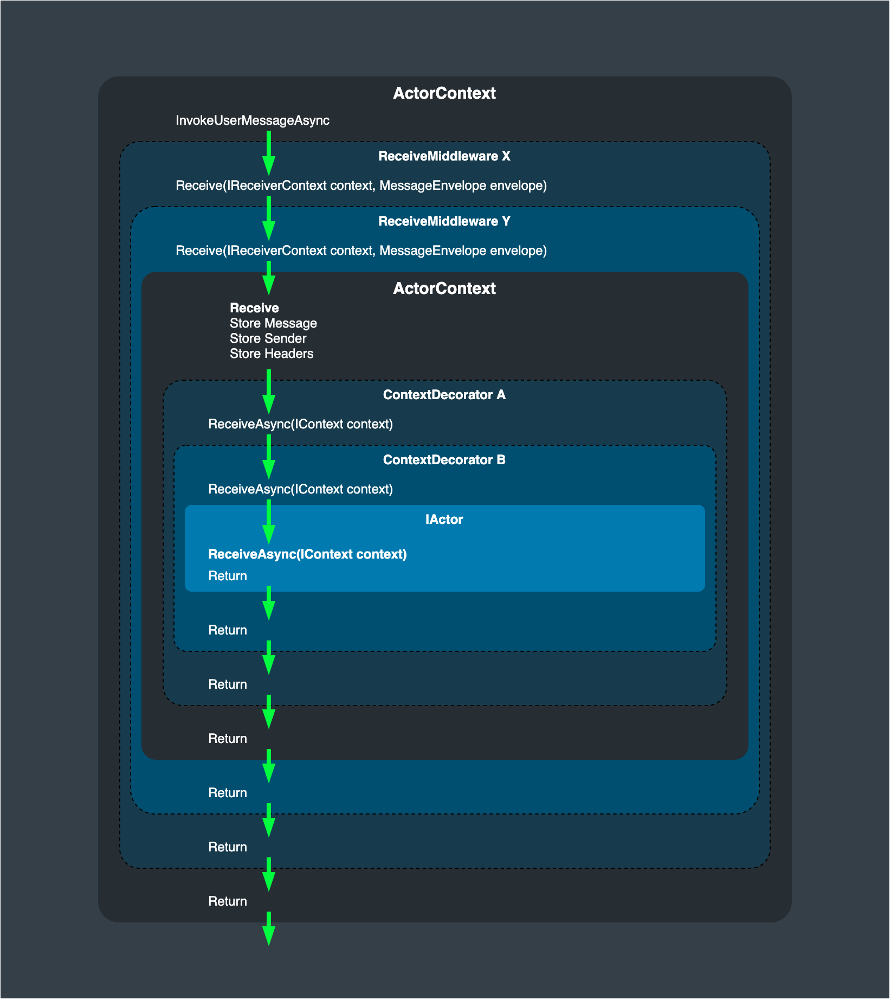

# Extensions and Context Decorators

Proto.Actor can be extended at both the actor and actor system level.

## Context Decorators

Context decorators allow developers to surround actors with custom functionality, from custom
message receive logic to intercepting outgoing calls.

To apply context decorators to an actor, use the `Props.WithContextDecorator` method.


#### .NET

```csharp
public class MyDecorator : IContextDecorator
{
    public IContext Decorate(IContext context) => new MyContext(context);
}

var props = Props.FromProducer(() => new MyActor())
    .WithContextDecorator(new MyDecorator());
```

#### Go

```go
func myDecorator(next actor.ContextDecoratorFunc) actor.ContextDecoratorFunc {
    return func(ctx actor.Context) actor.Context {
        return &myContext{Context: next(ctx)}
    }
}

props := actor.PropsFromProducer(func() actor.Actor { return &myActor{} },
    actor.WithContextDecorator(myDecorator))
```


## Actor Extensions

Actor extensions allow adding cross-cutting functionality to individual actors by decorating
their `IContext`. They are ideal for concerns such as logging or metrics and build upon the
context decorator mechanism shown above.

## Actor System Extensions

Actor system extensions provide hooks into the lifecycle of the entire `ActorSystem`.



#### .NET

```csharp
public class MyExtension : IActorSystemExtension { }

var system = new ActorSystem();
system.Extensions.Register(new MyExtension());
```

#### Go

```go
import "github.com/asynkron/protoactor-go/extensions"

var extID = extensions.NextExtensionID()

type myExtension struct{}

func (*myExtension) ExtensionID() extensions.ExtensionID {
    return extID
}

system := actor.NewActorSystem()
system.Extensions.Register(&myExtension{})
```


## Conceptual overview

This overview aims to show how the different extension points of Proto.Actor interact together.


