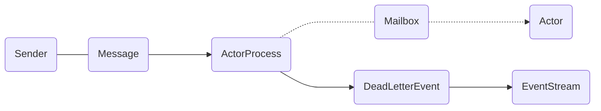

# Dead Letters

Messages which cannot be delivered (and for which this can be ascertained) will be delivered to a synthetic actor are called DeadLetters. This delivery happens on a best-effort basis; it may fail even within the local process (e.g. during actor termination). Messages sent via unreliable network transports will be lost without turning up as dead letters.

## What should I use Dead Letters for?

The main use of this facility is for debugging, especially if an actor send does not arrive consistently (where usually inspecting the dead letters will tell you that the sender or recipient was set wrong somewhere along the way). In order to be useful for this purpose it is good practice to avoid sending to deadLetters where possible, i.e. run your application with a suitable dead letter logger (see more below) from time to time and clean up the log output. This exercise—like all else—requires judicious application of common sense: it may well be that avoiding to send to a terminated actor complicates the sender’s code more than is gained in debug output clarity.

The dead letter service follows the same rules with respect to delivery guarantees as all other message sends, hence it cannot be used to implement guaranteed delivery.

## How do I receive Dead Letters?

An actor can subscribe to type DeadLetter on the event stream, see `EventStream` for how to do that. The subscribed actor will then receive all dead letters published in the (local) system from that point onwards. Dead letters are not propagated over the network, if you want to collect them in one place you will have to subscribe one actor per network node and forward them manually. Also consider that dead letters are generated at that node which can determine that a send operation is failed, which for a remote send can be the local system (if no network connection can be established) or the remote one (if the actor you are sending to does not exist at that point in time).

## Dead Letters which are (usually) not worrisome

Every time an actor does not terminate by its own decision, there is a chance that some messages which it sends to itself are lost. There is one which happens quite easily in complex shutdown scenarios that is usually benign: `Stop` message dropped means that two stop requests were given, but of course only one can succeed. In the same vein, you might see `Stop` messages from children while stopping a hierarchy of actors turning up in dead letters if the parent is still watching the child when the parent terminates.

## Usage

DeadLetter is a channel for undelivered messages. It stores all messages that have not been processed or delivered. This is the most common channel, but most often, it is not used to send messages. Only when it is detected, a problem with a message. For example, if message cannot be delivered, will the message be automatically placed into DeadLetter channel.



By monitoring this channel, you can find out which messages have not been processed and take appropriate action. In particular, by testing the system using this channel you can find out why some messages have not been processed. If the system should not simply reset any messages, this channel can be used to resend messages after the problem has been resolved.

EventStream is used in Proto.Actor to implement a queue of undelivered messages. When a message is delivered to the mailbox of an already completed actor or sent after the message has been completed, the message arrives in the EventStream of the ActorSystem. The message is wrapped in a DeadLetterEvent class that contains the original message, the sender's address, and the receiver's address. That is, the queue of undelivered messages is integrated into the common EventStream queue. To receive undelivered messages, it's enough to subscribe the actor to receive messages of `DeadLetterEvent()` type from EventStream. An example with a subscription to a certain type of messages as described in the previous lesson.

Let's see at a little example. Let's create a simple actor called Echo that returns any messages back to the sender, and after it's started, we'll immediately send it a PoisonPill message. This will cause immediate shutdown of an actor work. You can see from the listing that the message can be received by subscribing to receive messages like `DeadLetterEvent()`.

```csharp
static async Task Main(string[] args)
{
    var system = new ActorSystem();
    var props = Props.FromProducer(() => new Echo());
    var pid = system.Root.Spawn(props);

    system.EventStream.Subscribe<DeadLetterEvent>(msg =>
        Console.WriteLine($"Sender: {msg.Sender}, Pid: {msg.Pid}, Message: {msg.Message}"));

    system.Root.Send(pid, new TestMessage());
    await system.Root.PoisonAsync(pid);
    system.Root.Send(pid, new TestMessage());

    Console.ReadLine();
}
```

Messages sent to a terminated actor cannot be processed and the PID on that actor must no longer be used. When messages are sent to a terminated actor, they are placed in the DeadLetter queue. This confirms receipt of the message by our handler.

```csharp
system.EventStream.Subscribe<DeadLetterEvent>(msg =>
    Console.WriteLine($"Sender: {msg.Sender}, Pid: {msg.Pid}, Message: {msg.Message}"));
```
