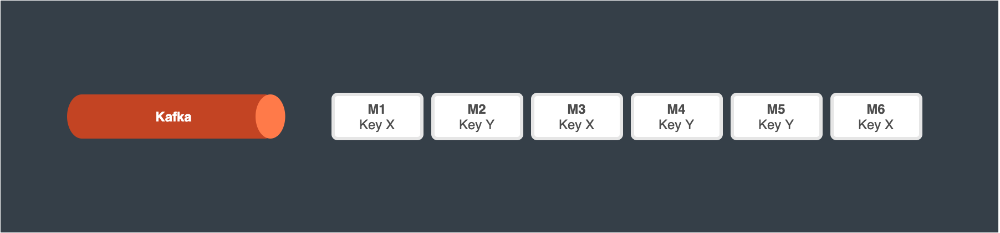
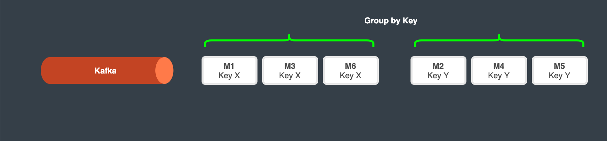
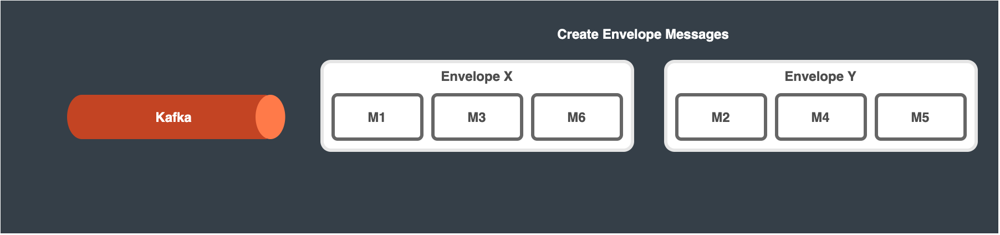
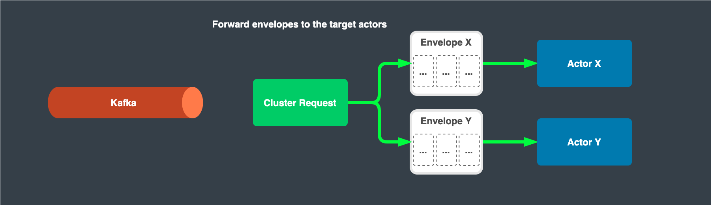
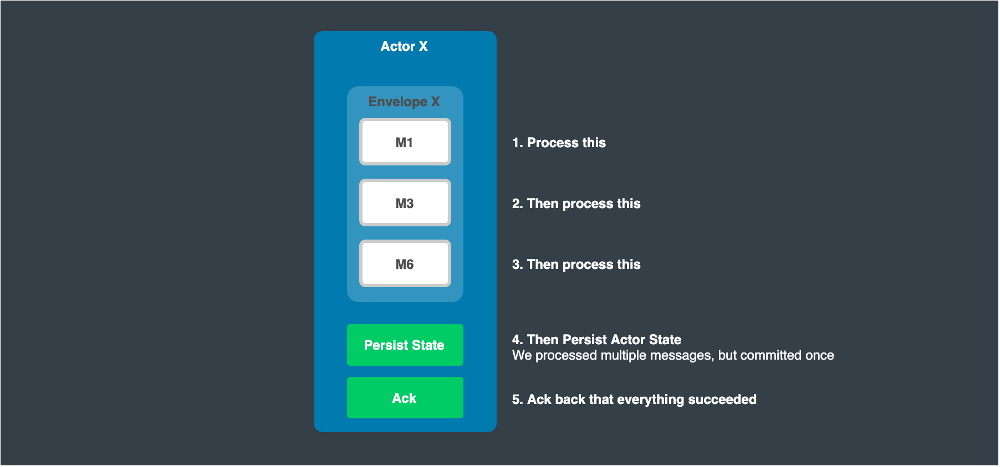
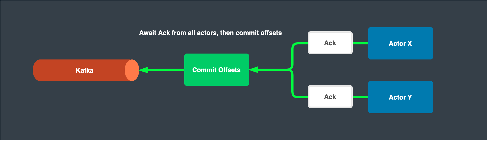

# Envelope Pattern

## Batching in event-driven architectures

A common use case for actor-based event processing is consuming data from a queue or log, such as RabbitMQ or Kafka.

If you use some form of persistence in your event processor, be it plain snapshots of state or event-sourcing, this can result in writes to the database for each message processed.
One message goes in, you process it, you write the new state of your entity/actor back to the persistent store.

This can result in bottlenecks in terms of writes against the persistent store. For example, if you process 10,000 messages per second, that could result in 10,000 writes to the persistent store.

This pattern reduces writes to the persistent store by grouping messages and writing once after they are all processed, then acknowledging the batch to the underlying message queue or log.

Besides the trivial use case of writing to persistent storage, sending messages in batch from one actor to the other improves performance significantly when the system is under load and processing lots of messages per second.


#### Requires:
* [Idempotency in Messaging](idempotency.md) and message deduplication in actor (can be done using `Props.WithClusterRequestDeduplication(deduplicationWindow)`, where `deduplicationWindow` is an optional field and is of `TimeSpan` type)

#### Pros:
* High throughput processing
* Guaranteed delivery of messages (at least once)
* Guaranteed state persistence

#### Cons:
* Higher latency due to batching
* Idempotency state and logic can add complexity


## How the pattern works

### Prefetch a batch of messages from the queue/log



### Group these messages based on the target actor



### Construct the Envelope messages



#### Sample code snippet:

```csharp
// Here we are using Proto.Cluster.PubSub.PubSubBatch to construct the envelope
PubSubBatch pubSubBatch = new PubSubBatch();
// Appending a custom message in the envelope
// Note that messages of various types can be appended to the same envelope, but need to consider the logic at the receiving side
pubSubBatch.Envelopes.Add(message);
```

### Send the envelopes to the target actors



#### Sample code snippet:

```csharp
// To publish the envelope to a grain (virtual actor)
PublishResponse publishResponse = await Context.Cluster().RequestAsync<PublishResponse>(grainId, GrainActor.Kind, pubSubBatch, new CancellationTokenSource(1000).Token);

// To publish the envelope to an actor
PublishResponse publishResponse = await Context.RequestAsync<PublishResponse>(actorPid, pubSubBatch, new CancellationTokenSource(1000).Token);

// The response can be used to ascertain whether the batch has been delivered successfully or not
```

### Consume the envelopes in the actors

At this point, we process each message in the envelope, but we only commit state back to our persistent store once we have processed all of the content.

This strategy allows us to process messages at high throughput, while still guaranteeing persistence.



#### Sample code snippet:

```csharp
// We need to process each message in the envelope
// Implement additional logic in case the envelope contains messages of various types
// This example is illustrated for grain (virtual actor)
// In case of actor, process this message in the ReceiveAsync() overloaded method.
public override async Task OnReceive()
{
    switch (Context.Message)
    {
        case PubSubBatch pubSubBatch:
            foreach(MessageType message in pubSubBatch.Envelopes)
            {
                // process the message
            }
            // To send the response back to the batch publisher
            Context.Respond(new PublishResponse());
            break;
    }
}
```

### Await Ack and commit offsets

Once all envelopes are processed for all actors, we commit the highest offsets for each key or partition depending on what queue/log technology we are using.


