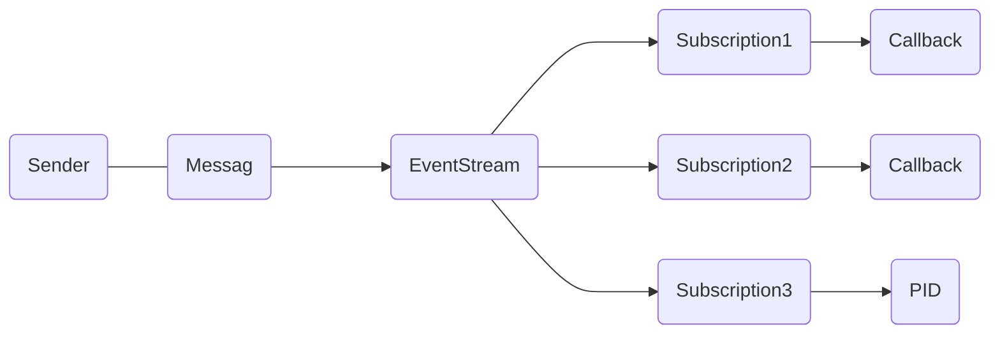

# EventStream

The EventStream is used internally in Proto.Actor to broadcast framework events.



In the Proto.Actor platform the EventStream class implements the support of "publisher/subscriber" channels. Each ActorSystem has such an object available to any actor (by system.EventStream). EventStream can be considered as a multi-channel publisher/subscriber dispatcher because any actor can subscribe to messages of a certain type. When some other actor publishes a message of this type, the subscriber will receive it.

You can subscribe anywhere in the system where links to EventStream are available. To subscribe the actor to receive messages, you should invoke the Subscribe method of EventStream class. And to save the value returned by it. This value contains a full description of the just made subscription.

```csharp
orderSubscription = Cluster.System.EventStream.Subscribe<Order>(msg =>
    Console.WriteLine("message received"))
```

When the subscription is no longer necessary, for example, when the gift campaign is over, you can use `Unsubscribe` method. In this example, we have canceled the subscription of the GiftModule component, and after calling this method, the actor will stop receiving Order messages.

```csharp
orderSubscription.Unsubscribe()
```

It is all that is required to subscribe GiftModule component to receive Order messages. After calling the `Subscribe` method, the GiftModule component will be receiving all Order messages published in EventStream. This method can be invoked for any actor that is interested in receiving Order messages. And when an actor needs to receive messages of different types, the `Subscribe` method can be called several times with varying kinds of messages.

Publishing messages in EventStream is as easy as that; just call the Publish method,

```csharp
system.EventStream.Publish(msg);
```

After that, the msg message will be passed to all subscribed actors. In fact, this completes description of the realization of channels like "publisher/subscriber" in Proto.Actor.

In Proto.Actor you can subscribe to several types of events at once. For example, our GiftModule component must also handle order cancellation messages, because in this case, the gift should not be sent. To do this, the GiftModule component must subscribe to EventStream to receive Order and Cancel messages. Both subscriptions are independent, i.e. after the cancellation of the Orders subscription, the Cancel message subscription will continue to be valid, and these messages will be delivered.

Earlier we mentioned the advantages of loose coupling between sender and receiver, and the dynamic character of the "publisher/subscriber" channel. And since EventStream is available to all actors, it is also an excellent solution for cases when all messages from all over the local system must flow into one or more actors. Bright examples are the logging. All logs should flock to a single point and be written to a log file.

## DeadLetter

**Events**

- `actor.DeadLetter`

When a message is sent to a non-existing `actor.PID`, the message will be forwarded to the `actor.EventStream` as a `actor.DeadLetter`.
This can be used to monitor if your system holds on to broken/expired `actor.PID`s.


Learn more about DeadLetters [here](deadletter.md).


## Remote termination

**Events**

- `remoting.EndpointTerminated`

When an endpoint terminates, the remoting layer will send a `remoting.EndpointTerminated` event.
This can be used if you need to know about your current network topology.
This event is also used to trigger `actor.Terminate` events for remote watched actors.


## Cluster topology

**Events**

- `cluster.MemberStatusBatch`
- `cluster.MemberStatusEvent` - _Interface_
- `cluster.MemberJoinedEvent` - _Implements `cluster.MemberStatusEvent`_
- `cluster.MemberRejoinedEvent` - _Implements `cluster.MemberStatusEvent`_
- `cluster.MemberLeftEvent` - _Implements `cluster.MemberStatusEvent`_
- `cluster.MemberUnavailableEvent` - _Implements `cluster.MemberStatusEvent`_
- `cluster.MemberAvailableEvent` - _Implements `cluster.MemberStatusEvent`_

### Usages

#### Cluster Provider

In clustering, the `cluster.ClusterProvider`s broadcast `cluster.MemberStatusBatch` messages to inform the system about the current cluster topology.

#### MemberListActor

The member list actor use the `cluster.MemberStatusBatch` to calculate a delta of topology changes and refine this information into `cluster.MemberStatusEvent` messages.

#### PartitionActor

The `cluster.MemberStatusEvent` messages are handled by the `cluster.PartitionActor`'s to determine if virtual actor ownership should be handed over to other nodes.


