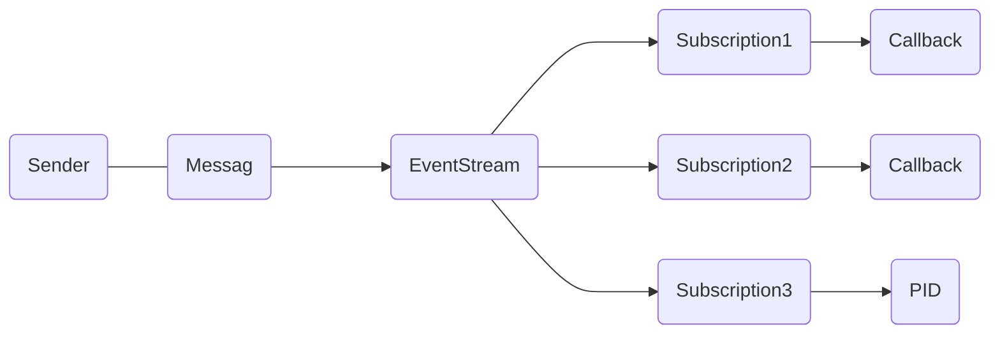

# EventStream

The EventStream is used internally in Proto.Actor to broadcast framework events.

## DeadLetter

**Events**

- `actor.DeadLetter`

When a message is sent to a non-existing `actor.PID`, the message will be forwarded to the `actor.EventStream` as a `actor.DeadLetter`.
This can be used to monitor if your system holds on to broken/expired `actor.PID`s.


Learn more about DeadLetters [here](deadletter.md).


## Remote termination

**Events**

- `remoting.EndpointTerminated`

When an endpoint terminates, the remoting layer will send a `remoting.EndpointTerminated` event.
This can be used if you need to know about your current network topology.
This event is also used to trigger `actor.Terminate` events for remote watched actors.

## Cluster topology

**Events**

- `cluster.MemberStatusBatch`
- `cluster.MemberStatusEvent` - _Interface_
- `cluster.MemberJoinedEvent` - _Implements `cluster.MemberStatusEvent`_
- `cluster.MemberRejoinedEvent` - _Implements `cluster.MemberStatusEvent`_
- `cluster.MemberLeftEvent` - _Implements `cluster.MemberStatusEvent`_
- `cluster.MemberUnavailableEvent` - _Implements `cluster.MemberStatusEvent`_
- `cluster.MemberAvailableEvent` - _Implements `cluster.MemberStatusEvent`_

### Usages

#### Cluster Provider

In clustering, the `cluster.ClusterProvider`s broadcast `cluster.MemberStatusBatch` messages to inform the system about the current cluster topology.

#### MemberListActor

The member list actor use the `cluster.MemberStatusBatch` to calculate a delta of topology changes and refine this information into `cluster.MemberStatusEvent` messages.

#### PartitionActor

The `cluster.MemberStatusEvent` messages are handled by the `cluster.PartitionActor`'s to determine if virtual actor ownership should be handed over to other nodes.

