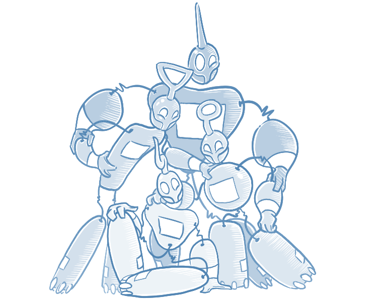

# Getting started with Proto.Actor

Proto.Actor is a cross-platform actor framework that helps you build concurrent and distributed systems. In this guide you will build a minimal greeter in both .NET and Go to learn the basic building blocks: messages, actors, and the actor system.



## Set up your project

Proto.Actor can be used from multiple languages. We'll create a simple console application in each runtime.

#### .NET

Create a new console project and install the Proto.Actor package from NuGet:

```PM
PM> Install-Package Proto.Actor
```

Reference the Proto namespace in your source file:

```csharp
using Proto;
```

#### Go

Initialize a module and pull in the Proto.Actor dependency:

```bash
go mod init greeter
go get github.com/asynkron/protoactor-go
```

## Define a message

Actors communicate exclusively through messages. Messages should be immutable so they can safely be shared between threads. Our greeter will respond to a `Greet` message containing the name to greet.

#### .NET

```csharp
// Greet carries the name of the person to greet
public record Greet(string Who);
```

#### Go

```go
// Greet carries the name of the person to greet
type Greet struct{ Who string }
```

## Create the actor

An actor processes one message at a time and encapsulates its own state. The `GreetingActor` prints a message whenever it receives a `Greet`. The Go version uses the standard `fmt` package for output.

#### .NET

```csharp
public class GreetingActor : IActor
{
    public Task ReceiveAsync(IContext ctx)
    {
        if (ctx.Message is Greet greet)
        {
            Console.WriteLine($"Hello {greet.Who}");
        }
        return Task.CompletedTask;
    }
}
```

#### Go

```go
type greetingActor struct{}

// Receive handles incoming messages for the actor
func (g *greetingActor) Receive(ctx actor.Context) {
    switch msg := ctx.Message().(type) {
    case *Greet:
        fmt.Printf("Hello %s\n", msg.Who)
    }
}
```

## Run the actor

The actor system is the runtime container for your actors. It is used to spawn actors and send them messages.

#### .NET

```csharp
var system = new ActorSystem();
var props = Props.FromProducer(() => new GreetingActor());
var pid = system.Root.Spawn(props);

// Send a message to the actor
system.Root.Send(pid, new Greet("World"));

// Prevent the application from exiting immediately
Console.ReadLine();
```

#### Go

```go
func main() {
    system := actor.NewActorSystem()
    props := actor.PropsFromProducer(func() actor.Actor { return &greetingActor{} })
    pid := system.Root.Spawn(props)

    // Send a message to the actor
    system.Root.Send(pid, &Greet{Who: "World"})

    // Prevent the program from exiting immediately
    _, _ = console.ReadLine()
}
```

You've now created and run your first Proto.Actor program in both .NET and Go. This simple example forms the foundation for building resilient, concurrent applications that scale across cores and machines.

## Example Source Code

Working implementations are available on GitHub:

- [.NET greeter example](https://github.com/asynkron/protoactor-dotnet/tree/dev/examples/HelloWorld)
- [Go greeter example](https://github.com/asynkron/protoactor-go/tree/dev/examples/actor-helloworld)

