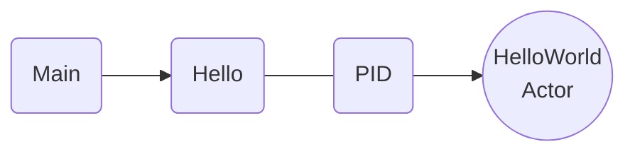

# Hello World

In this guide, we'll walk you through creating a simple "Hello World" example using Proto.Actor to understand the basics of actor systems, actors, and messages.

## Prerequisites

Ensure you have the following installed on your system:

- [.NET SDK](https://dotnet.microsoft.com/download)
- [Go](https://golang.org/dl/)

## Creating an Actor System

An Actor System is a container for your actors and a central point for managing their lifecycle. It is responsible for creating and supervising actors.

Let's create an actor system called `MySystem`:

#### .NET

```csharp
// Import the Proto namespace
using Proto;

// Create a new ActorSystem
var system = new ActorSystem();
```

#### Go

```go
// Import the actor package
import (
	"github.com/asynkron/protoactor-go/actor"
)

// Create a new ActorSystem
system := actor.NewActorSystem()
```

## Defining Messages

Actors communicate by exchanging messages. In this example, we will create a simple `Hello` message with a `Who` property:

#### .NET

```csharp
// Define the Hello message with a Who property
public record Hello(string Who);
```

#### Go

```go
// Define the Hello message with a Who property
type Hello struct {
	Who string
}
```

## Creating an Actor

Now, let's create a `HelloWorldActor` that will receive and process `Hello` messages. We will define the actor's behavior using a `Receive` method that takes the incoming message and processes it:

#### .NET

```csharp
// Import the Proto namespace
using Proto;

// Define the HelloWorldActor class implementing IActor
public class HelloWorldActor : IActor
{
    // Implement the ReceiveAsync method for message processing
    public Task ReceiveAsync(IContext context)
    {
        // Check if the received message is of type Hello
        if (context.Message is Hello hello)
        {
            // Print the greeting to the console
            Console.WriteLine($"Hello {hello.Who}");
        }
        // Return a completed task
        return Task.CompletedTask;
    }
}
```

#### Go

```go
// Define the HelloWorldActor struct
type HelloWorldActor struct{}

// Implement the Receive method for message processing
func (state *HelloWorldActor) Receive(context actor.Context) {
	switch msg := context.Message().(type) {
	case *Hello:
		// Print the greeting to the console
		fmt.Printf("Hello %v\n", msg.Who)
	}
}
```

## Starting the Actor

To start the `HelloWorldActor`, we need to create a `Props` object, which defines the properties of the actor, and then use the actor system to spawn a new instance:

#### .NET

```csharp
// Import the Proto namespace
using Proto;

// Create a Props object for the HelloWorldActor
var props = Props.FromProducer(() => new HelloWorldActor());

// Spawn a new instance of the HelloWorldActor
var pid = system.Root.Spawn(props);
```

#### Go

```go
// Create a Props object for the HelloWorldActor
props := actor.PropsFromProducer(func() actor.Actor { return &HelloWorldActor{} })

// Spawn a new instance of the HelloWorldActor
pid := system.Root.Spawn(props)
```

## Sending a Message

Finally, let's send a `Hello` message to our `HelloWorldActor`:



#### .NET

```csharp
system.Root.Send(pid, new Hello("World"));
```

#### Go

```go
system.Root.Send(pid, &Hello{Who: "World"})
time.Sleep(1 * time.Second)
```

When you run the code, the `HelloWorldActor` will receive and process the `Hello` message, and you should see "Hello World" printed on the console.

That's it! You've successfully created a basic Proto.Actor example. Feel free to explore further and create more complex systems using the powerful features provided by Proto.Actor.

## Example Source Code

Complete implementations are available on GitHub:

- [.NET HelloWorld example](https://github.com/asynkron/protoactor-dotnet/tree/dev/examples/HelloWorld)
- [Go HelloWorld example](https://github.com/asynkron/protoactor-go/tree/dev/examples/actor-helloworld)
