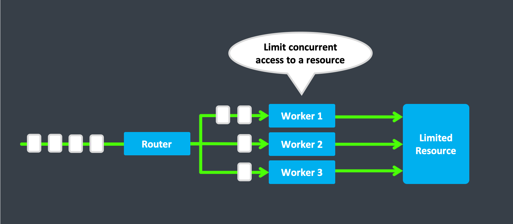

# Limit Concurrency

In some scenarios, it can be useful to be able to limit the number of parallel interactions with some resource.

e.g. there might be some 3rd party service which cannot handle more than X simultaneous requests for whatever reasons, be it technical or legal.

In those cases, you can use a round-robin router to address this.

As seen in the image above, we use a round-robin router to forward messages to, in this case, three worker actors.
These worker actors can then interact with the limited resource.

Because actors process one message at a time, we can guarantee that there will never be more than (in this case) three parallel requests to the limited resource at any given point in time.