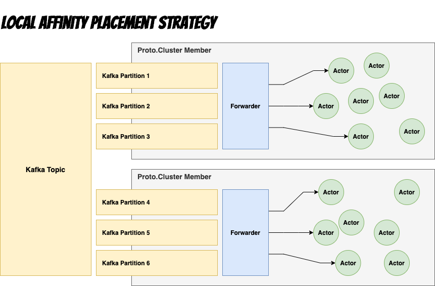
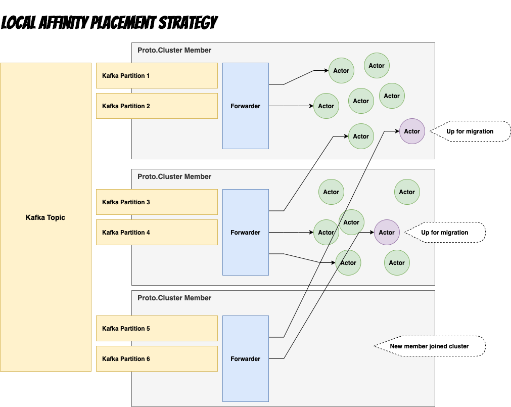
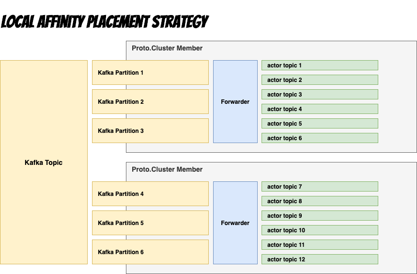

# Local Affinity

### Virtual Actors with locality to Kafka consumer

Local affinity placement lets us position virtual actors close to other resources.
In this example, virtual actors are placed near an Apache Kafka consumer. The actors on the same cluster member consume messages only from the partitions handled by that consumer.

### Scale up or down

If the cluster scales up or down, some actors may no longer reside on the node where they first spawned.
This means the communication from the Proto.Kafka forwarder will have to use remote communication with those actors.

Here is where gradual migration comes into play.
Actors check whether the message sender is on a remote node and, at a random user-defined interval, shut themselves down and eventually respawn on the correct node.

### Migrating local actors

Once all actors have migrated, we are now back at having fully local affinity from Kafka partitions to actors consuming the messages from those partitions.

### Simulating millions of topics

We now get the best of both worlds, robust fault-tolerant systems, with the performance of in-process communication.

Conceptually, we can view this setup as refined topics, where you have a single topic per named actor.
This means that we can have millions of topics with actor concurrency guarantees for consumption.

