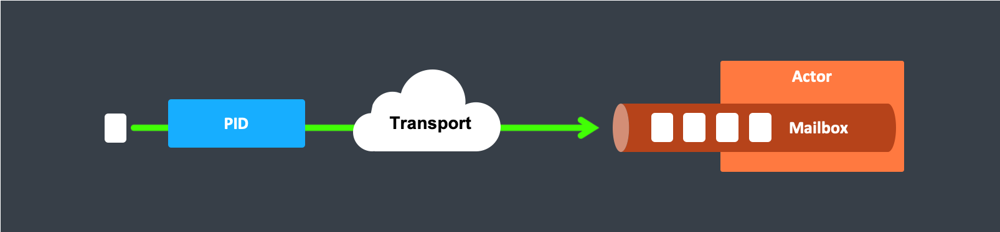

# Location Transparency

The previous section describes how actor PIDs are used to enable location transparency. This special feature deserves some extra explanation, because the related term "transparent remoting" was used quite differently in the context of programming languages, platforms and technologies.

## Distributed by Default

Everything in Proto.Actor is designed to work in a distributed setting: all interactions of actors use purely message passing and everything is asynchronous. This effort has been undertaken to ensure that all functions are available equally when running within a single actor system or on a cluster of hundreds of machines. The key for enabling this is to go from remote to local by way of optimization instead of trying to go from local to remote by way of generalization.

In Proto.Actor, a PID can be thought of similar to a phone number.
If you have a PID to someone, you can communicate with them.
No matter if they are close or far away.

##### Using a PID to communicate with a local actor:

##### Using a PID to communicate with a remote actor:

## Ways in which Transparency is Broken

Just as there are differences talking to someone next to you as opposed to talking on your cellphone to someone in another country, where there might be bad reception and delays in communication, there are some aspects to consider when building distributed systems.

What is true of Proto.Actor need not be true of the application which uses it, since designing for distributed execution poses some restrictions on what is possible. The most obvious one is that all messages sent over the wire must be serializable.
In Proto.Actor the default for remote messaging is Protobuf.
On the .NET platform, we have built in support for generating Protobuf to C# out of the box.
Good practice is to define most of your systems message this way to avoid later problems switching from non serializable to serializable messages.

Another consequence is that everything needs to be aware of all interactions being fully asynchronous, which in a computer network might mean that it may take several minutes for a message to reach its recipient (depending on configuration). It also means that the probability for a message to be lost is much higher than within one CLR, where it is close to zero.

## Peer-to-Peer vs. Client-Server

Proto.Remote is a communication module for connecting actor systems in a peer-to-peer fashion, and it is the foundation for Proto.Cluster. The design of remoting is driven by two (related) design decisions:

Communication between involved systems is symmetric: if a system A can connect to a system B then system B must also be able to connect to system A independently.
The role of the communicating systems are symmetric in regards to connection patterns: there is no system that only accepts connections, and there is no system that only initiates connections.

## Marking Points for Scaling Out with Routers

In addition to being able to run different parts of an actor system on different nodes of a cluster, it is also possible to scale up onto more cores by multiplying actor sub-trees which support parallelization (think for example a search engine processing different queries in parallel). The clones can then be routed to in different fashions, e.g. round-robin. The only thing necessary to achieve this is that the developer needs to declare a certain actor using `New***Router`, then—in its stead—a router actor will be created which will spawn up a configurable number of children of the desired type and route to them in the configured fashion.
Read more about this in [Routers](routers.md).

### References

* **[*Reactive Manifesto*: Glossary - Location Transparency](http://www.reactivemanifesto.org/glossary#Location-Transparency)**
* **[*Wikipedia*: "Location transparency"](http://en.wikipedia.org/wiki/Location_transparency)**
