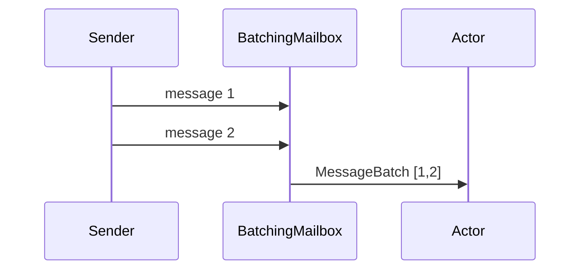

# Mailboxes

## Introduction

When you send a message to an actor, the message doesn't go directly to the actor, but goes to the actor's mailbox until the actor gets time to process it.

The default mailbox consists of two queues of messages: system messages and user messages. The system messages are used internally by the Actor Context to suspend and resume mailbox processing in case of failure. System messages are also used by internally to manage the Actor, e.g. starting, stopping and restarting it. User messages are sent to the actual Actor.

Messages in the mailbox will always be delivered in FIFO order, with one exception: if there are any system messages they will always be processed before any user messages.

Fundamentally, the following rules apply to the actor mailbox:

* Message posting can be done concurrently by multiple senders , aka. MPSC, Multiple Producers, Single Consumer.
* Message receive is done sequentially by the actor. other rules can apply for special mailboxes, e.g. priority mailboxes.
* Mailboxes are never shared between actors

By default, an unbounded mailbox is used, this means any number of messages can be enqueued into the mailbox.

## Changing the mailbox

To use a specific mailbox implementation, you can customize the Props:



```csharp
var props = Actor.FromProducer(() => new MyActor())
    .WithMailbox(() => UnboundedMailbox.Create());
```


```go
props := actor.PropsFromProducer(MyActorProducer,
    actor.WithMailbox(MyMailboxProducer))
```



## Unbounded Mailbox

The unbounded mailbox is a convenient default but in a scenario where messages are added to the mailbox faster than the actor can process them, this can lead to the application running out of memory. For this reason a bounded mailbox can be specified, the bounded mailbox will pass new messages to [dead-letters](deadletter.md) when the mailbox is full.

## Bounded Mailbox

### Dropping Tail Mailbox


### Dropping Head Mailbox


## Batching Mailbox

A batching mailbox collects messages from one or more sources and groups them into a `MessageBatch`
before handing them to the configured `IMessageInvoker`. This can improve throughput when many small
messages arrive in bursts.



To use the batching mailbox with an actor:



```csharp
var props = Props.FromProducer(() => new MyActor())
    .WithMailbox(() => new BatchingMailbox(100));
```


```go
props := actor.PropsFromProducer(func() actor.Actor { return &MyActor{} },
    actor.WithMailbox(func() actor.Mailbox { return mailbox.NewBatching(100) }))
```



The same mailbox can also be used outside actors for scenarios such as log aggregation or batched
database writes.

## Mailbox Instrumentation

### Dispatchers and Invokers

The mailbox requires two handlers to be registered, a dispatcher and an invoker. When an actor is spawned, the invoker will be the actor context, and the dispatcher is taken from the Props.

#### Mailbox Invoker

When the mailbox pops a message from the queue, it hands over the message to the registered invoker to handle the message. For an actor, the actor's context will get the message and invoke the actor's `Receive` method for processing. 

If an error occurs while the message is being processed, the mailbox will escalate the error to its registered invoker, so that it can take the appropriate action (e.g. restart the actor) and continue if possible.

You can read more on this topic here: [Supervision](supervision.md)

#### Mailbox Dispatchers

When the mailbox gets a message, it will schedule itself to process messages that are in the mailbox queues, using the dispatcher. 

The dispatcher is responsible for scheduling the processing to be run. 
The implementation of this varies by platform, e.g. in Go it is a simple invocation of a goroutine, whereas in C# the processing is handled by registering a Task to be run on the thread pool. 

The dispatcher is also responsible for limiting the throughput on each mailbox run. The mailbox will pick messages one by one in a single thread. By limiting the throughput of each run, the thread in use can be released so that other mailboxes can get scheduled to run.

There are some other common reasons to select a different dispatcher. These reasons include (but are not limited to):

* isolating one or more actors to specific threads in order to:
  * ensure high-load actors don't starve the system by consuming too much cpu-time;
  * ensure important actors always have a dedicated thread to do their job;
  * create [bulkheads](http://skife.org/architecture/fault-tolerance/2009/12/31/bulkheads.html), ensuring problems created in one part of the system do not leak to others;
* allow actors to execute in a specific SynchronizationContext;


Consider using custom dispatchers for special cases only. Correctly configuring dispatchers requires some understanding of how the framework works. Custom dispatchers *should not* be considered the default solution for performance problems. It's considered normal for complex applications to have one or a few custom dispatchers, it's not usual for most or all actors in a system to require a custom dispatcher configuration.



##### .NET Specific information

By default, all actors share a singleton `ThreadPoolDispatcher` with a throughput of 300 messages per mailbox run.

###### ThreadPoolDispatcher

The `ThreadPoolDispatcher` uses the built-in `TaskFactory` to schedule mailbox runs on the standard .NET thread pool.

###### CurrentSynchronizationContextDispatcher

The `CurrentSynchronizationContextDispatcher` works the same way as the `ThreadPoolDispatcher`, but uses the current `SynchronizationContext` as the `TaskScheduler`. This dispatcher is useful if you are running Proto.Actor in a desktop GUI application.

### Mailbox Statistics

Mailbox statistics allows the developer to listen to the following mailbox events:

- User messages
- System messages
- Started event
- Empty event

Mailbox statistics provides an extension point to get notifications of the following mailbox events: MailboxStarted, MailboxEmpty, MessagePosted, MessageReceived.

```csharp
var props = Actor.FromProducer(() => new MyActor())
    .WithMailbox(() => UnboundedMailbox.Create(myMailboxStatistics1, myMailboxStatistics2));
```
