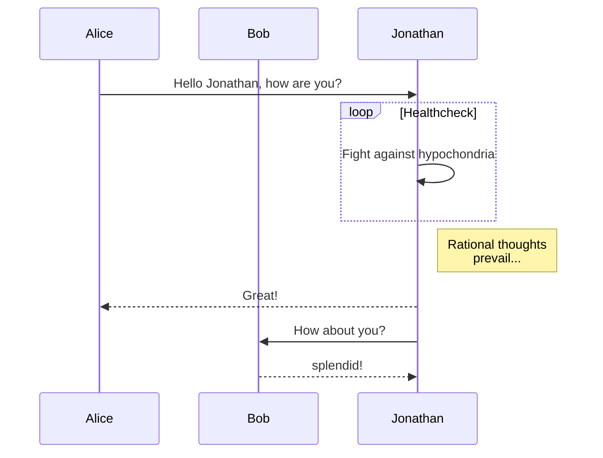
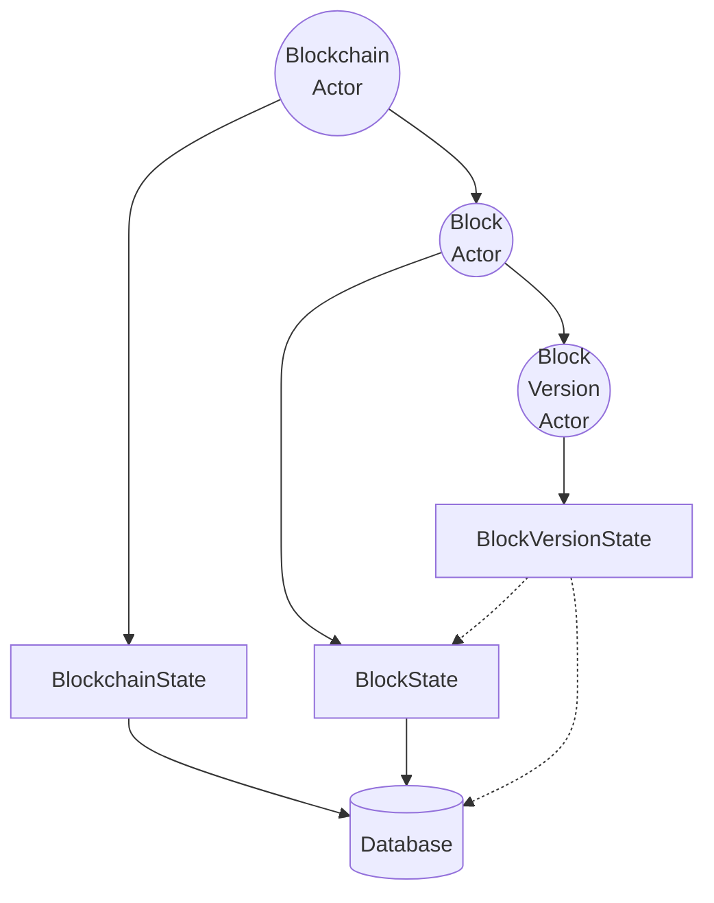
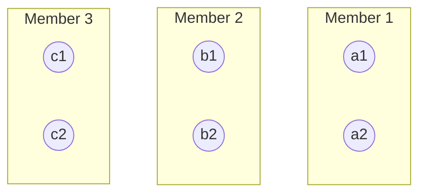

# Mermaid diagram tests

```mermaid
sequenceDiagram
    participant Alice
    participant Bob
    Alice->>Jonathan: Hello Jonathan, how are you?
    loop Healthcheck
        Jonathan->>Jonathan: Fight against hypochondria
    end
    Note right of Jonathan: Rational thoughts<br/>prevail...
    Jonathan-->>Alice: Great!
    Jonathan->>Bob: How about you?
    Bob-->>Jonathan: splendid!
```

## test test

```mermaid
  graph TD;
      DB[(Database)]
      BlockchainActor((Blockchain<br/>Actor))
      BlockActor((Block<br/>Actor))
      BlockVersionActor((Block<br/>Version<br/>Actor))
      BlockchainActor-->BlockchainState
      BlockchainActor-->BlockActor
      BlockActor-->BlockState
      BlockActor-->BlockVersionActor
      BlockVersionActor-->BlockVersionState
      BlockchainState-->DB
      BlockState-->DB
      BlockVersionState-.->DB
      BlockVersionState-.->BlockState
```

```mermaid
graph TB
    a1((a1))
    a2((a2))
    b1((b1))
    b2((b2))
    c1((c1))
    c2((c2))

    subgraph Member 1
        a1
        a2
    end
    subgraph Member 2
        b1
        b2
    end
    subgraph Member 3
        c1
        c2
    end
```
