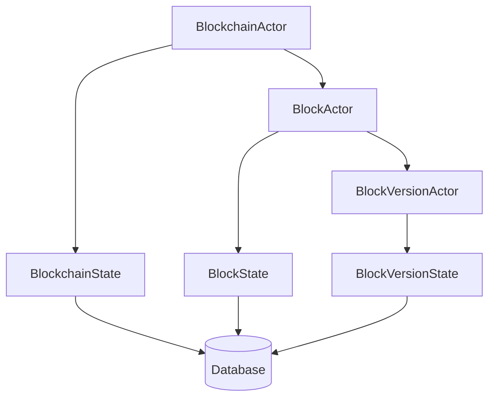

# Mermaid diagram tests

```mermaid
  graph TD;
      DB[(Database)]
      BlockchainActor-->BlockchainState
      BlockchainActor-->BlockActor
      BlockActor-->BlockState
      BlockActor-->BlockVersionActor
      BlockVersionActor-->BlockVersionState
      BlockchainState-->DB
      BlockState-->DB
      BlockVersionState-->DB
```
