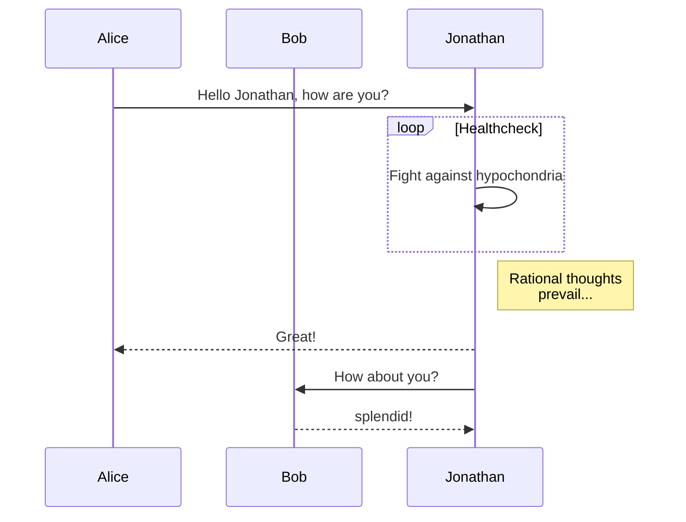
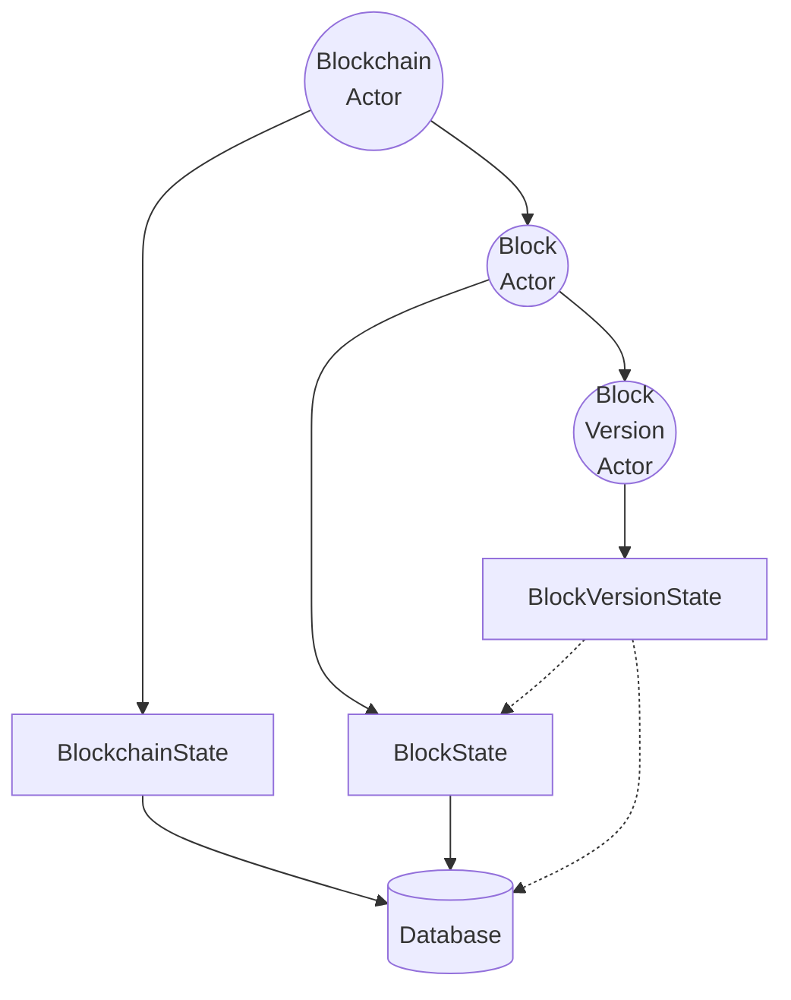
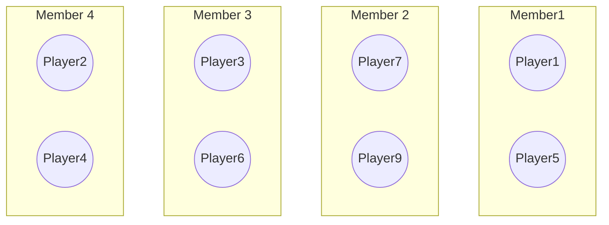
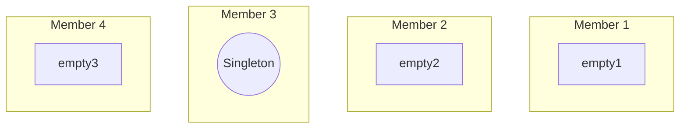
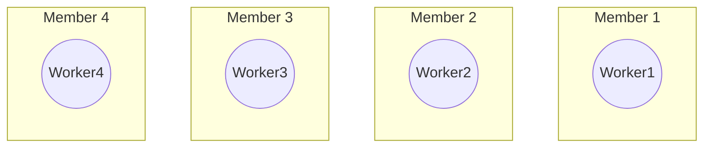
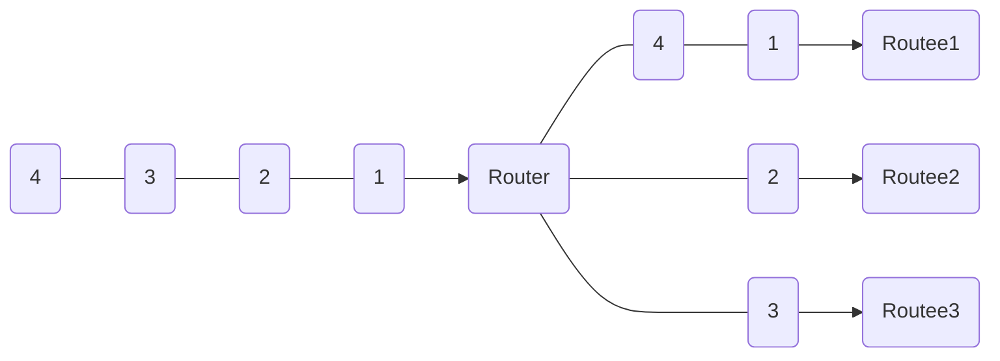
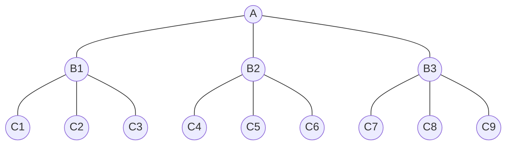
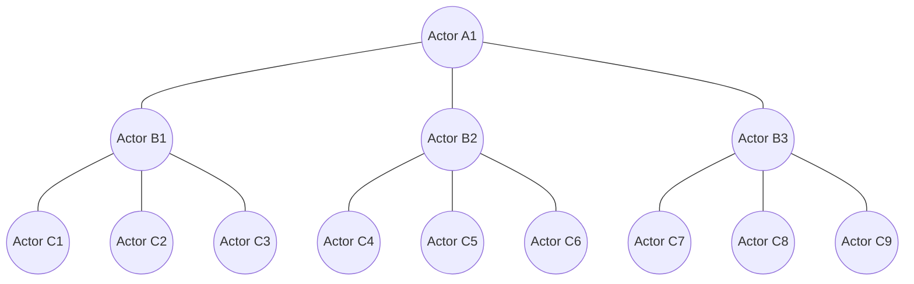
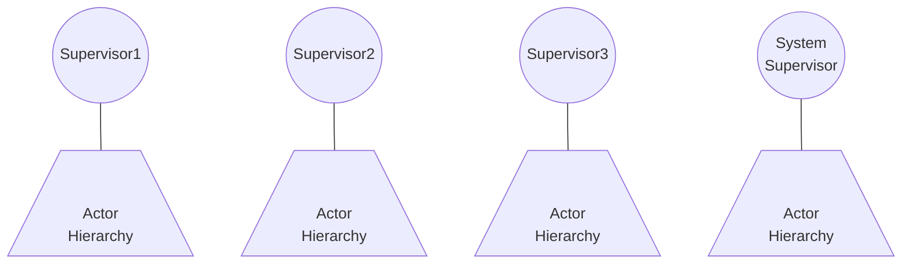

# Mermaid Diagram Examples

```mermaid
sequenceDiagram
    participant Alice
    participant Bob
    Alice->>Jonathan: Hello Jonathan, how are you?
    loop Healthcheck
        Jonathan->>Jonathan: Fight against hypochondria
    end
    Note right of Jonathan: Rational thoughts<br/>prevail...
    Jonathan-->>Alice: Great!
    Jonathan->>Bob: How about you?
    Bob-->>Jonathan: splendid!
```

## Additional Examples

```mermaid
  graph TD;
      DB[(Database)]
      class DB yellow
      BlockchainActor((Blockchain<br/>Actor))
      BlockActor((Block<br/>Actor))
      BlockVersionActor((Block<br/>Version<br/>Actor))
      BlockchainActor-->BlockchainState
      BlockchainActor-->BlockActor
      BlockActor-->BlockState
      BlockActor-->BlockVersionActor
      BlockVersionActor-->BlockVersionState
      BlockchainState-->DB
      BlockState-->DB
      BlockVersionState-.->DB
      BlockVersionState-.->BlockState
```

```mermaid
graph TB

    a1((Player1))
    a2((Player5))
    b1((Player7))
    b2((Player9))
    c1((Player3))
    c2((Player6))
    d1((Player2))
    d2((Player4))

    subgraph Member1
        a1
        a2
    end
    subgraph Member 2
        b1
        b2
    end
    subgraph Member 3
        c1
        c2
    end
    subgraph Member 4
        d1
        d2
    end
```

```mermaid
graph TD

    s((Singleton))

    subgraph Member 1
        empty1
    end
    subgraph Member 2
        empty2
    end
    subgraph Member 3
        s
    end
    subgraph Member 4
        empty3
    end
```

```mermaid
graph TB

    a1((Worker1))

    b1((Worker2))

    c1((Worker3))

    d1((Worker4))

    subgraph Member 1
        a1
    end
    subgraph Member 2
        b1
    end
    subgraph Member 3
        c1
    end
    subgraph Member 4
        d1
    end
```

```mermaid
graph LR

l1(1)
class l1 message
l2(2)
class l2 message
l3(3)
class l3 message
l4(4)
class l4 message

r1(1)
class r1 message
r2(2)
class r2 message
r3(3)
class r3 message
r4(4)
class r4 message

Router(Router)
Routee1(Routee1)
Routee2(Routee2)
Routee3(Routee3)


l4---l3---l2---l1-->Router

Router---r4---r1-->Routee1
Router----r2-->Routee2
Router----r3-->Routee3


```

```mermaid
  graph TD;
  A((A))
  A---B1((B1))
  A---B2((B2))
  A---B3((B3))

  B1---C1((C1))
  B1---C2((C2))
  B1---C3((C3))

  B2---C4((C4))
  B2---C5((C5))
  B2---C6((C6))

  B3---C7((C7))
  B3---C8((C8))
  B3---C9((C9))
```

```mermaid
  graph TD;
  A((Actor A1))
  B1((Actor B1))
  B2((Actor B2))
  B3((Actor B3))

  C1((Actor C1))
  C2((Actor C2))
  C3((Actor C3))

  C4((Actor C4))
  C5((Actor C5))
  C6((Actor C6))

  C7((Actor C7))
  C8((Actor C8))
  C9((Actor C9))


  class A blue
  class B1 yellow
  class B1 selected
  class B2 light-blue
  class B3 light-blue

  class C1 red
  class C1 selected
  class C2 light-blue
  class C3 light-blue
  class C4 light-blue
  class C5 light-blue
  class C6 light-blue
  class C7 light-blue
  class C8 light-blue
  class C9 light-blue


  A---B1
  A---B2
  A---B3

  B1---C1
  B1---C2
  B1---C3

  B2---C4
  B2---C5
  B2---C6

  B3---C7
  B3---C8
  B3---C9
```

```mermaid
    graph TD;

A1((Supervisor1))
class A1 blue
A2((Supervisor2))
class A2 blue
A3((Supervisor3))
class A3 blue
A4((System<br>Supervisor))
class A4 blue

B1[/<br><br>Actor<br>Hierarchy\]
class B1 light-blue

B2[/<br><br>Actor<br>Hierarchy\]
class B2 light-blue

B3[/<br><br>Actor<br>Hierarchy\]
class B3 light-blue

B4[/<br><br>Actor<br>Hierarchy\]
class B4 light-blue

A1---B1
A2---B2
A3---B3
A4---B4

```
