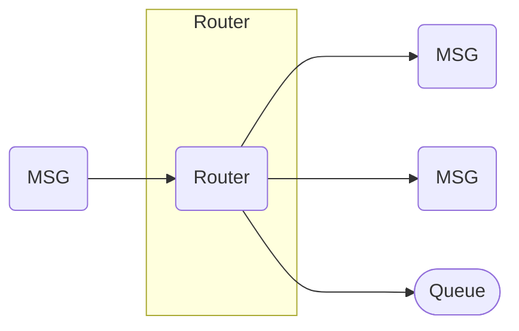

# Messaging Patterns

Actors communicate by exchanging messages. Proto.Actor supports several common patterns that build on this simple foundation.

- **Send** – fire and forget, the sender does not expect a reply.
- **[Ask Pattern](ask-pattern.md)** – request–response using `Request` or `RequestAsync`.
- **[Envelope Pattern](envelope-pattern.md)** – batch multiple messages and acknowledge them as a unit.
- **Routing** – use [Routers](routers.md) to distribute work across actors or forward messages.

The diagram below summarizes how messages can be routed and queued.

