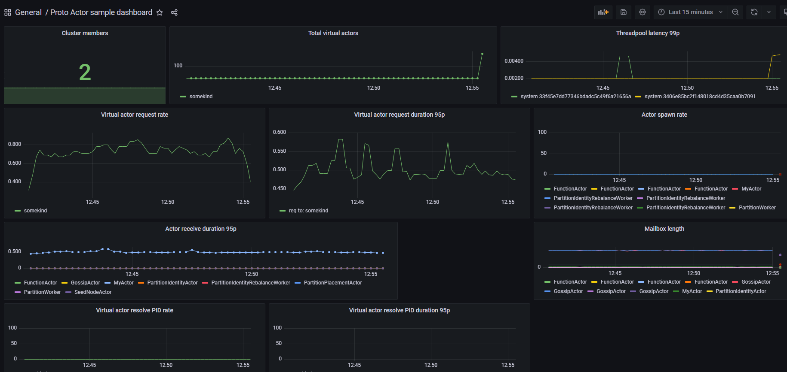

# Metrics

Nowadays, there are a lot of complex distributed systems, and every day their number is increasing. When developing such systems, it is important to strive for the highest possible performance.
But how can we assess the performance of a system? There are special metrics for this.

Metrics are numerical data that are calculated or aggregated over a period of time. Metrics give us an idea of ​​the current and historical state of the system. They can be used for statistical analysis, to predict the future behavior of the system.

There are many types of metrics that can be used for monitoring the performance of distributed systems. For example, latency, bandwidth, error, saturation, traffic, etc. For each distributed system, we need to choose a list of metrics that suit it exactly.

For convenient graphical display and analysis of metrics, we should use monitoring systems such as Grafana, Prometheus.
These systems allow us to create dashboards and display specific metrics over a given period of time. For each distributed system, it is necessary to be able to store metrics into monitoring systems for their further analysis.

## Metrics in Proto.Actor

Proto.Actor is using metrics provided by [OpenTelemetry](https://opentelemetry.io/docs/reference/specification/metrics/). With simple Proto.Actor instrumentation from `Proto.OpenTelemetry`, it is possible to get insights how actor system is performing.
Below it is possible to find more details regarding built in metrics.

Small remark, when using Prometheus exporter directly in the application then the metric names get postfixed with unit name, e.g. histogram `protoactor_threadpool_latency_duration` is renamed to `protoactor_threadpool_latency_duration_seconds`.

### Proto.Actor Metrics

| Name                                             | Type      | Labels                              |
|--------------------------------------------------|-----------|-------------------------------------|
| protoactor_threadpool_latency_duration           | Histogram | id, address                         |
| protoactor_deadletter_count                      | Count     | id, address, messagetype            |
| protoactor_actor_spawn_count                     | Count     | id, address, actortype              |
| protoactor_actor_stopped_count                   | Count     | id, address, actortype              |
| protoactor_actor_restarted_count                 | Count     | id, address, actortype              |
| protoactor_actor_failure_count                   | Count     | id, address, actortype              |
| protoactor_actor_mailbox_length                  | Gauge     | id, address, actortype              |
| protoactor_actor_messagereceive_duration         | Histogram | id, address, actortype, messagetype |
| protoactor_future_started_count                  | Count     | id, address                         |
| protoactor_future_timedout_count                 | Count     | id, address                         |
| protoactor_future_completed_count                | Count     | id, address                         |

### Proto.Remote Metrics

| Name                                    | Type  | Labels                          |
|-----------------------------------------|-------|---------------------------------|
| protoremote_message_serialize_count     | Count | id, address, messagetype        |
| protoremote_message_deserialize_count   | Count | id, address, messagetype        |
| protoremote_spawn_count                 | Count | id, address, kind               |
| protoremote_endpoint_connected_count    | Count | id, address, destinationaddress |
| protoremote_endpoint_disconnected_count | Count | id, address, destinationaddress |

### Proto.Cluster Metrics

| Name                                                    | Type      | Labels                                           |
|---------------------------------------------------------|-----------|--------------------------------------------------|
| protocluster_virtualactors                              | Gauge     | id, address, clusterkind                         |
| protocluster_virtualactor_spawn_duration                | Histogram | id, address, clusterkind                         |
| protocluster_virtualactor_requestasync_duration         | Histogram | id, address, clusterkind, messagetype, pidsource |
| protocluster_virtualactor_requestasync_retry_count      | Count     | id, address, clusterkind, messagetype            |
| protocluster_members_count                              | Gauge     | id, address                                      |
| protocluster_resolve_pid_duration                       | Histogram | id, address, clusterkind                         |

## Getting started

### OpenTelemetry Exporter example

[Realtime map is using Proto.OpenTelemetry](https://github.com/asynkron/realtimemap-dotnet/blob/ccaa9099f5a6cae615feabd38c3cfcc08e791a6f/Backend/Program.cs#L20) and might be used as a working example.
It uses OpenTelemetry exporter and also shows [how to set it up locally](https://github.com/asynkron/realtimemap-dotnet/blob/ccaa9099f5a6cae615feabd38c3cfcc08e791a6f/devenv/docker-compose.yml#L36).

### Prometheus Exporter example

First what needs to be done is to register `MeterProvider` instance. It might be achieved with ready to use extension from `OpenTelemetry.Extensions.Hosting` nuget package.
This extension is using builder pattern to properly configure `MeterProvider` with labels common for all metrics.
Prometheus exporter built-in in the application is the easiest to setup and it will be shown as an example. It is needed to reference `OpenTelemetry.Exporter.Prometheus` nuget package and call `AddPrometheusExporter()` extension method.
It adds `/metrics` endpoint from where Prometheus is able to scrape metrics. To make it work properly it is needed to call also `app.UseOpenTelemetryPrometheusScrapingEndpoint()` after building an application.

`OpenTelemetry` metrics in C# implementation use [System.Diagnostics.Metrics](https://docs.microsoft.com/en-us/dotnet/core/diagnostics/metrics-instrumentation).
`AddProtoActorInstrumentation()` extension shown in the example is adding Proto.Actor meter name.
Method has additional parameter `useRecommendedHistogramBoundaries` which is true by default. It causes that default buckets used in OpenTelemetry implementation are changed to more preferred ones.

```csharp
void ConfigureMetrics(WebApplicationBuilder builder) =>
    builder.Services.AddOpenTelemetryMetrics(b =>
        b.SetResourceBuilder(ResourceBuilder
                .CreateDefault()
                .AddAttributes(new KeyValuePair<string, object>[]
                {
                    new("someLabel", builder.Configuration["SomeLabel"]),
                    new("env", builder.Environment.EnvironmentName)
                })
                .AddService(builder.Configuration["Service:Name"])
            )
            .AddProtoActorInstrumentation()
            .AddPrometheusExporter()
    );

```

### OpenTelemetry .NET AutoInstrumentation

Just as we have discussed about using [OpenTelemetry .NET AutoInstrumentation](https://github.com/open-telemetry/opentelemetry-dotnet-instrumentation) while collecting [Proto.Actor traces](https://proto.actor/docs/tracing/), you can also collect metrics using it, and hence, no manual metrics builder configuration (like the above code snippet) is required. Besides, you can even use it to collect any manual metrics, if required. All the metrics emitted from the Proto.Actor library correspond to the meter name `Proto.Actor` and hence, once you specify that, all the metrics would be collected.

#### Configurations

Import the latest OpenTelemetry .NET AutoInstrumentation package in your .NET project

```csharp
<PackageReference Include="OpenTelemetry.AutoInstrumentation" Version="1.0.0" />
```

Configure these .NET CLR environment variables, besides the [required ones](https://github.com/open-telemetry/opentelemetry-dotnet-instrumentation?tab=readme-ov-file#instrument-a-net-application)

`OTEL_DOTNET_AUTO_METRICS_ADDITIONAL_SOURCES=Proto.Actor`

You can even mention any manual `Meter` names above to collect any manual instrumented data from them.

You can either set `Console_Exporter` to `true` or `false`, depending on whether you want to view the instrumented data in the console (for debugging purposes). By default, they are all set to `false`.

`OTEL_DOTNET_AUTO_METRICS_CONSOLE_EXPORTER_ENABLED=true`

You can configure the OpenTelemetry collector endpoint and protocol using the environment variables

- `OTEL_EXPORTER_OTLP_ENDPOINT=http://otel-collector:4317`
- `OTEL_EXPORTER_OTLP_PROTOCOL=grpc`

#### Word of caution!

OpenTelemetry .NET AutoInstrumentation works only with `System.Diagnostics.DiagnosticSource` version of 8.0.0 or more, and `.NET` framework version of 4.6.2 or more. Hence, request you to go through their detailed documentation before using.

## Using Prometheus and Grafana to store and visualize metrics

Another example of Prometheus metrics setup might be found in [ActorMetrics example](https://github.com/asynkron/protoactor-dotnet/tree/dev/examples/ActorMetrics).

In this section, it will be presented how to run Prometheus and Grafana locally using Docker.

```yml
version: '3.7'

services:     
  grafana:
    image: grafana/grafana
    ports:
      - 3000:3000
      
  prometheus:
    image: prom/prometheus
    volumes:
      - ./prometheus.yml:/etc/prometheus/prometheus.yml
    ports:
      - 9090:9090
```

prometheus.yml

```yml
scrape_configs:
- job_name: 'your-application'
  scrape_interval: 10s
  static_configs:
  - targets: ['host.docker.internal:5000']

```

A few words of exmplanation regarding docker-compose setup:

* Grafana setup is bare minimum to run it, UI is available under `3000` port
* Prometheus is available under `9090` port. Prometheus requires `prometheus.yml` config file to properly configure targets from where metrics are scraped.
In this setup, file points only to application's prometheus endpoint.

After running this docker-compose and some application that exposes metrics, it is possible to create some dashboard in Grafana do visualize it.

[ActorMetrics example](https://github.com/asynkron/protoactor-dotnet/tree/dev/examples/ActorMetrics) contains a
[sample dashboard](https://github.com/asynkron/protoactor-dotnet/blob/8edb25caf8213e1fe790402b0af1a3215ea04c0f/examples/ActorMetrics/grafana/dashboards/proto-actor-sample-dashboard.json#L1) that shows how to create a visualisation of metrics.


