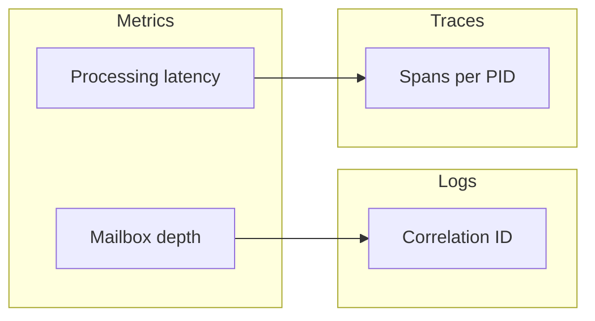

# Observability Cookbook

Distributed debugging requires end-to-end visibility. This page links tracing, metrics, and logging into actionable steps.

## Structured logs

Include correlation IDs to link logs to traces.

```csharp
log.LogInformation("{CorrelationId} handling {Message}", id, msg);
```

## Metrics to watch

- Mailbox depth per actor
- Message processing latency
- Restart counts and deadletters

## Sample dashboard



Start with these building blocks and iterate: good observability turns incidents into quick fixes rather than mysteries.
