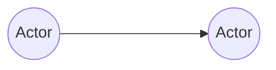
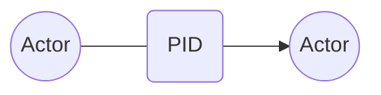
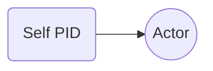
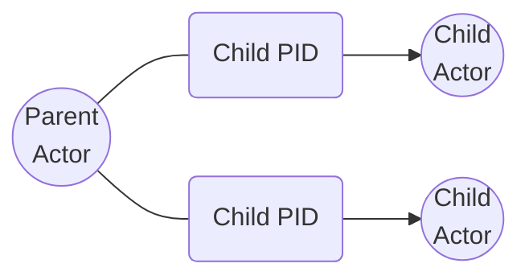
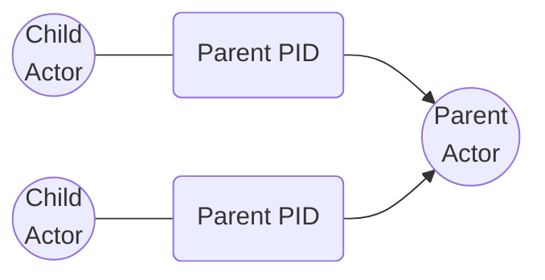
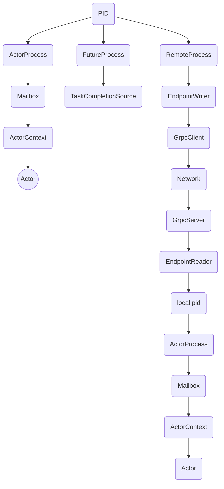

# PID

When you spawn an actor, you don't receive a direct reference to it. Instead, you get a `PID` (short for process ID), a serializable identifier used to send messages to the actor's mailbox. This `PID` can be easily serialized and sent over the wire, enabling actors to communicate remotely.

## Overview

Actors interact with each other by sending messages. So to be able to send a message, one actor needs some form of reference to another actor.

Here we see that actor 1 wants to send a message to actor 2, in Proto.Actor we don't work with actors directly. Instead, we work with the PID of the actor. The PID is the Process ID of the process.

Each actor has a unique PID that allows Proto.Actor to distinguish actors. When a new actor is created Photo.Actor assigns it the next free ID(i.e., not associated with any actor). ID's are assigned incrementally, i.e., the new actor's ID is higher than the actor created before it. When an actor completes his work, Proto.Actor frees the identifier occupied by it.

## Communicating with PIDs

There are two main methods of communicating with a PID.

### Send

`Send` is a non-blocking, fire-and-forget method for sending a message to an actor. The message will be enqueued in the receiving actor's mailbox and will eventually be processed, assuming the actor isn't stopped. Tell is also the most performant way of communicating with actors, so it is the preferred default unless your use case requires a request/reply pattern of communication.

### Request

`Request` is very similar to `Send`, but it also includes the sender PID so that the receiving actor can send a reply. It should only be used when you require request/reply communication between two actors, because it creates an extra allocation for each message in order to include the sender PID. For remote communication, it will also increase the payload that is serialized and deserialized.

`RequestAsync<T>` is identical to `Request` but it returns an awaitable `Task` that will complete when the actor has sent a reply of type `T`. It should only be used when you require a synchronous mode of communication.

## Topology

Thus, a PID is a layer of abstraction over an actor. And by having this level of abstraction, we can transfer references to actors throughout the system via messages. In addition to that, each actor has several special references to other actors.

### Self

The first link is a link to yourself. Since a PID is an abstraction above an actor. We can use our PID to send a message to yourself. For example, you may need to do this when you want to send a message to yourself that delayed in time.

### Children

The next special link that our actor has is a link to his child actors. For example, our actor has created two child actors. And you can use those links to interact with those child actors.

### Parent

And the last link that interests us. This is a reference to the parent. That is, child actors can communicate with their parents. For example, the child actor can notify the parent that an error has occurred while processing the message.

## Architecture of PIDs

You can think of the PID as the phone number to an actor, and the process as the underlying infrastructure used to reach the target.

There are three built-in Process types in Proto.Actor.

`ActorProcess`, `RemoteProcess` and `FutureProcess`.

