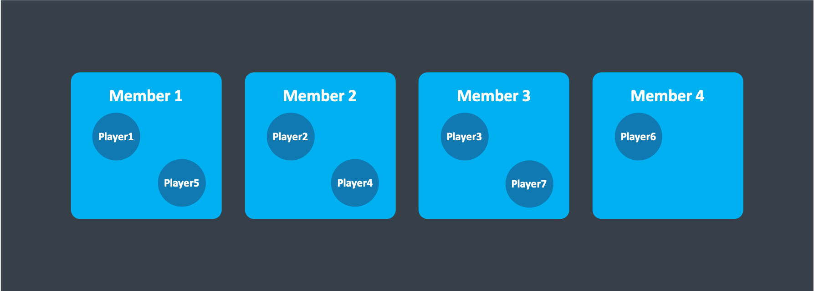
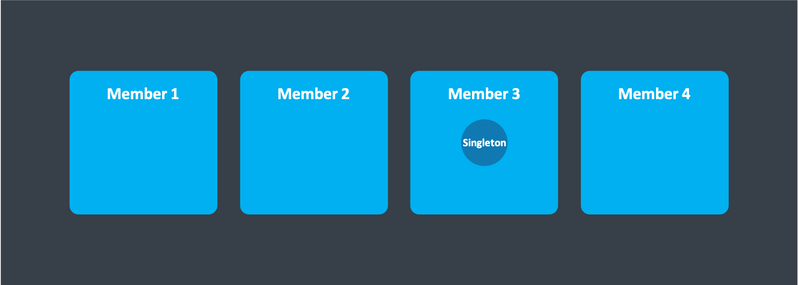
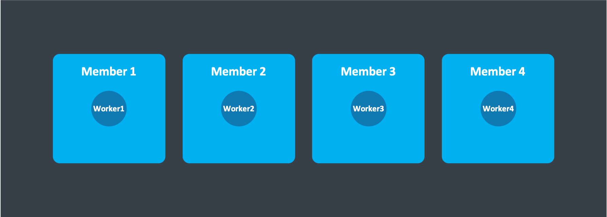

# Cluster placement patterns

## How do I make an actor that:

### Is unique for a given ID

Use a virtual actor with the ID as part of its name

**Use-case:** e.g. Players, monsters, user accounts 

### Is a cluster singleton

Use a virtual actor with a known name.

**Use-case:** e.g. a manager actor of some sort, that manages work for the entire cluster

### Always exist on each member:

Use a normal actor, boot on startup.
Use MemberList to see what members exists when communicating with these actors

**Use-case:** e.g. a worker actor that performs maintanance work for each cluster member

