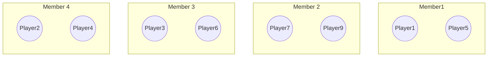
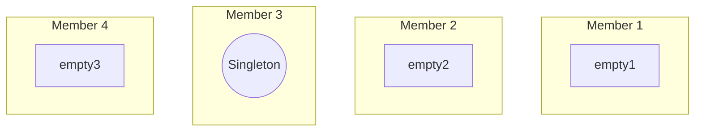
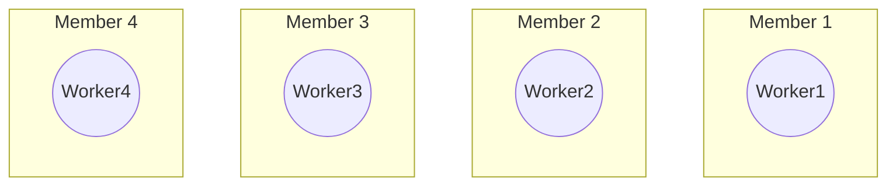

# Cluster placement patterns

## How do I make an actor that:

### Is unique for a given ID

This strategy involves using a virtual actor with a unique identifier (ID) as part of its name. This ensures that each actor is unique and can be individually addressed within the cluster. By assigning a distinct ID to each actor, the system can prevent conflicts and ensure that each entity, whether a player, monster, or user account, is represented by exactly one actor. This approach is typically used in systems where entities need to be distinctly manageable and trackable across distributed environments.

**Use-case:** e.g. Players, monsters, user accounts .

### Is a cluster singleton

This pattern employs a virtual actor that is instantiated only once within the entire cluster and is known by a predefined, constant name. This singleton actor acts as a centralized manager or coordinator, handling tasks that need a global view or centralized control, such as aggregating data from various parts of the cluster or managing shared resources. It ensures that only one instance of the actor exists in the cluster, preventing duplicate efforts and maintaining consistency in operations that require a single point of control.

**Use-case:** e.g. a manager actor of some sort, that manages work for the entire cluster.

### Always exist on each member

In this setup, a normal actor is created on each cluster member upon startup, ensuring that an instance of the actor is always active and available on every node. These actors, often termed as worker actors, are used for tasks that need to be performed locally on each node, like maintenance routines or data processing specific to that node's segment of the workload. The system uses a member list to track which nodes are active, allowing communication and coordination among the worker actors across the cluster. This method enhances reliability and local responsiveness within the distributed system.

**Use-case:** e.g. a worker actor that performs maintenance work for each cluster member.
