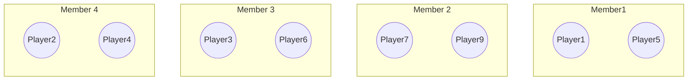
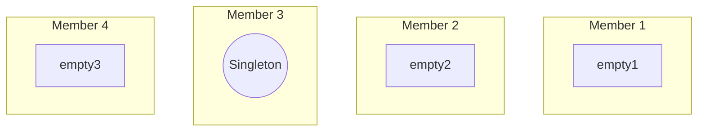
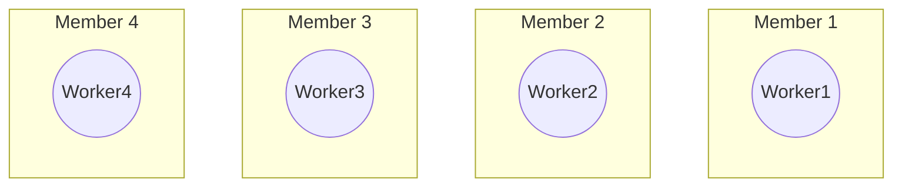

# Cluster placement patterns

## How do I make an actor that:

### Is unique for a given ID

This strategy involves using a virtual actor with a unique identifier (ID) as part of its name. This ensures that each actor is unique and can be individually addressed within the cluster. This strategy is typically used when you need to maintain a unique instance of an actor for each entity in your system.

**Use-case:** e.g. Players, monsters, user accounts .

### Is a cluster singleton

Use a virtual actor with a known name.

**Use-case:** e.g. a manager actor of some sort, that manages work for the entire cluster.

### Always exist on each member

Use a normal actor, boot on startup.
Use MemberList to see what members exist when communicating with these actors.

**Use-case:** e.g. a worker actor that performs maintenance work for each cluster member.
